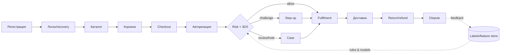
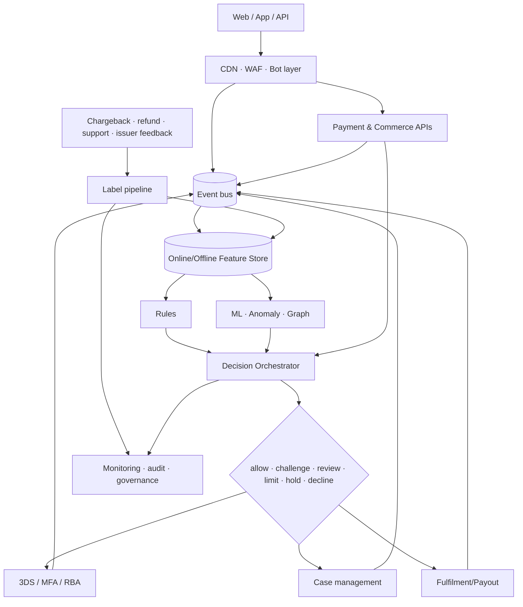
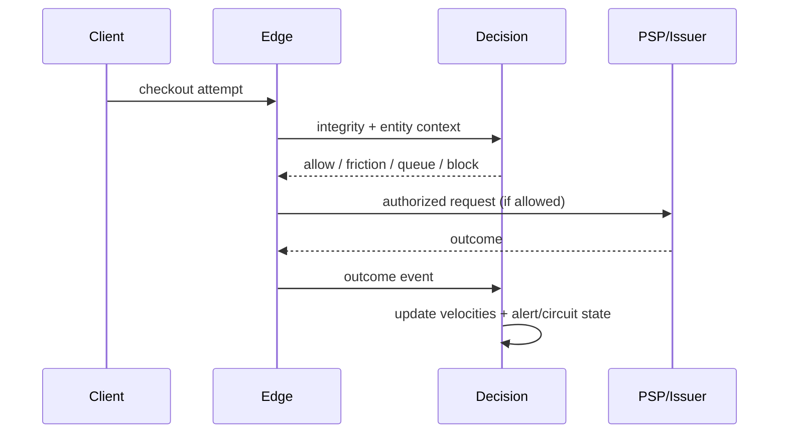

# Как читать эту книгу

Антифрод — не кнопка «заблокировать мошенника», а управляемая система решений при неполной информации. Эта книга ведёт от экономики одного заказа до архитектуры, операций и дорожной карты. Начинайте с глав 1–3, затем выберите свой стек в главе 14 и превратите чек-листы главы 17 в задачи.

**Граница материала.** Руководство исключительно защитное. Модели атак описаны ровно настолько, чтобы распознать риск и поставить контроль. Здесь намеренно нет операционных инструкций по кардингу, card testing, покупке или проверке карт, обходу 3-D Secure (3DS), AVS/CVV, device fingerprinting, антибота, WAF, KYC и лимитов, stealth-настроек или способов повысить «траст» злоумышленника.

## Статус утверждений

* **[ОБЯЗ.]** — требование применимого закона, договора или стандарта; применимость подтверждает юрист, эквайер либо QSA.
* **[ПРАКТ.]** — устоявшаяся отраслевая практика, но не универсальная обязанность.
* **[РЕК.]** — авторская рекомендация: её следует проверить экспериментом.
* **[ПРИМЕР]** — реализация конкретного провайдера, не независимый факт и не рекомендация купить продукт.

Ссылки вида **[S12]** раскрыты в `research/SOURCE_LEDGER.md`; трассировка ключевых выводов находится в `research/CLAIM_MAP.md`. Срез — **2026-07-21**. Стандарты, правила платёжных систем и законы меняются: перед внедрением повторно проверьте применимость.

# 1. Деньги, риск и экономика мошенничества

## 1.1 Интуитивная модель

У заказа есть не только выручка. Есть себестоимость товара, доставка, комиссия, стоимость проверки, цена трения для честного клиента и будущая ценность клиента (LTV). Мошеннику нужна воспроизводимая прибыль; защитнику — сделать ожидаемую прибыль атаки отрицательной, не разрушив конверсию.

Пусть для решения \(a\):

\[
EC(a)=P(F\mid x,a)\cdot L_F + P(G\mid x,a)\cdot L_{FP}+C_a+C_{latency}
\]

где `F` — fraud, `G` — честный клиент, `L_F` — полный убыток от пропущенного fraud, `L_FP` — потеря от ложного отказа, `C_a` — стоимость действия, `x` — наблюдаемые признаки. Выбираем действие с минимальным ожидаемым ущербом, соблюдая закон, правила схем и ограничения сервиса.

**Мини-пример.** Товар стоит 10 000 ₽, валовая маржа 2 500 ₽. При мошенничестве магазин теряет товар, логистику 600 ₽, операционные 400 ₽ и возможную комиссию спора 1 000 ₽: `L_F = 12 000 ₽`, а не маржа. Ложный decline хорошего постоянного клиента может стоить 2 500 ₽ сейчас плюс часть LTV. Поэтому одинаковый risk score может вести к hold для физического товара и к challenge для цифрового.

## 1.2 Кто несёт убыток

| Событие | Возможный прямой носитель | Скрытые последствия |
|---|---|---|
| Неавторизованный платёж | эмитент, эквайер или мерчант — зависит от юрисдикции, аутентификации, правил схемы и доказательств | комиссии, мониторинговые программы, резерв, потеря товара |
| Friendly/first-party fraud | часто мерчант до успешного представления доказательств | support, логистика, репутация |
| ATO | клиент и сервис; распределение зависит от фактов и права | компенсации, recovery, уведомления |
| Refund abuse | мерчант/маркетплейс/продавец | потеря товара и refund, рост ручного труда |
| Merchant abuse | покупатель, эквайер, платформа | регуляторный и репутационный риск |

**Красный флаг:** команда оптимизирует только chargeback rate. Отказы и 3DS могут снизить его, одновременно уничтожив approval rate и LTV.

# 2. Карта угроз: язык без паники

| Класс | Что происходит на защитном уровне | Наблюдаемые сигналы | Базовые контрмеры |
|---|---|---|---|
| CNP/card fraud | платёж без физического предъявления карты инициирует неуполномоченное лицо | несогласованность аккаунта, устройства, сети, адресов и истории; issuer response | токенизация, RBA/3DS, velocity, hold, подтверждение fulfilment |
| Card testing/enumeration | автоматизированный поток пытается выяснить пригодность реквизитов или существование сущностей | много малых/неуспешных попыток, распределённые связи, всплеск issuer declines | edge bot controls, многомерные velocity, единообразные ответы, circuit breaker [S08][S09] |
| ATO/credential stuffing | переиспользованные учётные данные ведут к захвату аккаунта | новый контекст, login velocity, recovery/change anomalies | passkeys/MFA, breached-password checks, device binding, recovery hardening [S10][S15] |
| Bot abuse | автоматизация захватывает дефицит, контент, промо или checkout | неестественная последовательность и целостность клиента | bot management, очереди, quotas, progressive friction |
| Stolen/synthetic identity | чужая или составная идентичность создаёт доверие/кредит | несогласованность источников, тонкий файл, shared attributes | пропорциональный KYC, документ/источник, граф, ручная проверка |
| Triangulation | покупатель, витрина-посредник и пострадавший мерчант образуют цепочку | повторяющиеся адреса/товары, сторонние контакты, disputes | seller due diligence, graph links, подтверждение доставки |
| Reshipping/mules | промежуточный получатель перемещает товар/деньги | кластер адресов и получателей, смена маршрута | address intelligence, hold, ограничения смены доставки |
| Promotion/referral abuse | формально допустимые действия масштабируются вопреки смыслу акции | связанные аккаунты, устройства, платёжные/доставочные атрибуты | eligibility, graph caps, delayed reward, clawback по условиям |
| Refund/return abuse | возврат денег/товара искажён или дублирован | refund velocity, несоответствие SKU/веса/треков | dual control, refund-to-origin, warehouse evidence |
| Chargeback/friendly fraud | держатель оспаривает распознанную покупку или злоупотребляет спором | история клиента, delivery/use evidence, descriptor confusion | ясный descriptor, receipts, evidence pack, early resolution |
| Gift-card fraud | ликвидный цифровой эквивалент покупают/крадут/обналичивают | высокая скорость, transfer/redemption graph | balance protection, delayed activation, limits, MFA |
| BNPL fraud | риск идентичности и кредита сочетается с payment fraud | новые identities, устройства, repayment links | KYC/credit controls, cross-merchant graph, staged limits |
| Marketplace fraud | злоупотребляет покупатель, продавец или сговор | seller graph, off-platform pressure, payout anomalies | onboarding, escrow/holds, payout risk, content moderation |
| API/payment-link/mobile | злоупотребление бизнес-логикой, ссылками или мобильной средой | token/link reuse, object access, attestation gaps | scoped tokens, API authz, replay defense, app integrity [S11][S12] |
| Social engineering | человек убеждает жертву или оператора выполнить действие | необычное изменение реквизитов, urgency, operator override | out-of-band verification, scripts, cooling-off, training |
| Merchant abuse | недобросовестный продавец не поставляет, маскирует MCC/товар | жалобы, fulfillment gap, резкий payout profile | KYB, reserves, monitoring, suspension, reporting |

Таксономии пересекаются: ATO может закончиться gift-card purchase, а затем refund abuse. Поэтому классифицируйте **событие**, **актор**, **инструмент**, **цель** и **потери** отдельно.

# 3. Fraud journey: защищаем весь путь

| Стадия | Что защищаем | Сигналы | Решение/контроль |
|---|---|---|---|
| Регистрация | уникальность и добросовестность аккаунта | email/phone age и verification, device/account graph, velocity | allow, verify, limit, deny automation |
| Логин | сессию и секреты | failed/success patterns, device binding, IP/ASN risk | passkey/MFA, revoke sessions, notify |
| Recovery | канал восстановления | смена SIM/почты, новый device, support interaction | cooling-off, strong re-auth, dual control |
| Каталог | дефицит и scraping | browse cadence, inventory targeting | queue, per-account quota, bot controls |
| Корзина | промо и business logic | coupon graph, quantity, repeated edits | reserve briefly, eligibility, recalc server-side |
| Checkout | данные заказа | billing/shipping/contact consistency | progressive friction, review, limit |
| Авторизация | платёж | issuer response, token, prior attempts | allow/decline/route законным способом; не повторять слепо |
| 3DS/step-up | аутентификацию | RBA inputs, challenge outcome, exemptions | challenge либо alternate safe path [S05][S06] |
| Fulfilment | необратимость | risk maturity, stock type, delivery channel | hold, split shipment, manual review |
| Доставка | передачу ценности | reroute, proof, recipient mismatch | restrict edits, signed/OTP delivery соразмерно риску |
| Return/refund | деньги и товар | return history, warehouse evidence | refund to original method, dual approval |
| Dispute | доказательства и обучение | reason code, delivery/use/contact history | evidence pack, accept/represent, label correction |

**Принцип обратимости:** чем необратимее действие (мгновенная выдача цифрового кода, payout), тем раньше и сильнее контроль. Авторизация банка не доказывает добросовестность заказа.

# 4. Сигналы: что они значат и чего не доказывают

Один сигнал редко является доказательством. Хорошая комбинация: независимые источники + временной контекст + объяснимое действие.

| Семейство | Полезный смысл | Ограничения/ложные срабатывания | Privacy и безопасная комбинация |
|---|---|---|---|
| Account/identity | возраст, подтверждения, стабильность, история | новый честный клиент выглядит «тонко»; семьи делят данные | минимизация, цель и срок; сочетать с поведением, не с демографическими стереотипами |
| Device/browser integrity | устойчивость контекста, tampering/automation hints | обновления, privacy browsers, shared devices | псевдонимизация, rotation; не считать fingerprint личностью |
| IP/network/ASN | география, hosting/proxy/TOR/VPN reputation | CGNAT, корпоративные VPN, мобильные сети | coarse location, короткий retention; повышать неопределённость, а не автоматически decline |
| Поведение/biometrics | последовательность навигации и взаимодействия | accessibility, возраст, моторные различия; sensitive profiling | DPIA/оценка, агрегация, запрет дискриминации; step-up вместо отказа |
| Velocity | частота по account/device/card-token/address/IP/SKU | распродажи, NAT, call center | окна нескольких размеров, peer baseline, граф; без единственного глобального порога |
| Payment/order | сумма, корзина, BIN country, issuer outcome, token history | путешествия, подарки, cross-border | не хранить лишний PAN; сочетать с customer history |
| Shipping | расстояние, reroute, pickup, повторное использование | офисы, общежития, forwarding legitimate | нормализация адреса, graph degree, delivery evidence |
| Email/phone | verification, tenure/reputation, change events | recycled numbers, aliases, новые домены | consent/legal basis, не передавать raw data без необходимости |
| Graph/link analysis | общие сущности и кольца | домохозяйства и корпоративные адреса создают hubs | типизированные рёбра, time decay, исключения legitimate hubs, analyst explanation |
| Consortium data | внешний опыт по сущности | непрозрачные labels, разные рынки, stale data | договор, provenance, dispute/correction, локальная валидация |

## 4.1 Качество признака

Для каждого признака заведите паспорт: определение, владелец, источник, event time и processing time, freshness, missing semantics, допустимые значения, PII-класс, retention, offline/online parity, known bias, мониторинг. Значение `missing` не равно `false`: отсутствие AVS в регионе не означает mismatch.

## 4.2 Граф без магии

Узлы: account, device pseudonym, payment token, address, phone, order, seller. Рёбра: «использовал», «доставил», «получил payout» с временем и типом. Полезны degree, число новых соседей, компоненты, motifs и расстояние до подтверждённого fraud. Снижайте вес старых связей; исключайте легитимные hubs (отель, офис); позволяйте аналитику увидеть путь объяснения.

# 5. Эталонная real-time архитектура

## 5.1 Контракты и отказоустойчивость

**[РЕК.] Decision API** принимает `event_id`, event time, customer/order references, контекст и purpose; возвращает decision, reason codes, policy/model versions, expiry и correlation ID. Идемпотентность предотвращает двойные решения. Денежные значения — integer minor units + currency.

Определите fail-safe по операции: при недоступности антифрода низкорисковый просмотр может fail-open, payout и дорогой цифровой товар — hold/fail-closed. Нужны таймаут, bulkhead, circuit breaker, деградационная policy и очередь повторной оценки. Логи решений неизменяемы и не содержат секретов/PAN.

## 5.2 Слои

1. **Edge/WAF/bot:** volumetric и protocol defense, client integrity, rate policy. WAF не знает весь бизнес-контекст.
2. **События:** единая схема и часы, server-side facts, consent/purpose metadata.
3. **Feature store:** одинаковое вычисление online/offline, freshness и point-in-time joins.
4. **Rules:** точные политики, аварийные controls, compliance gates.
5. **Models/anomaly/graph:** ранжируют неопределённость; не заменяют ограничения.
6. **Orchestrator:** выбирает действие и управляет конфликтами.
7. **3DS/RBA/step-up:** получает минимально нужный контекст и возвращает outcome.
8. **Case management:** очередь, SLA, evidence, dual control.
9. **Feedback:** disputes, refunds и outcomes с задержкой, качеством и provenance.
10. **Monitoring/audit:** бизнес-, fairness-, drift-, latency- и security-наблюдаемость.

# 6. Решения и risk-based step-up

| Действие | Когда уместно | Цена ошибки | Guardrail |
|---|---|---|---|
| Allow | риск и неопределённость малы | fraud loss | post-event monitoring; лимит необратимости |
| Challenge | идентичность можно подтвердить | abandonment/friction | доступный альтернативный путь; не зацикливать |
| Review | машина не видит важный контекст | очередь и задержка | SLA, приоритет по expected loss, reason codes |
| Limit | риск растёт с объёмом/скоростью | недополученная выручка | ясное восстановление, time-bound |
| Hold | ценность ещё обратима | fulfilment delay | expiry, уведомление, владелец release |
| Decline | риск/запрет высок и альтернативы нет | false positive и trust | общий безопасный текст; appeal/recovery |

### Матрица «сигнал × действие × цена ошибки»

| Комбинация | Предпочтение | Почему | Что проверить |
|---|---|---|---|
| Новый device + привычный аккаунт + низкая сумма | allow или мягкий step-up | device change сам по себе слаб | recovery/change events |
| Новый аккаунт + связанный fraud graph + мгновенный товар | hold/review/decline по policy | необратимость и сильная связь | legitimate shared hub |
| Hosting ASN + успешная сильная auth + стабильная история | не auto-decline; limit/monitor | network signal неоднозначен | session integrity |
| Резкий refund velocity + новый оператор | hold + dual review | insider/process risk | системный сбой/кампания |
| Распределённый authorization failure spike | queue/circuit breaker + issuer-aware control | защищает PSP/issuer и данные | outage, BIN-level incident |

Политика конфликта: обязательный запрет выше модели; затем incident controls; затем risk decision. Challenge не должен превращать несогласие модели в бесконечную стену.

# 7. Правила и velocity controls

## 7.1 Жизненный цикл правила

`proposal → peer review → simulation → shadow → canary → active → monitor → retire`.

Каждое правило имеет ID, гипотезу, owner, scope, версию, start/end, источники, действие, reason code, expected impact, kill switch и rollback. Изменения проходят four-eyes; emergency rule автоматически истекает.

**Синтетический защитный пример:** «если за короткое окно для одного payment token наблюдается аномальное число разных account, а за более длинное окно растёт доля отказов авторизации, отправить поток в progressive friction и alert». Числа намеренно определяются вашей базовой линией, а не публикуются как универсальный порог.

## 7.2 Velocity правильно

* считайте по нескольким сущностям и их связям, а не только IP;
* используйте короткие и длинные окна, seasonal baseline и event time;
* разделяйте `attempt`, `authorization`, `capture`, `refund`;
* храните distinct counts и доли outcomes;
* защищайте counters от race conditions и retry duplication;
* наблюдайте matched, acted, incremental fraud caught, false positives, latency;
* выключайте правило автоматически при budget breach.

**Anti-pattern:** сотни перекрывающихся правил без attribution. Решение — decision trace и holdout там, где это этично и безопасно.

# 8. ML без магии

## 8.1 Labels и задержка

Chargeback приходит спустя недели или месяцы; отсутствие chargeback сегодня не равно good. Храните `label_observed_at`, reason, source и confidence. Разделяйте unauthorized fraud, first-party fraud, policy abuse и operational error. Используйте maturity window; не обучайте на незрелых «хороших» заказах.

**Leakage:** признак содержит будущее, например итог спора при оценке checkout. Делайте point-in-time join: модель видит только то, что существовало в момент решения. Feedback решения тоже создаёт selection bias: declined заказ не показывает контрфактический outcome.

## 8.2 Дисбаланс и метрики

Accuracy бесполезна: при fraud 0,2% модель «всё good» имеет 99,8%. Смотрите:

* `precision = TP/(TP+FP)` — доля fraud среди срабатываний;
* `recall = TP/(TP+FN)` — найденная доля fraud;
* PR-AUC — качество ранжирования редкого класса;
* approval/false-positive rate по сегментам;
* expected cost/profit на выбранных действиях;
* calibration: среди score 0,10 действительно около 10% целевого outcome.

Калибруйте на свежем representative наборе. ROC-AUC можно показать дополнительно, но он скрывает цену большого числа FP при редком fraud.

## 8.3 Cost-sensitive решения

Модель выдаёт вероятность, policy переводит её в действие с учётом суммы, маржи, обратимости и цены friction. Порог не один: challenge и decline имеют разные cost curves. Проверяйте sensitivity к ошибке в cost assumptions.

## 8.4 Evaluation

1. Time-based train/validation/test, без случайного перемешивания будущего в прошлое.
2. Offline: PR curves, calibration, сегменты, latency replay.
3. Shadow: новый challenger ничего не решает.
4. Canary: малый контролируемый трафик с guardrails.
5. Champion–challenger и rollback.
6. Online: incremental loss, approvals, customer contacts, зрелые labels.

Мониторьте data quality, feature drift, score drift, calibration drift и concept drift. Drift — сигнал расследовать, не автоматическое доказательство атаки.

## 8.5 Explainability, fairness, adaptation

Reason codes должны объяснять действие оператору без раскрытия защитной логики клиенту. Проверяйте disparate impact по законно допустимым сегментам; не используйте protected attributes как удобные proxies. Ограничьте доступ к model artifacts. Предполагайте, что противник адаптируется: меняйте набор независимых сигналов и проверяйте controls на синтетическом purple-team стенде.

Graph ML полезен для колец, но наследует ошибки связей. Начинайте с понятных graph features; затем сравните GNN с простым baseline по incremental value, latency и объяснимости.

# 9. Платёжная и account security

## 9.1 3DS2 и RBA

EMV 3-D Secure передаёт данные между 3DS Server, Directory Server и Access Control Server; issuer выполняет risk-based authentication и при необходимости challenge [S05]. **[ПРАКТ.]** Передавайте качественные, правдивые данные; используйте challenge соразмерно риску и требованиям рынка. 3DS не заменяет merchant fraud controls: аутентифицированный пользователь может злоупотреблять собственным аккаунтом, а fulfillment risk остаётся.

В Европейской экономической зоне Strong Customer Authentication и exemptions регулируются PSD2/RTS; применение и liability нельзя сводить к лозунгу «3DS = liability shift» [S24]. Сверяйтесь с эквайером и правилами каждой схемы.

## 9.2 Tokenization, network tokens, CVV/AVS

Токен снижает распространение PAN; network token может быть связан с merchant/device и обновляться жизненным циклом сети. Это уменьшает exposure, но украденная активная сессия всё ещё опасна. **[ОБЯЗ.]** PCI DSS запрещает хранить sensitive authentication data после авторизации, включая card verification code, даже в зашифрованном виде [S01]. AVS доступен не везде и даёт match/mismatch/unknown, а не доказательство личности. CVV/AVS — сигналы и controls, не самостоятельная стратегия.

**PCI scope reduction:** hosted fields/redirect/tokenization могут уменьшить область, но не отменяют ответственности. Для e-commerce PCI DSS 4.0.1 требования 6.4.3 и 11.6.1 требуют управления/инвентаризации/авторизации payment-page scripts и механизма обнаружения несанкционированных изменений; точная применимость зависит от SAQ/архитектуры [S01][S03].

## 9.3 Passkeys, MFA, binding и recovery

WebAuthn использует origin-bound public-key credentials и помогает против phishing; FIDO passkeys улучшают пользовательский путь [S14][S15]. Поддерживайте несколько аутентификаторов, безопасную регистрацию нового и отзыв старого. Device binding — связь ключа/приложения с аккаунтом, но migration и accessibility требуют recovery.

Recovery часто слабее login. Требуйте strong re-auth для смены payout/payment/recovery attributes; уведомляйте старые каналы; вводите cooling-off для необратимых действий; защищайте операторский override dual control. NIST SP 800-63B-4 задаёт актуальные требования к authenticator management и phishing-resistant options [S13].

## 9.4 Secure APIs

* OAuth/OIDC scopes и audience, короткоживущие tokens; mTLS/подпись где модель угроз требует.
* Проверка object- и function-level authorization на сервере [S11].
* Idempotency key, nonce/timestamp/replay protection для денежных команд.
* Сервер вычисляет сумму, скидку, получателя и состояние; клиент не источник истины.
* Secrets не в mobile/web bundle и логах; key rotation и least privilege.
* Webhook signature, freshness, deduplication и state-machine validation.

# 10. Bot management и защита от card testing

OWASP относит carding и credential stuffing к automated threats [S08][S09]. Защита слоистая:

1. **Edge:** capacity limits, WAF/protocol validation, reputation как слабый сигнал.
2. **Client integrity:** tamper/automation indicators с graceful fallback для accessibility/privacy.
3. **Entity/graph velocities:** account, session, device pseudonym, token, address, BIN/issuer aggregate и связи.
4. **Progressive friction:** задержка, очередь, challenge или re-auth растут с уверенностью; честному клиенту есть путь восстановления.
5. **Payment orchestration:** не превращать retries в amplifier; учитывать issuer/BIN-level всплеск, idempotency и безопасный backoff.
6. **Circuit breaker:** временно ограничить наиболее вредную операцию, сохранив просмотр/поддержку.
7. **Observability:** attempt→auth outcome funnel, decline families, issuer concentration, unique entities, edge-to-PSP correlation.

Не публикуйте фиксированные пороги. Выводите их из нормального профиля и защищайте конфигурацию. Единообразные ответы и timing уменьшают enumeration; наружу — correlation ID, внутрь — точная причина. Координируйтесь с PSP/эквайером: массовые попытки вредят всей цепочке.

# 11. Метрики и экономика

## 11.1 Канонические определения

Определите numerator, denominator, event time, maturity и currency.

* `fraud rate = confirmed fraud amount / eligible processed amount`;
* `chargeback rate` — считать ровно по определению схемы/эквайера: denominators и окна различаются;
* `approval rate = approved auth attempts / eligible auth attempts` (очищайте технические повторы);
* `false-positive rate = good orders declined / all mature good orders` — наблюдается неполно;
* `review rate`, `review yield`, `review SLA breach`;
* `loss per order = mature fraud loss / eligible orders`;
* `3DS challenge rate`, completion, abandonment и post-auth fraud;
* dispute win rate — отдельно submitted и eligible, по зрелым исходам;
* p50/p95/p99 decision latency и timeout rate.

**Expected net value заказа:**

`revenue − COGS − payment − fulfilment − review − expected fraud/dispute loss − expected friction/LTV loss`.

## 11.2 Пример dashboard

| Панель | Срезы | Guardrail |
|---|---|---|
| Authorization funnel | issuer/BIN country, PSP, device, new/returning | approval и technical error |
| Fraud & disputes | cohort week, reason, product, delivery | maturity coverage |
| Decisions | policy/model version, reason, action | FP proxy, overturn rate |
| 3DS | frictionless/challenge/outcome | abandonment, latency |
| Ops | queue, age, analyst, decision | SLA, QA disagreement |
| System | API p95/p99, timeouts, feature freshness | fail-open/closed counts |
| Customer | contacts, appeals, repeat purchase | segment fairness/LTV |

Показывайте абсолютные числа рядом с процентами. Сравнивайте cohort по моменту покупки, а не только дату получения chargeback.

# 12. Anti-fraud operations

## 12.1 Роли и контроль доступа

| Роль | Ответственность |
|---|---|
| Product/risk owner | risk appetite, экономика, приоритеты |
| Fraud analyst | cases, patterns, rules proposal |
| Data/ML | features, evaluation, models, monitoring |
| Engineering/SRE | decision platform, reliability, deployment |
| Security | app/API/bot security, incident response |
| Payments/finance | PSP, reconciliation, disputes |
| Legal/privacy/compliance | basis, notices, DPIA, rights, retention |
| Support/fulfilment | customer verification и evidence |
| Internal audit/QA | независимая проверка governance |

Least privilege, just-in-time access, masked data, session logging, no bulk export по умолчанию. Rule/model deploy и крупный refund/payout — разделение обязанностей.

## 12.2 Manual review

Очередь сортируется по expected avoidable loss и SLA, а не только score. Case view показывает timeline, source freshness, graph с legitimate-hub warnings, reason codes и policy. Аналитик выбирает из стандартных outcomes, фиксирует evidence, confidence и комментарий; нельзя копировать PAN/документы в свободный текст.

QA: случайная слепая повторная проверка, disagreement review, analyst-level bias/throughput без «гонки кликов». Feedback аналитика не становится ground truth автоматически.

## 12.3 Incident response

`detect → triage → contain → preserve → coordinate → recover → learn`.

* Назначьте incident commander и каналы с PSP/эквайером/security/privacy.
* Зафиксируйте временную линию, версии rules/models, samples и decision IDs.
* Containment должен иметь owner, expiry и customer fallback.
* Не уничтожайте evidence; соблюдайте retention/legal hold.
* После восстановления отделите attacker adaptation, outage и data-quality incident.

Purple-team выполняет только синтетические сценарии в изолированной среде: нагрузка, replay, stale features, compromised account simulation, review social-engineering drill. Никаких реальных карт/чужих аккаунтов.

## 12.4 Privacy и регулирование РФ

**[ОБЯЗ.]** 152-ФЗ требует законной цели, соразмерности и безопасности обработки персональных данных; конкретные обязанности зависят от роли, данных и трансграничной передачи [S31]. При автоматизированном решении с юридическими последствиями проверьте статью 16 и обеспечьте предусмотренные законом объяснение/возражение. Локализацию данных граждан РФ и уведомления Роскомнадзора оцените с юристом по действующей редакции.

**[ОБЯЗ.]** Для переводов денежных средств 161-ФЗ и акты Банка России устанавливают обязанности операторов, включая противодействие операциям без добровольного согласия клиента; с 25 июля 2024 действуют дополнительные нормы о признаках и базе данных Банка России, а актуальный перечень признаков следует брать с официальной страницы регулятора [S27][S28][S29]. Для участника НСПК действуют правила платёжной системы «Мир» и бюллетени — договорные документы, которые надо получать в актуальной редакции через НСПК [S30].

Не смешивайте: PCI DSS защищает платёжные данные; privacy law — права и законность обработки; anti-fraud law/rules — обязанности конкретного участника. Выполнение одного не означает выполнение остальных.

# 13. Governance и безопасная эксплуатация

**Rule/model registry:** owner, purpose, data, version, approvals, validation, limitations, effective dates, rollback, dependent services. Изменение risk appetite утверждает бизнес и risk; технический deploy не должен незаметно менять политику.

**Audit trail:** входные references (не секреты), feature timestamps, решение, scores, reasons, versions, overrides, actor и final outcome. Retention — не «навсегда»: матрица по цели, закону, схеме и спору; автоматическое удаление и legal hold.

**Release gates:** schema compatibility; point-in-time correctness; offline/online parity; latency budget; segment metrics; privacy/security review; shadow/canary; alert/rollback; runbook. Emergency change получает постфактум review и expiry.

# 14. Три целевых стека

## 14.1 Маленький магазин

* Hosted checkout/fields у надёжного PCI-совместимого PSP; не принимать PAN на свой сервер.
* PSP fraud tooling + 3DS, базовые server-side order/velocity rules.
* MFA/passkeys для админов, сильный recovery, WAF/CDN managed layer.
* Ручная очередь дорогих/необратимых заказов; refund только исходным способом.
* Еженедельный dashboard: approval, fraud/dispute, review, support и latency.

Не стройте ML: сначала качественные события, reconciliation, правила и feedback.

## 14.2 Растущий e-commerce

Добавьте event bus, online counters, feature registry, decision orchestrator, case system, graph features, shadow models, bot management, multi-PSP observability и formal governance. Держите vendor score как один вход, а финальную policy — у себя.

## 14.3 Крупный marketplace/fintech

Разделяйте buyer, seller, payment, payout, AML/compliance и platform-abuse решения, но связывайте их типизированным графом. Нужны high-availability feature platform, real-time graph, experiment governance, region/data residency, модельный риск, 24×7 operations, insider-risk controls, consortium interfaces и независимая валидация.

## 14.4 Build vs buy

| Критерий | Buy сильнее, если… | Build сильнее, если… |
|---|---|---|
| Скорость | нужен быстрый baseline | уникальная логика уже формализована |
| Данные | полезна внешняя сеть | богатый proprietary journey |
| Команда | мало специалистов | есть 24×7 engineering/data/risk |
| Контроль | стандартные workflows | нужна точная latency/policy/data residency |
| Стоимость | объём мал/средний | scale оправдывает полную TCO |

Часто выигрывает hybrid. Считайте TCO: лицензия, integration, review, false positives, egress, retraining, exit. Проверяйте data ownership, sub-processors, retention/deletion, explainability, SLA, portability, incident notification и возможность shadow/holdout. Маркетинговый «AI catches X%» без denominator, maturity и независимого теста — не доказательство.

# 15. Безопасные кейсы и anti-patterns

### Кейс A: распределённый всплеск отказов

Симптом: edge traffic умеренный, но authorization failures растут по множеству IP и сходятся на связанных сущностях. Команда включает graph velocity, progressive queue и circuit breaker на рискованный путь, координируется с PSP, оставляет browsing доступным. После инцидента исправляет retry amplification. **Урок:** per-IP limit недостаточен.

### Кейс B: «идеальная» модель ухудшила бизнес

Offline ROC-AUC вырос, но approval упал у новых клиентов. Причины: незрелые good labels и leakage из post-order признака. Команда восстанавливает champion, делает time split, PR/calibration/cost evaluation и canary. **Урок:** metric не равна ценности.

### Кейс C: refund insider/process anomaly

Refund rate растёт у нового operator credential. Hold и dual approval предотвращают необратимые выплаты; расследование находит ошибочную автоматизацию, не злой умысел. **Урок:** control должен допускать operational cause.

### Частые провалы

* blacklist как вечная истина; IP/VPN или страна как единственная причина decline;
* «успешный 3DS значит безопасно»;
* хранение CVV или PAN «для антифрода»;
* CAPTCHA на каждом шаге, недоступная честным пользователям;
* повтор авторизации без идемпотентности/backoff;
* обучение на analyst decisions как ground truth;
* одна метрика и отсутствие cohort maturity;
* правило без owner/expiry/kill switch;
* vendor score без локальной проверки и права на объяснение;
* чрезмерный сбор device/behavior данных «на всякий случай»;
* раскрытие точной причины и порога наружу;
* автоматический refund на новый платёжный инструмент.

# 16. Нормативная карта: что обязательно, а что нет

| Область | Источник | Статус | Практический вывод |
|---|---|---|---|
| Cardholder data | PCI DSS 4.0.1 | договорный стандарт ecosystem; применимость подтверждается | scope, SAD prohibition, scripts, logging [S01] |
| E-commerce skimming | PCI SSC guidance | guidance + связанные DSS requirements | inventory/authorize/integrity payment page [S02][S03] |
| 3DS | EMVCo specs + scheme rules | протокол + договорные правила | корректная интеграция, RBA, scheme-specific liability [S05][S06] |
| Web/API security | OWASP | guidance, не закон | ASVS/API controls как verification baseline [S07][S11] |
| Identity | NIST 800-63-4 | US federal guidance; полезный baseline | assurance, authenticator lifecycle [S13] |
| РФ payments | 161-ФЗ + акты ЦБ | закон/нормативные акты для применимых субъектов | признаки, база, процедуры [S27–S29] |
| РФ personal data | 152-ФЗ и подзаконные акты | закон | purpose, minimization, security, rights [S31][S32] |
| EU payments/privacy | PSD2 RTS, GDPR | право ЕС при применимости | SCA, automated decision/privacy assessment [S24][S25] |

Версия PCI DSS 4.0 была retired 31 декабря 2024; 4.0.1 — активная limited revision, а future-dated requirements стали обязательны 31 марта 2025 [S01][S04]. Проверяйте Document Library перед аудитом.

# 17. Практические чек-листы

## 17.1 Запуск за 7 дней

**День 1:** владелец, risk appetite, карта payment/data flow, контакты PSP/эквайера.  
**День 2:** server-side события attempt/auth/capture/refund/dispute; correlation/idempotency.  
**День 3:** PSP 3DS и managed controls; запрет CVV storage; секреты/логи.  
**День 4:** velocity на account/token/device/address + retry circuit breaker.  
**День 5:** high-value/instant fulfilment hold-review, refund-to-origin, dual approval.  
**День 6:** dashboard и alerts; incident runbook; безопасные customer messages.  
**День 7:** синтетический tabletop, rollback, review итогов и backlog.

## 17.2 30/60/90/180

| Срок | Результат |
|---|---|
| 0–30 | inventory, baseline metrics, hosted payments, essential rules, case queue, incident contacts, PCI/privacy gap assessment |
| 31–60 | event schema, multidimensional velocity, graph MVP, 3DS analysis, QA, rule registry, feedback ingestion |
| 61–90 | decision orchestrator, feature registry, shadow model, cost dashboard, bot layered defense, vendor RFP if needed |
| 91–180 | champion–challenger, calibrated action policy, mature labels, automated governance, purple-team synthetic drills, independent validation |

## 17.3 Readiness audit

- [ ] Все денежные состояния образуют серверную state machine и идемпотентны.
- [ ] Data-flow показывает PAN/token, PII, third parties и retention.
- [ ] Известны PCI SAQ/scope и QSA/acquirer interpretation.
- [ ] CVV не хранится после авторизации; secrets не попадают в логи.
- [ ] Есть account/device/token/address/issuer aggregate velocities.
- [ ] Решение возвращает version/reasons/correlation ID.
- [ ] Fail-open/closed определён для каждой операции.
- [ ] 3DS outcomes связаны с order и downstream fraud.
- [ ] Refund/payout имеют dual control и cooling-off по риску.
- [ ] Labels имеют source, confidence, observed time, maturity.
- [ ] Правила имеют owner, expiry, shadow/canary, kill switch.
- [ ] Модель проверена time split, PR, calibration, cost и сегментами.
- [ ] Manual review имеет SLA, QA и запрет свободного копирования PII.
- [ ] Customer appeal/recovery доступен и измеряется.
- [ ] Incident runbook проверен синтетически.

## 17.4 Incident playbook (карточка)

1. Объявить severity, IC, affected journey и временную шкалу.
2. Проверить data quality/outage до вывода «атака».
3. Сегментировать по entity graph, issuer/PSP, product и outcome.
4. Включить минимальное обратимое containment с expiry/owner.
5. Сообщить PSP/эквайеру/security/privacy/legal по критериям.
6. Сохранить evidence и версии; не собирать лишние секреты.
7. Наблюдать approval, good friction, capacity и displacement.
8. Восстановить поэтапно; закрыть emergency controls.
9. Postmortem без поиска виноватого: root/contributing causes, actions, owners.

## 17.5 Vendor RFP

- Какие labels, regions, segments и maturity стоят за заявленной эффективностью?
- Можно ли провести shadow test на наших данных и измерить incremental value?
- Какие input/output, reason codes, confidence, latency percentiles и uptime?
- Как устроены missing data, calibration, drift, model/rule changes и rollback?
- Где данные, кто subprocessor, срок, deletion/export, training use и breach notice?
- Поддерживаются tokenization, 3DS, webhooks, idempotency, graph и case export?
- Как обрабатываются accessibility, privacy browsers, shared devices и appeals?
- Есть ли audit logs, RBAC/SSO/MFA, dual control и pen-test reports?
- Что происходит при outage и расторжении; можно ли выгрузить history/features?
- Полная TCO: calls, reviews, chargebacks, overages, professional services?

# 18. FAQ

**Нужен ли ML маленькому магазину?** Обычно нет. Хорошая интеграция PSP, 3DS, события, velocity и операции дают больше контролируемой пользы.

**Можно ли блокировать VPN/TOR?** Как единственную причину — плохая практика: есть честные privacy и corporate use cases. Используйте как неопределённый сигнал и выбирайте step-up.

**3DS устраняет chargeback?** Нет. Он помогает аутентификации и может влиять на liability по конкретным правилам, но не решает first-party, fulfilment и все reason codes.

**AVS/CVV mismatch — decline?** Не универсально. Доступность и смысл различаются по рынкам/issuer; учитывайте unknown и сочетайте сигналы. CVV после авторизации не хранить.

**Почему bank approval недостаточно?** Issuer отвечает на authorization, располагая не всем контекстом аккаунта, товара, доставки и поведения.

**Что сказать отклонённому клиенту?** Нейтрально: операция не завершена, безопасный путь повторной проверки/support и correlation reference. Внутреннюю rule logic не раскрывать.

**Как измерить false positives, если declined order не получил label?** Прямо — нельзя. Используйте appeals, reattempt outcomes, controlled safe experiments, review samples и causal methods; отмечайте uncertainty.

**Что хранить для dispute?** Минимально достаточные, законно полученные order/auth/delivery/use/contact records с provenance и integrity; требования reason-code и схемы уточняйте у эквайера.

**Антифрод и AML — одно?** Нет. Fraud защищает от обмана/неавторизованного действия, AML — от отмывания и иных финансовых преступлений по отдельным обязанностям. Сигналы пересекаются, governance и цели различны.

# 19. Глоссарий

* **ACS** — issuer-компонент 3DS, выполняющий аутентификацию.
* **ATO** — account takeover, захват аккаунта.
* **AVS** — проверка элементов billing address там, где поддерживается.
* **BIN/IIN** — идентификатор issuer/product в номере карты; не храните полный PAN ради него.
* **CNP** — card-not-present, карта физически не предъявляется.
* **CVV/CVC/CID** — card verification code; sensitive authentication data.
* **Device binding** — криптографическая/системная связь устройства или ключа с аккаунтом.
* **EMV 3DS** — протокол аутентификации для e-commerce.
* **Feature** — вычисляемый вход правила/модели.
* **First-party/friendly fraud** — злоупотребление реального клиента/держателя, включая неправомерный спор.
* **FPR** — доля хороших объектов, ошибочно помеченных fraud при известных labels.
* **Graph** — типизированная сеть сущностей и связей во времени.
* **Holdout** — группа без новой policy для измерения эффекта, допустима лишь при безопасном дизайне.
* **KYC/KYB** — проверка клиента/бизнеса по применимым требованиям.
* **Network token** — токен карточной сети вместо PAN с lifecycle controls.
* **PAN** — основной номер карты.
* **Passkey/WebAuthn** — public-key credential, связанный с origin.
* **PSP** — платёжный провайдер.
* **RBA** — risk-based authentication.
* **SCA** — strong customer authentication в европейском регулировании.
* **Step-up** — дополнительная проверка при повышенном риске.
* **Velocity** — частота/разнообразие событий по сущности и окну.

# Заключение

Зрелый антифрод не обещает нулевой fraud. Он делает цену ошибки видимой, использует минимально достаточные данные, сочетает независимые сигналы, оставляет честному клиенту путь, умеет деградировать и учится на зрелой обратной связи. Начните с необратимых точек, событий и владельцев. Затем автоматизируйте то, что уже понимаете.
