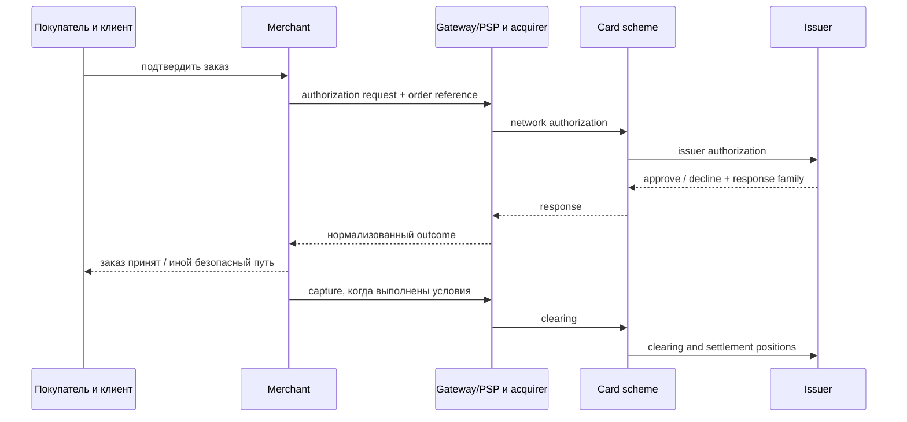
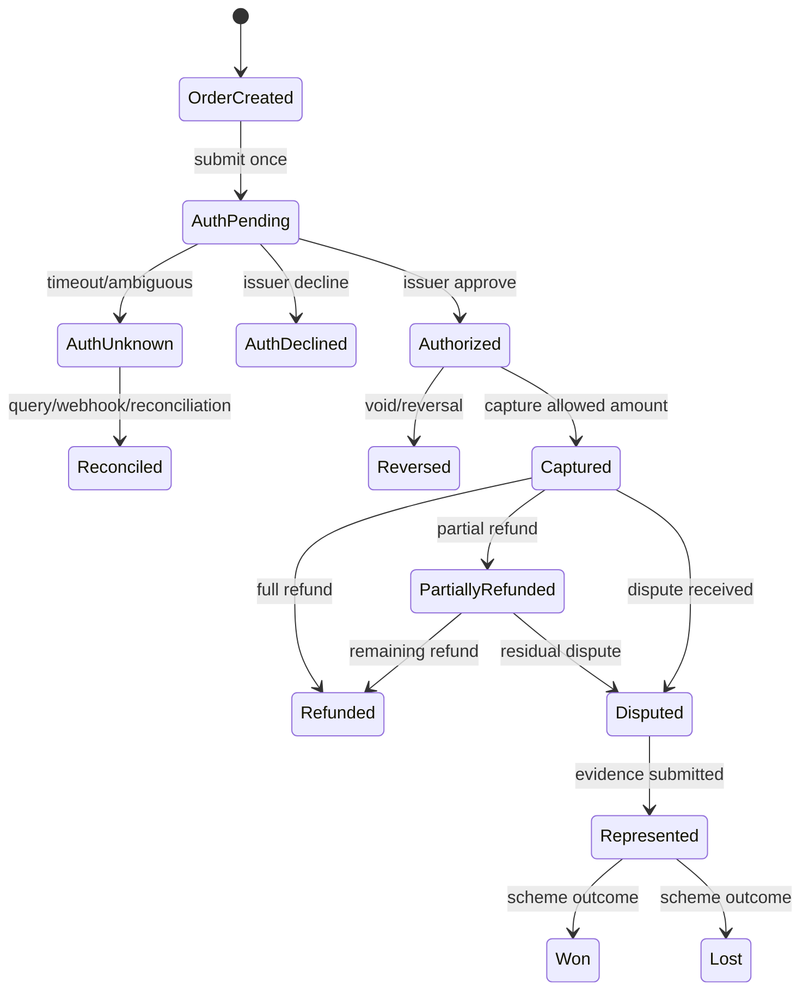
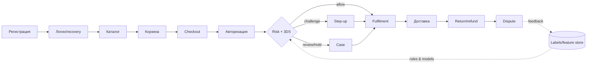
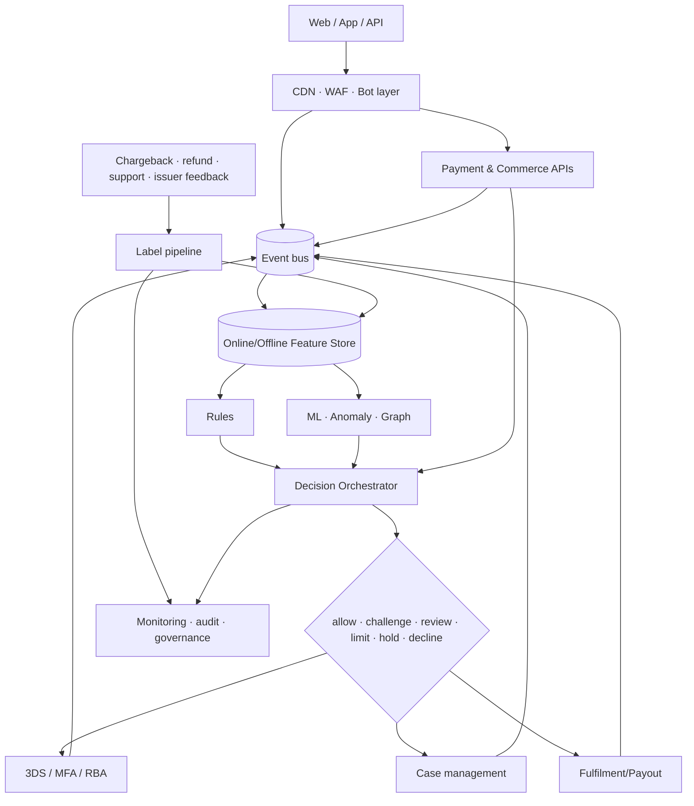
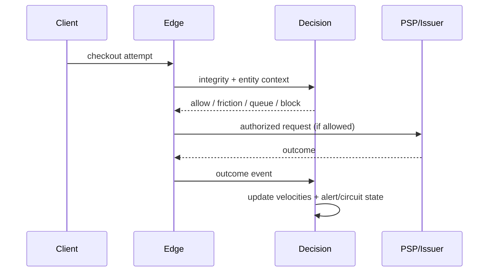

# Как читать эту книгу

Антифрод — не кнопка «заблокировать мошенника», а управляемая система решений при неполной информации. Эта книга ведёт от экономики одного заказа до архитектуры, операций и дорожной карты. Начинайте с глав 1–3, затем выберите свой стек в главе 14 и превратите чек-листы главы 17 в задачи.

**Граница материала.** Руководство исключительно защитное. Модели атак описаны ровно настолько, чтобы распознать риск и поставить контроль. Здесь намеренно нет операционных инструкций по кардингу, card testing, покупке или проверке карт, обходу 3-D Secure (3DS), AVS/CVV, device fingerprinting, антибота, WAF, KYC и лимитов, stealth-настроек или способов повысить «траст» злоумышленника.


## Пять маршрутов чтения

Книга устроена как система, а не как каталог продуктов. Всем читателям полезны главы 1–6 и итоговый аудит готовности; дальше маршрут зависит от роли.

| Роль | Сначала | Затем | Практический результат |
|---|---|---|---|
| Владелец небольшого магазина | 1–3, 7, 12, 15, 18 | профиль малого магазина и emergency baseline | карта убытков, вопросы PSP, минимальный набор контролей и dashboard |
| Product/risk manager | 1–7, 9, 12–14 | сквозной кейс, экономика решений, governance | risk appetite, action policy, roadmap и Definition of Done |
| Разработчик/SRE/security | 2, 4–6, 8, 10–11 | data contracts, payment states, runbooks и тесты | реализуемая архитектура, API, наблюдаемость и безопасная деградация |
| Аналитик/ML/оператор | 4, 7–9, 12–13 | labels, review SOP, граф, ML validation | словарь признаков, очередь cases, модельная карточка и QA |
| Руководитель/аудитор | 1, 7, 12–18 | нормативная карта, RACI, vendor scorecard | решения о бюджете, ответственности, остаточном риске и доказательствах |

Не читайте главы о моделях раньше, чем определены денежные состояния и события. Модель, обученная на неразличимых `authorization failed`, `merchant declined` и `customer abandoned`, автоматизирует путаницу.

## Как устроена каждая глава

Сначала даётся интуиция и русский смысл, затем английский термин и точный контракт. В начале крупных глав сформулирована цель, в конце — «проверьте себя». Таблицы с **владельцем** называют роль, ответственную за результат, а не поставщика технологии. Примеры полностью синтетические: имена, суммы, идентификаторы и события вымышлены.

## Статус утверждений

* **[ОБЯЗ.]** — требование применимого закона, договора или стандарта; применимость подтверждает юрист, эквайер либо QSA.
* **[ПРАКТ.]** — устоявшаяся отраслевая практика, но не универсальная обязанность.
* **[РЕК.]** — авторская рекомендация: её следует проверить экспериментом.
* **[ПРИМЕР]** — реализация конкретного провайдера, не независимый факт и не рекомендация купить продукт.

Ссылки вида **[S12]** раскрыты в `research/SOURCE_LEDGER.md`; трассировка ключевых выводов находится в `research/CLAIM_MAP.md`. Срез — **2026-07-21**. Стандарты, правила платёжных систем и законы меняются: перед внедрением повторно проверьте применимость.

# 1. Деньги, риск и экономика мошенничества

## 1.1 Интуитивная модель

У заказа есть не только выручка. Есть себестоимость товара, доставка, комиссия, стоимость проверки, цена трения для честного клиента и будущая ценность клиента (LTV). Мошеннику нужна воспроизводимая прибыль; защитнику — сделать ожидаемую прибыль атаки отрицательной, не разрушив конверсию.

**Ожидаемая стоимость решения:** `EC(action) = P(fraud | context, action) × fraud loss + P(good | context, action) × false-positive loss + action cost + latency cost`.

где `F` — fraud, `G` — честный клиент, `L_F` — полный убыток от пропущенного fraud, `L_FP` — потеря от ложного отказа, `C_a` — стоимость действия, `x` — наблюдаемые признаки. Выбираем действие с минимальным ожидаемым ущербом, соблюдая закон, правила схем и ограничения сервиса.

**Мини-пример.** Товар стоит 10 000 ₽, валовая маржа 2 500 ₽. При мошенничестве магазин теряет товар, логистику 600 ₽, операционные 400 ₽ и возможную комиссию спора 1 000 ₽: `L_F = 12 000 ₽`, а не маржа. Ложный decline хорошего постоянного клиента может стоить 2 500 ₽ сейчас плюс часть LTV. Поэтому одинаковый risk score может вести к hold для физического товара и к challenge для цифрового.

## 1.2 Кто несёт убыток

| Событие | Возможный прямой носитель | Скрытые последствия |
|---|---|---|
| Неавторизованный платёж | эмитент, эквайер или мерчант — зависит от юрисдикции, аутентификации, правил схемы и доказательств | комиссии, мониторинговые программы, резерв, потеря товара |
| Friendly/first-party fraud | часто мерчант до успешного представления доказательств | support, логистика, репутация |
| ATO | клиент и сервис; распределение зависит от фактов и права | компенсации, recovery, уведомления |
| Refund abuse | мерчант/маркетплейс/продавец | потеря товара и refund, рост ручного труда |
| Merchant abuse | покупатель, эквайер, платформа | регуляторный и репутационный риск |

**Красный флаг:** команда оптимизирует только chargeback rate. Отказы и 3DS могут снизить его, одновременно уничтожив approval rate и LTV.

# 2. Как проходит интернет-платёж

**Цель главы:** научиться отличать решения магазина, банка, 3DS и антибота, видеть денежное состояние заказа и не превращать повторную попытку в источник ущерба.

## 2.1 Участники: одна покупка, несколько систем

Покупатель взаимодействует с **клиентом** — браузером или мобильным приложением. Клиент обращается к серверу **торговца** (merchant). Торговец формирует заказ и через платёжный шлюз либо платёжного провайдера (**gateway/PSP**) отправляет платёж. **Эквайер** (acquirer) обслуживает торговца. **Платёжная система** (card scheme/network) маршрутизирует сообщения и задаёт правила. **Эмитент** (issuer) выпустил карту и решает, разрешить ли авторизацию. Участники могут технически совмещать роли, но ответственность надо определять по договору и фактической функции, а не по логотипу SDK.



Торговец знает аккаунт, корзину, товар, адрес, доставку и историю поведения. Эмитент знает счёт, карту и собственные риски, но не весь контекст магазина. Поэтому `issuer approved` значит «эмитент разрешил сумму в данном сообщении», а не «заказ честный». И наоборот, `issuer declined` не доказывает мошенничество: возможны недостаток средств, ограничение продукта или техническая причина.

## 2.2 Жизненный цикл денег

1. **Авторизация (authorization)** — запрос эмитенту зарезервировать доступность суммы. Успешная авторизация обычно создаёт временный hold на счёте держателя, но ещё не всегда является окончательным списанием.
2. **Capture** — подтверждение торговцем суммы к финансовой обработке. Возможны full/partial capture согласно договору и правилам.
3. **Clearing** — обмен финансовыми данными и расчёт позиционных обязательств.
4. **Settlement** — расчёты между участниками; payout торговцу — отдельное договорное событие и может иметь собственный срок/резерв.
5. **Reversal/void** — отмена неиспользованной или ошибочной авторизации, когда это допускает текущее состояние.
6. **Refund** — отдельное возвращение средств после capture; это не то же самое, что reversal.
7. **Dispute/chargeback** — формальный спор по правилам схемы. Он может вести к списанию, обмену доказательствами и representment.
8. **Representment** — представление эквайером/торговцем доказательств в ответ на спор; дальнейшие стадии и названия scheme-specific.



`AuthUnknown` нельзя автоматически считать decline или повторять. Сначала идемпотентный запрос статуса, webhook и reconciliation: иначе можно создать двойную авторизацию. Hard issuer decline не следует слепо ретраить, менять маршрут или маскировать. Разрешённые retry/dunning для soft/technical outcomes определяет документированная политика PSP, эквайера и схемы; торговец ограничивает число и время попыток, сохраняет исходную причинную цепочку и прекращает повторы при неопределённости.

## 2.3 Семь разных «остановок»

| Механизм | Кто решает | Что означает | Денежное состояние | Что видит клиент |
|---|---|---|---|---|
| Issuer decline | эмитент | авторизация не одобрена | capture невозможен | нейтральное сообщение и допустимые варианты оплаты |
| Merchant risk decline | policy торговца | магазин не принимает риск заказа | авторизация могла не отправляться либо должна быть корректно reversed | безопасное объяснение без раскрытия правил и appeal |
| 3DS challenge | issuer ACS в протоколе 3DS | нужна аутентификация держателя | до/вокруг авторизации по интеграции | интерфейс issuer, затем возврат результата |
| CAPTCHA/bot challenge | edge/bot layer торговца | проверка автоматизации/целостности клиента | денег не касается | доступный альтернативный путь |
| Account MFA/re-auth | сервис торговца | подтверждается управление аккаунтом | денег не касается напрямую | passkey/MFA/recovery сервиса |
| Authorization hold | issuer/accounting | сумма временно зарезервирована | `Authorized`, не fulfilment approval | может отображаться в банке |
| Order/fulfilment hold | торговец | заказ или выдача ожидает review/условия | auth/capture состояние хранится отдельно | срок, статус, поддержка и отмена |

**3DS и account MFA не взаимозаменяемы.** 3DS относится к аутентификации держателя карты в платёжной цепочке. Passkey или MFA сервиса защищает аккаунт магазина. Успех одного не доказывает безопасность другого: захваченный аккаунт может пройти cardholder authentication законным держателем в неподходящем контексте, а безопасный аккаунт не превращает чужую карту в допустимый платёж.

## 2.4 Варианты интеграции

| Способ | Где вводятся платёжные данные | Преимущество | Риск/обязанность |
|---|---|---|---|
| Redirect/hosted checkout | страница PSP | минимальный прямой контакт merchant-систем | проверить redirect integrity, return/webhook state, vendor и PCI scope |
| Iframe/hosted fields | поля PSP внутри страницы | управляемый UX, tokenization | parent page и сторонние scripts всё ещё значимы; SAQ/applicability уточнять |
| Direct API | merchant environment | полный контроль | наибольший PCI/security scope; не выбирать без зрелой программы |
| Wallet | wallet/provider cryptogram/token | меньше ручного ввода, device authentication | корректно различать wallet outcome и merchant risk; не считать гарантией |
| Card-on-file | PSP/network/merchant token | последующие платежи | consent, lifecycle, credential-on-file flags, recovery/ATO risk |

**PSP token** — указатель конкретного провайдера. **Network token** выпускается в экосистеме платёжной сети и имеет domain/lifecycle controls. **PAN hash** — производное от номера; это не платёжный токен, может оставаться персональным/карточным данным и опасен для linkability. Не стройте cross-merchant identity на PAN hash без строгой правовой и PCI-оценки.

Для recurring payments различайте customer-initiated transaction (**CIT**) и merchant-initiated transaction (**MIT**), исходную установку мандата/credential и последующие сообщения. Account updater или lifecycle update помогает обновлять реквизит, но не даёт разрешения на новую покупку и не заменяет consent. Dunning — контролируемое повторное взыскание по договорённой подписке; оно подчиняется scheme/PSP правилам, остановке после hard decline и customer cancellation.

## 2.5 Кто что решает

| Вопрос | Главный источник истины | Антифрод получает |
|---|---|---|
| Существует ли заказ и какова цена? | merchant order service | server-calculated amount, items, version |
| Разрешена ли карта/сумма? | issuer response через цепочку | normalized response family, network reference |
| Пройдена ли 3DS-аутентификация? | 3DS components/issuer | authenticated outcome, protocol/version references |
| Можно ли отдать товар? | merchant risk + fulfilment policy | payment, account, delivery, graph, review outcome |
| Состоялся ли capture/refund? | PSP/acquirer ledger + reconciliation | immutable monetary event |
| Кто выиграл dispute? | scheme/acquirer process | reason/stage/outcome/evidence timestamp |

### Проверьте себя

Вы должны уметь нарисовать для своей интеграции: кто принимает PAN; кто создаёт order ID; где идемпотентность; кто инициирует 3DS; когда capture; что происходит при timeout; где reconciliation; кто снимает order hold. Если ответ «PSP всё делает», запросите точный state contract и ответственность сторон.

# 3. Карта угроз: язык без паники

| Класс | Что происходит на защитном уровне | Наблюдаемые сигналы | Базовые контрмеры |
|---|---|---|---|
| CNP/card fraud | платёж без физического предъявления карты инициирует неуполномоченное лицо | несогласованность аккаунта, устройства, сети, адресов и истории; issuer response | токенизация, RBA/3DS, velocity, hold, подтверждение fulfilment |
| Card testing/enumeration | автоматизированный поток пытается выяснить пригодность реквизитов или существование сущностей | много малых/неуспешных попыток, распределённые связи, всплеск issuer declines | edge bot controls, многомерные velocity, единообразные ответы, circuit breaker [S08][S09] |
| ATO/credential stuffing | переиспользованные учётные данные ведут к захвату аккаунта | новый контекст, login velocity, recovery/change anomalies | passkeys/MFA, breached-password checks, device binding, recovery hardening [S10][S15] |
| Bot abuse | автоматизация захватывает дефицит, контент, промо или checkout | неестественная последовательность и целостность клиента | bot management, очереди, quotas, progressive friction |
| Stolen/synthetic identity | чужая или составная идентичность создаёт доверие/кредит | несогласованность источников, тонкий файл, shared attributes | пропорциональный KYC, документ/источник, граф, ручная проверка |
| Triangulation | покупатель, витрина-посредник и пострадавший мерчант образуют цепочку | повторяющиеся адреса/товары, сторонние контакты, disputes | seller due diligence, graph links, подтверждение доставки |
| Reshipping/mules | промежуточный получатель перемещает товар/деньги | кластер адресов и получателей, смена маршрута | address intelligence, hold, ограничения смены доставки |
| Promotion/referral abuse | формально допустимые действия масштабируются вопреки смыслу акции | связанные аккаунты, устройства, платёжные/доставочные атрибуты | eligibility, graph caps, delayed reward, clawback по условиям |
| Refund/return abuse | возврат денег/товара искажён или дублирован | refund velocity, несоответствие SKU/веса/треков | dual control, refund-to-origin, warehouse evidence |
| Chargeback/friendly fraud | держатель оспаривает распознанную покупку или злоупотребляет спором | история клиента, delivery/use evidence, descriptor confusion | ясный descriptor, receipts, evidence pack, early resolution |
| Gift-card fraud | ликвидный цифровой эквивалент покупают/крадут/обналичивают | высокая скорость, transfer/redemption graph | balance protection, delayed activation, limits, MFA |
| BNPL fraud | риск идентичности и кредита сочетается с payment fraud | новые identities, устройства, repayment links | KYC/credit controls, cross-merchant graph, staged limits |
| Marketplace fraud | злоупотребляет покупатель, продавец или сговор | seller graph, off-platform pressure, payout anomalies | onboarding, escrow/holds, payout risk, content moderation |
| API/payment-link/mobile | злоупотребление бизнес-логикой, ссылками или мобильной средой | token/link reuse, object access, attestation gaps | scoped tokens, API authz, replay defense, app integrity [S11][S12] |
| Social engineering | человек убеждает жертву или оператора выполнить действие | необычное изменение реквизитов, urgency, operator override | out-of-band verification, scripts, cooling-off, training |
| Merchant abuse | недобросовестный продавец не поставляет, маскирует MCC/товар | жалобы, fulfillment gap, резкий payout profile | KYB, reserves, monitoring, suspension, reporting |

Таксономии пересекаются: ATO может закончиться gift-card purchase, а затем refund abuse. Поэтому классифицируйте **событие**, **актор**, **инструмент**, **цель** и **потери** отдельно.

# 4. Fraud journey: защищаем весь путь



| Стадия | Что защищаем | Сигналы | Решение/контроль |
|---|---|---|---|
| Регистрация | уникальность и добросовестность аккаунта | email/phone age и verification, device/account graph, velocity | allow, verify, limit, deny automation |
| Логин | сессию и секреты | failed/success patterns, device binding, IP/ASN risk | passkey/MFA, revoke sessions, notify |
| Recovery | канал восстановления | смена SIM/почты, новый device, support interaction | cooling-off, strong re-auth, dual control |
| Каталог | дефицит и scraping | browse cadence, inventory targeting | queue, per-account quota, bot controls |
| Корзина | промо и business logic | coupon graph, quantity, repeated edits | reserve briefly, eligibility, recalc server-side |
| Checkout | данные заказа | billing/shipping/contact consistency | progressive friction, review, limit |
| Авторизация | платёж | issuer response, token, prior attempts | allow/decline/route законным способом; не повторять слепо |
| 3DS/step-up | аутентификацию | RBA inputs, challenge outcome, exemptions | challenge либо alternate safe path [S05][S06] |
| Fulfilment | необратимость | risk maturity, stock type, delivery channel | hold, split shipment, manual review |
| Доставка | передачу ценности | reroute, proof, recipient mismatch | restrict edits, signed/OTP delivery соразмерно риску |
| Return/refund | деньги и товар | return history, warehouse evidence | refund to original method, dual approval |
| Dispute | доказательства и обучение | reason code, delivery/use/contact history | evidence pack, accept/represent, label correction |

**Принцип обратимости:** чем необратимее действие (мгновенная выдача цифрового кода, payout), тем раньше и сильнее контроль. Авторизация банка не доказывает добросовестность заказа.

# 5. Сигналы: что они значат и чего не доказывают

Один сигнал редко является доказательством. Хорошая комбинация: независимые источники + временной контекст + объяснимое действие.

| Семейство | Полезный смысл | Ограничения/ложные срабатывания | Privacy и безопасная комбинация |
|---|---|---|---|
| Account/identity | возраст, подтверждения, стабильность, история | новый честный клиент выглядит «тонко»; семьи делят данные | минимизация, цель и срок; сочетать с поведением, не с демографическими стереотипами |
| Device/browser integrity | устойчивость контекста, tampering/automation hints | обновления, privacy browsers, shared devices | псевдонимизация, rotation; не считать fingerprint личностью |
| IP/network/ASN | география, hosting/proxy/TOR/VPN reputation | CGNAT, корпоративные VPN, мобильные сети | coarse location, короткий retention; повышать неопределённость, а не автоматически decline |
| Поведение/biometrics | последовательность навигации и взаимодействия | accessibility, возраст, моторные различия; sensitive profiling | DPIA/оценка, агрегация, запрет дискриминации; step-up вместо отказа |
| Velocity | частота по account/device/card-token/address/IP/SKU | распродажи, NAT, call center | окна нескольких размеров, peer baseline, граф; без единственного глобального порога |
| Payment/order | сумма, корзина, BIN country, issuer outcome, token history | путешествия, подарки, cross-border | не хранить лишний PAN; сочетать с customer history |
| Shipping | расстояние, reroute, pickup, повторное использование | офисы, общежития, forwarding legitimate | нормализация адреса, graph degree, delivery evidence |
| Email/phone | verification, tenure/reputation, change events | recycled numbers, aliases, новые домены | consent/legal basis, не передавать raw data без необходимости |
| Graph/link analysis | общие сущности и кольца | домохозяйства и корпоративные адреса создают hubs | типизированные рёбра, time decay, исключения legitimate hubs, analyst explanation |
| Consortium data | внешний опыт по сущности | непрозрачные labels, разные рынки, stale data | договор, provenance, dispute/correction, локальная валидация |

## 5.1 Качество признака

Для каждого признака заведите паспорт: определение, владелец, источник, event time и processing time, freshness, missing semantics, допустимые значения, PII-класс, retention, offline/online parity, known bias, мониторинг. Значение `missing` не равно `false`: отсутствие AVS в регионе не означает mismatch.

## 5.2 Граф без магии

Узлы: account, device pseudonym, payment token, address, phone, order, seller. Рёбра: «использовал», «доставил», «получил payout» с временем и типом. Полезны degree, число новых соседей, компоненты, motifs и расстояние до подтверждённого fraud. Снижайте вес старых связей; исключайте легитимные hubs (отель, офис); позволяйте аналитику увидеть путь объяснения.

# 6. Эталонная real-time архитектура



## 6.1 Контракты и отказоустойчивость

**[РЕК.] Decision API** принимает `event_id`, event time, customer/order references, контекст и purpose; возвращает decision, reason codes, policy/model versions, expiry и correlation ID. Идемпотентность предотвращает двойные решения. Денежные значения — integer minor units + currency.

Определите fail-safe по операции: при недоступности антифрода низкорисковый просмотр может fail-open, payout и дорогой цифровой товар — hold/fail-closed. Нужны таймаут, bulkhead, circuit breaker, деградационная policy и очередь повторной оценки. Логи решений неизменяемы и не содержат секретов/PAN.

## 6.2 Слои

1. **Edge/WAF/bot:** volumetric и protocol defense, client integrity, rate policy. WAF не знает весь бизнес-контекст.
2. **События:** единая схема и часы, server-side facts, consent/purpose metadata.
3. **Feature store:** одинаковое вычисление online/offline, freshness и point-in-time joins.
4. **Rules:** точные политики, аварийные controls, compliance gates.
5. **Models/anomaly/graph:** ранжируют неопределённость; не заменяют ограничения.
6. **Orchestrator:** выбирает действие и управляет конфликтами.
7. **3DS/RBA/step-up:** получает минимально нужный контекст и возвращает outcome.
8. **Case management:** очередь, SLA, evidence, dual control.
9. **Feedback:** disputes, refunds и outcomes с задержкой, качеством и provenance.
10. **Monitoring/audit:** бизнес-, fairness-, drift-, latency- и security-наблюдаемость.


## 6.3 Реализуемая модель данных

**Цель раздела:** дать команде минимальный общий язык, из которого можно построить stream processing, признаки, аудит и reconciliation без PAN/CVV.

### Словарь сущностей

| Сущность | Устойчивый ключ | Владелец | Чувствительные поля | Важные связи |
|---|---|---|---|---|
| Customer/account | внутренний random ID | identity service | контакты, status, recovery | sessions, orders, authenticators |
| Session | random opaque ID | auth service | auth strength, timestamps | account, device pseudonym |
| Device context | rotating pseudonym | risk/client integrity | browser/app integrity signals | sessions, attempts; не «личность» |
| Order | merchant order ID | order service | товары, контакты, адрес | customer, payment attempts, shipment |
| Payment attempt | unique attempt ID | payment service | PSP token reference, outcome | order, auth, 3DS, capture |
| Payment instrument reference | PSP/network token alias | vault/PSP | token metadata; никогда CVV | attempts/accounts graph |
| Shipment/entitlement | fulfilment ID | fulfilment | адрес/получатель или digital entitlement | order, evidence, returns |
| Refund | refund ID | finance/payment | amount/reason/approver | capture, return, operator |
| Dispute | case/network reference | disputes team | reason, evidence, outcome | payment/order/customer |
| Risk decision | decision ID | decision platform | features references, reasons | event, policy/model versions |
| Case | case ID | operations | notes/evidence pointers | decisions, analyst, outcome |

Ключи наружу должны быть непредсказуемыми. Raw email/phone/address живут в ограниченном PII vault или исходной системе; антифрод получает нормализованные либо псевдонимизированные представления по цели. Токенизация не отменяет access control и retention.

### Канонический конверт события

Все доменные события используют один envelope. Payload меняется по `event_type`, но смысл полей фиксирован schema registry. Событие — факт в прошедшем времени, а не команда. Пример не содержит PAN, CVV, полного адреса или секретов:

```json
{
  "event_id": "evt_01J_SYNTHETIC_0001",
  "event_type": "payment.authorization.completed",
  "schema_version": "2.1.0",
  "occurred_at": "2026-07-21T10:15:31.412Z",
  "ingested_at": "2026-07-21T10:15:31.690Z",
  "producer": "payment-service",
  "tenant_id": "shop_demo",
  "correlation_id": "corr_demo_order_4711",
  "entities": {
    "account_id": "acc_demo_84",
    "order_id": "ord_demo_4711",
    "payment_attempt_id": "pay_demo_03",
    "instrument_ref": "tokref_demo_rotating"
  },
  "payload": {
    "amount_minor": 129900,
    "currency": "RUB",
    "outcome": "approved",
    "response_family": "approved",
    "three_ds": {"status": "authenticated", "protocol": "2.3.1.1"}
  },
  "privacy": {"class": "restricted", "purpose": "fraud_prevention", "retention_policy": "risk_events_v3"}
}
```

`occurred_at` — когда факт произошёл в домене. `ingested_at` — когда платформа его получила. **Decision time** — cutoff, после которого признаки не могли влиять на конкретное решение. Храните также processing time для диагностики. Большая разница показывает задержку; событие, пришедшее позже decision time, годится для labels и последующих решений, но не должно «путешествовать назад» в offline training join.

### Decision API

```json
{
  "request_id": "req_demo_9001",
  "idempotency_key": "risk:checkout:ord_demo_4711:v4",
  "event_ref": "evt_demo_checkout_9001",
  "decision_point": "pre_fulfilment",
  "occurred_at": "2026-07-21T10:15:32.000Z",
  "entities": {"account_id": "acc_demo_84", "order_id": "ord_demo_4711"},
  "context": {"amount_minor": 129900, "currency": "RUB", "product_profile": "physical_standard"}
}
```

```json
{
  "decision_id": "dec_demo_5521",
  "request_id": "req_demo_9001",
  "action": "hold",
  "state": "awaiting_review",
  "expires_at": "2026-07-21T10:45:32Z",
  "reason_codes": ["NEW_RELATIONSHIP", "LINK_REQUIRES_REVIEW"],
  "customer_fallback": "support_or_cancel",
  "versions": {"policy": "checkout-17", "model": "order-risk-8", "features": "online-42"},
  "decided_at": "2026-07-21T10:15:32.041Z"
}
```

API возвращает stable machine codes, не prose и не скрытые attacker-facing details. Повтор с тем же idempotency key и тем же payload возвращает тот же logical decision. Тот же ключ с другим payload — ошибка конфликта. TTL имеет владельца и terminal fallback: истёкший hold не может висеть бесконечно.

### Payment и order state machines

Payment state и order state разделены. `Authorized` не переводит заказ автоматически в `Fulfilled`. Пример допустимых переходов:

| Из состояния | Событие | В состояние | Guard |
|---|---|---|---|
| order.created | risk allow | order.accepted | current version, no active hold |
| order.created | risk hold | order.held | reason, owner, expiry required |
| order.held | analyst release | order.accepted | RBAC, evidence, decision version |
| order.held | expiry | order.cancelled или fallback review | product policy; customer notification |
| payment.auth_pending | PSP approve | payment.authorized | dedup by PSP/network reference |
| payment.auth_pending | hard decline | payment.declined | no blind retry |
| payment.auth_pending | timeout | payment.unknown | reconciliation before new attempt |
| payment.authorized | capture command | payment.captured | amount ≤ authorized and order eligible |
| payment.captured | refund command | payment.partially_refunded/refunded | idempotency, amount remaining, approval |

Команда создаёт намерение, событие подтверждает факт. Webhook не принимается на доверии: signature, freshness, replay/dedup и допустимый переход. Состояние нельзя «перепрыгнуть» только потому, что клиент прислал `paid=true`.

### Идемпотентность, dedup, replay и reconciliation

* **Idempotency** предотвращает повторный эффект одной команды. Scope включает merchant, operation и business object; срок покрывает максимальную неопределённость.
* **Deduplication** распознаёт повторную доставку события по `event_id` и provider reference. Exactly-once transport не заменяет exactly-once business effect.
* **Replay** нужен для восстановления stream projection и historical evaluation. Consumer детерминирован, schema version известна, side effects отключаются либо защищены отдельным ключом.
* **Reconciliation** сравнивает merchant ledger с PSP/acquirer reports: missing capture, duplicate, unknown authorization, refund mismatch. Разница создаёт case, а не молчаливую правку прошлого.
* **Ordering** нельзя предполагать глобально. Используйте sequence/version внутри entity; позднее событие либо корректно применимо, либо попадает в quarantine.

### Матрица качества данных и отсутствия

| Поле/признак | Проверка | Значение missing | Деградация | Alert/owner |
|---|---|---|---|---|
| event time | parse, future/old bound, clock skew | producer failure | processing-time feature только если разрешено | SRE + producer |
| instrument reference | format, vault lookup | payment path/region may not supply | не строить token velocity; повысить uncertainty | payments |
| 3DS outcome | enum + protocol | не применялся, не завершён или integration gap — разные enums | scheme/market policy | payments/risk |
| device context | freshness, SDK version | privacy/accessibility/web fallback | не считать suspicious; использовать account/order | client platform |
| issuer response | mapping coverage | timeout/unknown, не decline | payment unknown + reconciliation | payments |
| address graph | normalization version | digital/no shipping или failure | product-specific feature off | fulfilment/data |
| model score | range/version/freshness | service/model unavailable | documented fallback policy | ML/SRE |
| dispute label | source/reason/maturity | censored/not yet observed | exclude from mature good set | disputes/data |

Missingness может сама коррелировать с каналом, но сначала устраняют instrumentation failure. Нельзя наказывать пользователей за privacy setting, если продукт обещает его поддержку.

### Online/offline parity

Feature definition задаётся один раз: имя, тип, entity, event-time window, filter, aggregation, freshness, missing value, privacy class и version. Offline materialization использует point-in-time cutoff. Online store хранит value + computed_at + source watermark. Перед release сравнивайте пары `(entity, decision_time)` на историческом replay: значение, missingness и rounding. Разница выше tolerance блокирует rollout.

Паритет не значит одинаковое хранилище. Online оптимизирован на latency, warehouse — на историю. Контракт одинаков, реализации сверяются. Backfill никогда не меняет то, что «видела» старая модель: старое решение хранит feature snapshot/reference и version.

## 6.4 Расширенная архитектура и доступность

| Компонент | Назначение | Отказ | Защита/доказательство |
|---|---|---|---|
| Edge/API gateway | protocol, authn/z, bot/capacity | overload or bypass | config version, request correlation, rate telemetry |
| Schema registry/stream | contracts and delivery | malformed/late/lag | compatibility gates, DLQ, watermark |
| Online feature store | fresh counters/features | stale/unavailable | freshness per feature, regional replica |
| Offline store/warehouse | labels/training/replay | late partition/backfill | immutable raw zone, lineage, point-in-time tests |
| Policy/rule store | approved decision logic | bad rollout | signed version, shadow/canary, kill switch |
| Model registry/serving | scores/model cards | latency/drift | champion fallback, artifact hash |
| Graph/entity resolution | typed links | false merges/stale edges | provenance, time decay, hub exceptions |
| PII/token vault | restricted resolution | breach/unavailable | encryption, JIT access, audit, minimised cache |
| Immutable decision log | why/what/version | audit gap | append-only, integrity, retention/legal hold |
| Case management | human review | queue overload | SLA priority, RBAC, dual control |
| Reconciliation | monetary truth | mismatch backlog | daily/intraday reports, owner, ageing |
| Observability | service/data/business health | blind spot | independent alerts and synthetic probes |

| Flow | Default outage posture | Queue limit | Recovery rule |
|---|---|---|---|
| browse/search | fail-open with edge safety | shed expensive features | no retroactive block |
| registration/login | degraded allow or account step-up by risk | bounded auth queue | revoke anomalous sessions if evidence emerges |
| payment authorization | do not invent result; payment `unknown` | provider limits | reconcile before retry |
| physical fulfilment | bounded hold for material risk | capacity tied to SLA | release/cancel with customer notice |
| instant digital/gift value | fail-closed or short queue according to policy | strict expiry | human/strong step-up or cancel |
| refund/payout | fail-closed/dual approval | finance-owned queue | reconcile before release |

HA требует не только второй сервер: feature freshness, policy version, keys, stream offsets и payment state должны согласовываться. Региональный failover без token vault или актуальных counters может дать формально зелёный endpoint с опасным решением. Тестируйте целый decision path.

# 7. Решения и risk-based step-up

| Действие | Когда уместно | Цена ошибки | Guardrail |
|---|---|---|---|
| Allow | риск и неопределённость малы | fraud loss | post-event monitoring; лимит необратимости |
| Challenge | идентичность можно подтвердить | abandonment/friction | доступный альтернативный путь; не зацикливать |
| Review | машина не видит важный контекст | очередь и задержка | SLA, приоритет по expected loss, reason codes |
| Limit | риск растёт с объёмом/скоростью | недополученная выручка | ясное восстановление, time-bound |
| Hold | ценность ещё обратима | fulfilment delay | expiry, уведомление, владелец release |
| Decline | риск/запрет высок и альтернативы нет | false positive и trust | общий безопасный текст; appeal/recovery |

### Матрица «сигнал × действие × цена ошибки»

| Комбинация | Предпочтение | Почему | Что проверить |
|---|---|---|---|
| Новый device + привычный аккаунт + низкая сумма | allow или мягкий step-up | device change сам по себе слаб | recovery/change events |
| Новый аккаунт + связанный fraud graph + мгновенный товар | hold/review/decline по policy | необратимость и сильная связь | legitimate shared hub |
| Hosting ASN + успешная сильная auth + стабильная история | не auto-decline; limit/monitor | network signal неоднозначен | session integrity |
| Резкий refund velocity + новый оператор | hold + dual review | insider/process risk | системный сбой/кампания |
| Распределённый authorization failure spike | queue/circuit breaker + issuer-aware control | защищает PSP/issuer и данные | outage, BIN-level incident |

Политика конфликта: обязательный запрет выше модели; затем incident controls; затем risk decision. Challenge не должен превращать несогласие модели в бесконечную стену.

# 8. Правила и velocity controls

## 8.1 Жизненный цикл правила

`proposal → peer review → simulation → shadow → canary → active → monitor → retire`.

Каждое правило имеет ID, гипотезу, owner, scope, версию, start/end, источники, действие, reason code, expected impact, kill switch и rollback. Изменения проходят four-eyes; emergency rule автоматически истекает.

**Синтетический защитный пример:** «если за короткое окно для одного payment token наблюдается аномальное число разных account, а за более длинное окно растёт доля отказов авторизации, отправить поток в progressive friction и alert». Числа намеренно определяются вашей базовой линией, а не публикуются как универсальный порог.

## 8.2 Velocity правильно

* считайте по нескольким сущностям и их связям, а не только IP;
* используйте короткие и длинные окна, seasonal baseline и event time;
* разделяйте `attempt`, `authorization`, `capture`, `refund`;
* храните distinct counts и доли outcomes;
* защищайте counters от race conditions и retry duplication;
* наблюдайте matched, acted, incremental fraud caught, false positives, latency;
* выключайте правило автоматически при budget breach.

**Anti-pattern:** сотни перекрывающихся правил без attribution. Решение — decision trace и holdout там, где это этично и безопасно.

# 9. ML без магии

## 9.1 Labels и задержка

Chargeback приходит спустя недели или месяцы; отсутствие chargeback сегодня не равно good. Храните `label_observed_at`, reason, source и confidence. Разделяйте unauthorized fraud, first-party fraud, policy abuse и operational error. Используйте maturity window; не обучайте на незрелых «хороших» заказах.

**Leakage:** признак содержит будущее, например итог спора при оценке checkout. Делайте point-in-time join: модель видит только то, что существовало в момент решения. Feedback решения тоже создаёт selection bias: declined заказ не показывает контрфактический outcome.

## 9.2 Дисбаланс и метрики

Accuracy бесполезна: при fraud 0,2% модель «всё good» имеет 99,8%. Смотрите:

* `precision = TP/(TP+FP)` — доля fraud среди срабатываний;
* `recall = TP/(TP+FN)` — найденная доля fraud;
* PR-AUC — качество ранжирования редкого класса;
* approval/false-positive rate по сегментам;
* expected cost/profit на выбранных действиях;
* calibration: среди score 0,10 действительно около 10% целевого outcome.

Калибруйте на свежем representative наборе. ROC-AUC можно показать дополнительно, но он скрывает цену большого числа FP при редком fraud.

## 9.3 Cost-sensitive решения

Модель выдаёт вероятность, policy переводит её в действие с учётом суммы, маржи, обратимости и цены friction. Порог не один: challenge и decline имеют разные cost curves. Проверяйте sensitivity к ошибке в cost assumptions.

## 9.4 Evaluation

1. Time-based train/validation/test, без случайного перемешивания будущего в прошлое.
2. Offline: PR curves, calibration, сегменты, latency replay.
3. Shadow: новый challenger ничего не решает.
4. Canary: малый контролируемый трафик с guardrails.
5. Champion–challenger и rollback.
6. Online: incremental loss, approvals, customer contacts, зрелые labels.

Мониторьте data quality, feature drift, score drift, calibration drift и concept drift. Drift — сигнал расследовать, не автоматическое доказательство атаки.

## 9.5 Explainability, fairness, adaptation

Reason codes должны объяснять действие оператору без раскрытия защитной логики клиенту. Проверяйте disparate impact по законно допустимым сегментам; не используйте protected attributes как удобные proxies. Ограничьте доступ к model artifacts. Предполагайте, что противник адаптируется: меняйте набор независимых сигналов и проверяйте controls на синтетическом purple-team стенде.

Graph ML полезен для колец, но наследует ошибки связей. Начинайте с понятных graph features; затем сравните GNN с простым baseline по incremental value, latency и объяснимости.

# 10. Платёжная и account security

## 10.1 3DS2 и RBA

EMV 3-D Secure передаёт данные между 3DS Server, Directory Server и Access Control Server; issuer выполняет risk-based authentication и при необходимости challenge [S05]. **[ПРАКТ.]** Передавайте качественные, правдивые данные; используйте challenge соразмерно риску и требованиям рынка. 3DS не заменяет merchant fraud controls: аутентифицированный пользователь может злоупотреблять собственным аккаунтом, а fulfillment risk остаётся.

В Европейской экономической зоне Strong Customer Authentication и exemptions регулируются PSD2/RTS; применение и liability нельзя сводить к лозунгу «3DS = liability shift» [S24]. Сверяйтесь с эквайером и правилами каждой схемы.

## 10.2 Tokenization, network tokens, CVV/AVS

Токен снижает распространение PAN; network token может быть связан с merchant/device и обновляться жизненным циклом сети. Это уменьшает exposure, но украденная активная сессия всё ещё опасна. **[ОБЯЗ.]** PCI DSS запрещает хранить sensitive authentication data после авторизации, включая card verification code, даже в зашифрованном виде [S01]. AVS доступен не везде и даёт match/mismatch/unknown, а не доказательство личности. CVV/AVS — сигналы и controls, не самостоятельная стратегия.

**PCI scope reduction:** hosted fields/redirect/tokenization могут уменьшить область, но не отменяют ответственности. Для e-commerce PCI DSS 4.0.1 требования 6.4.3 и 11.6.1 требуют управления/инвентаризации/авторизации payment-page scripts и механизма обнаружения несанкционированных изменений; точная применимость зависит от SAQ/архитектуры [S01][S03].

## 10.3 Passkeys, MFA, binding и recovery

WebAuthn использует origin-bound public-key credentials и помогает против phishing; FIDO passkeys улучшают пользовательский путь [S14][S15]. Поддерживайте несколько аутентификаторов, безопасную регистрацию нового и отзыв старого. Device binding — связь ключа/приложения с аккаунтом, но migration и accessibility требуют recovery.

Recovery часто слабее login. Требуйте strong re-auth для смены payout/payment/recovery attributes; уведомляйте старые каналы; вводите cooling-off для необратимых действий; защищайте операторский override dual control. NIST SP 800-63B-4 задаёт актуальные требования к authenticator management и phishing-resistant options [S13].

## 10.4 Secure APIs

* OAuth/OIDC scopes и audience, короткоживущие tokens; mTLS/подпись где модель угроз требует.
* Проверка object- и function-level authorization на сервере [S11].
* Idempotency key, nonce/timestamp/replay protection для денежных команд.
* Сервер вычисляет сумму, скидку, получателя и состояние; клиент не источник истины.
* Secrets не в mobile/web bundle и логах; key rotation и least privilege.
* Webhook signature, freshness, deduplication и state-machine validation.

# 11. Bot management и защита от card testing

OWASP относит carding и credential stuffing к automated threats [S08][S09]. Защита слоистая:

1. **Edge:** capacity limits, WAF/protocol validation, reputation как слабый сигнал.
2. **Client integrity:** tamper/automation indicators с graceful fallback для accessibility/privacy.
3. **Entity/graph velocities:** account, session, device pseudonym, token, address, BIN/issuer aggregate и связи.
4. **Progressive friction:** задержка, очередь, challenge или re-auth растут с уверенностью; честному клиенту есть путь восстановления.
5. **Payment orchestration:** не превращать retries в amplifier; учитывать issuer/BIN-level всплеск, idempotency и безопасный backoff.
6. **Circuit breaker:** временно ограничить наиболее вредную операцию, сохранив просмотр/поддержку.
7. **Observability:** attempt→auth outcome funnel, decline families, issuer concentration, unique entities, edge-to-PSP correlation.

Не публикуйте фиксированные пороги. Выводите их из нормального профиля и защищайте конфигурацию. Единообразные ответы и timing уменьшают enumeration; наружу — correlation ID, внутрь — точная причина. Координируйтесь с PSP/эквайером: массовые попытки вредят всей цепочке.



# 12. Метрики и экономика

## 12.1 Канонические определения

Определите numerator, denominator, event time, maturity и currency.

* `fraud rate = confirmed fraud amount / eligible processed amount`;
* `chargeback rate` — считать ровно по определению схемы/эквайера: denominators и окна различаются;
* `approval rate = approved auth attempts / eligible auth attempts` (очищайте технические повторы);
* `false-positive rate = good orders declined / all mature good orders` — наблюдается неполно;
* `review rate`, `review yield`, `review SLA breach`;
* `loss per order = mature fraud loss / eligible orders`;
* `3DS challenge rate`, completion, abandonment и post-auth fraud;
* dispute win rate — отдельно submitted и eligible, по зрелым исходам;
* p50/p95/p99 decision latency и timeout rate.

**Expected net value заказа:**

`revenue − COGS − payment − fulfilment − review − expected fraud/dispute loss − expected friction/LTV loss`.

## 12.2 Пример dashboard

| Панель | Срезы | Guardrail |
|---|---|---|
| Authorization funnel | issuer/BIN country, PSP, device, new/returning | approval и technical error |
| Fraud & disputes | cohort week, reason, product, delivery | maturity coverage |
| Decisions | policy/model version, reason, action | FP proxy, overturn rate |
| 3DS | frictionless/challenge/outcome | abandonment, latency |
| Ops | queue, age, analyst, decision | SLA, QA disagreement |
| System | API p95/p99, timeouts, feature freshness | fail-open/closed counts |
| Customer | contacts, appeals, repeat purchase | segment fairness/LTV |

Показывайте абсолютные числа рядом с процентами. Сравнивайте cohort по моменту покупки, а не только дату получения chargeback.

# 13. Anti-fraud operations

## 13.1 Роли и контроль доступа

| Роль | Ответственность |
|---|---|
| Product/risk owner | risk appetite, экономика, приоритеты |
| Fraud analyst | cases, patterns, rules proposal |
| Data/ML | features, evaluation, models, monitoring |
| Engineering/SRE | decision platform, reliability, deployment |
| Security | app/API/bot security, incident response |
| Payments/finance | PSP, reconciliation, disputes |
| Legal/privacy/compliance | basis, notices, DPIA, rights, retention |
| Support/fulfilment | customer verification и evidence |
| Internal audit/QA | независимая проверка governance |

Least privilege, just-in-time access, masked data, session logging, no bulk export по умолчанию. Rule/model deploy и крупный refund/payout — разделение обязанностей.

## 13.2 Manual review

Очередь сортируется по expected avoidable loss и SLA, а не только score. Case view показывает timeline, source freshness, graph с legitimate-hub warnings, reason codes и policy. Аналитик выбирает из стандартных outcomes, фиксирует evidence, confidence и комментарий; нельзя копировать PAN/документы в свободный текст.

QA: случайная слепая повторная проверка, disagreement review, analyst-level bias/throughput без «гонки кликов». Feedback аналитика не становится ground truth автоматически.

## 13.3 Incident response

`detect → triage → contain → preserve → coordinate → recover → learn`.

* Назначьте incident commander и каналы с PSP/эквайером/security/privacy.
* Зафиксируйте временную линию, версии rules/models, samples и decision IDs.
* Containment должен иметь owner, expiry и customer fallback.
* Не уничтожайте evidence; соблюдайте retention/legal hold.
* После восстановления отделите attacker adaptation, outage и data-quality incident.

Purple-team выполняет только синтетические сценарии в изолированной среде: нагрузка, replay, stale features, compromised account simulation, review social-engineering drill. Никаких реальных карт/чужих аккаунтов.

## 13.4 Privacy и регулирование РФ

**[ОБЯЗ.]** 152-ФЗ требует законной цели, соразмерности и безопасности обработки персональных данных; конкретные обязанности зависят от роли, данных и трансграничной передачи [S31]. При автоматизированном решении с юридическими последствиями проверьте статью 16 и обеспечьте предусмотренные законом объяснение/возражение. Локализацию данных граждан РФ и уведомления Роскомнадзора оцените с юристом по действующей редакции.

**[ОБЯЗ.]** Для переводов денежных средств 161-ФЗ и акты Банка России устанавливают обязанности операторов, включая противодействие операциям без добровольного согласия клиента; с 25 июля 2024 действуют дополнительные нормы о признаках и базе данных Банка России, а актуальный перечень признаков следует брать с официальной страницы регулятора [S27][S28][S29]. Для участника НСПК действуют правила платёжной системы «Мир» и бюллетени — договорные документы, которые надо получать в актуальной редакции через НСПК [S30].

Не смешивайте: PCI DSS защищает платёжные данные; privacy law — права и законность обработки; anti-fraud law/rules — обязанности конкретного участника. Выполнение одного не означает выполнение остальных.

# 14. Governance и безопасная эксплуатация

**Rule/model registry:** owner, purpose, data, version, approvals, validation, limitations, effective dates, rollback, dependent services. Изменение risk appetite утверждает бизнес и risk; технический deploy не должен незаметно менять политику.

**Audit trail:** входные references (не секреты), feature timestamps, решение, scores, reasons, versions, overrides, actor и final outcome. Retention — не «навсегда»: матрица по цели, закону, схеме и спору; автоматическое удаление и legal hold.

**Release gates:** schema compatibility; point-in-time correctness; offline/online parity; latency budget; segment metrics; privacy/security review; shadow/canary; alert/rollback; runbook. Emergency change получает постфактум review и expiry.

# 15. Три целевых стека

## 15.1 Маленький магазин

* Hosted checkout/fields у надёжного PCI-совместимого PSP; не принимать PAN на свой сервер.
* PSP fraud tooling + 3DS, базовые server-side order/velocity rules.
* MFA/passkeys для админов, сильный recovery, WAF/CDN managed layer.
* Ручная очередь дорогих/необратимых заказов; refund только исходным способом.
* Еженедельный dashboard: approval, fraud/dispute, review, support и latency.

Не стройте ML: сначала качественные события, reconciliation, правила и feedback.

## 15.2 Растущий e-commerce

Добавьте event bus, online counters, feature registry, decision orchestrator, case system, graph features, shadow models, bot management, multi-PSP observability и formal governance. Держите vendor score как один вход, а финальную policy — у себя.

## 15.3 Крупный marketplace/fintech

Разделяйте buyer, seller, payment, payout, AML/compliance и platform-abuse решения, но связывайте их типизированным графом. Нужны high-availability feature platform, real-time graph, experiment governance, region/data residency, модельный риск, 24×7 operations, insider-risk controls, consortium interfaces и независимая валидация.

## 15.4 Build vs buy

| Критерий | Buy сильнее, если… | Build сильнее, если… |
|---|---|---|
| Скорость | нужен быстрый baseline | уникальная логика уже формализована |
| Данные | полезна внешняя сеть | богатый proprietary journey |
| Команда | мало специалистов | есть 24×7 engineering/data/risk |
| Контроль | стандартные workflows | нужна точная latency/policy/data residency |
| Стоимость | объём мал/средний | scale оправдывает полную TCO |

Часто выигрывает hybrid. Считайте TCO: лицензия, integration, review, false positives, egress, retraining, exit. Проверяйте data ownership, sub-processors, retention/deletion, explainability, SLA, portability, incident notification и возможность shadow/holdout. Маркетинговый «AI catches X%» без denominator, maturity и независимого теста — не доказательство.

# 16. Безопасные кейсы и anti-patterns

### Кейс A: распределённый всплеск отказов

Симптом: edge traffic умеренный, но authorization failures растут по множеству IP и сходятся на связанных сущностях. Команда включает graph velocity, progressive queue и circuit breaker на рискованный путь, координируется с PSP, оставляет browsing доступным. После инцидента исправляет retry amplification. **Урок:** per-IP limit недостаточен.

### Кейс B: «идеальная» модель ухудшила бизнес

Offline ROC-AUC вырос, но approval упал у новых клиентов. Причины: незрелые good labels и leakage из post-order признака. Команда восстанавливает champion, делает time split, PR/calibration/cost evaluation и canary. **Урок:** metric не равна ценности.

### Кейс C: refund insider/process anomaly

Refund rate растёт у нового operator credential. Hold и dual approval предотвращают необратимые выплаты; расследование находит ошибочную автоматизацию, не злой умысел. **Урок:** control должен допускать operational cause.

### Частые провалы

* blacklist как вечная истина; IP/VPN или страна как единственная причина decline;
* «успешный 3DS значит безопасно»;
* хранение CVV или PAN «для антифрода»;
* CAPTCHA на каждом шаге, недоступная честным пользователям;
* повтор авторизации без идемпотентности/backoff;
* обучение на analyst decisions как ground truth;
* одна метрика и отсутствие cohort maturity;
* правило без owner/expiry/kill switch;
* vendor score без локальной проверки и права на объяснение;
* чрезмерный сбор device/behavior данных «на всякий случай»;
* раскрытие точной причины и порога наружу;
* автоматический refund на новый платёжный инструмент.


# 17. Сквозной синтетический кейс

**Цель главы:** соединить события, признаки, решения, людей, деньги и обучение. Компания «Северный сад» вымышлена; она продаёт физические товары и цифровые сертификаты.

## 17.1 Нормальный заказ

Анна, существующий клиент, входит с passkey, кладёт обычный товар в корзину и оплачивает сохранённым PSP token. Сервер создаёт `order.created`, затем `checkout.submitted`. Адрес новый, потому что это подарок; device context обновился после обновления браузера. Эти два сигнала повышают неопределённость, но история аккаунта стабильна, сессия аутентифицирована phishing-resistant способом, сумма типична, граф адреса не связан с подтверждённым злоупотреблением.

Online features на decision time: возраст отношений, успешные предыдущие доставки, число новых адресов в контекстном окне, свежесть re-auth, token/account stability, товарная обратимость. Rule engine проверяет запреты и state invariants; модель ранжирует риск; граф добавляет объяснимый `no_known_adverse_path`. Orchestrator возвращает `allow` с policy/model versions. PSP проводит 3DS/RBA и авторизацию. Магазин получает approve, выполняет capture по своей fulfilment policy и отправляет товар.

Доставка создаёт proof event. Через maturity window заказ получает label `good_observed` с оговоркой о цензурировании: это не вечная истина, а отсутствие известного fraud до даты. Пример важен тем, что «новый адрес» и «обновлённый browser» не стали автоматическими отказами.

## 17.2 Defensive card-testing incident

В другой день monitoring видит изменение funnel: растут checkout/payment attempts и доля отказов авторизации, а число реальных созданных корзин и успешных заказов не растёт пропорционально. Поток распределён по сетям, поэтому per-IP график выглядит умеренно. Entity graph показывает необычно много попыток, сходящихся на повторяемых merchant-side сущностях и product path. Никакие реквизиты карт аналитикам не показываются.

Сначала IC проверяет ложные объяснения: PSP status, mapping новых issuer responses, campaign traffic, release checkout, retry bug, clock skew и delayed webhooks. Reconciliation подтверждает: двойных merchant commands нет, а попытки действительно новые. Containment применяет progressive friction на risk path, bounded queue перед дорогой authorization operation, graph velocities и circuit breaker для сегмента с наиболее высокой уверенностью. Browsing и обычные покупки стабильных клиентов сохраняются. PSP и эквайеру отправляют временной диапазон, merchant IDs, correlation/network references и агрегированные outcomes — не CVV и не выгрузку лишнего PAN.

Displacement monitoring ищет смещение к регистрации, payment links, mobile endpoint, другой товарной категории и refund path. После стабилизации controls снимаются ступенчато. Postmortem находит две contributing causes: edge telemetry не связывалась с PSP outcome и один клиентский retry создавал новый attempt ID до получения reconciliation. Исправления: единый correlation chain, payment `unknown` state, graph feature, expiry аварийного правила и синтетический regression test.

## 17.3 ATO и recovery

Почти одновременно support получает обращение о потере доступа. Login telemetry показывает новый session context после серии неуспешных входов; затем попытку заменить authenticator и адрес доставки. Система не объявляет пользователя мошенником: она блокирует только чувствительные изменения, отзывает подозрительные sessions, уведомляет ранее подтверждённый канал и предлагает безопасный recovery.

Support не просит card secrets и не снимает hold по одному знанию order details. Override требует скрипта, evidence hierarchy и second approver. После восстановления новый authenticator регистрируется с audit event; payout/gift-card transfer остаются под cooling-off. Клиент может обжаловать блокировку. Case outcome разделяет `credential_stuffing_suspected`, `session_compromise_confirmed` и `recovery_completed`, чтобы не обучать payment model на одном грубом ATO label.

## 17.4 Review, fulfilment, dispute и label

Отдельный дорогой digital order попадает в review: новый account связан через адресный hub, но hub оказывается корпоративным офисом. Аналитик видит provenance связи и признаёт false graph merge. Он документирует evidence, releases order в пределах TTL, а entity-resolution owner добавляет legitimate-hub rule. Review overturn считается против первоначального action, но не становится fraud label.

Через месяц поступает спор по физическому заказу. Dispute team видит authorization/3DS references, receipt, ясный descriptor, tracking/proof, customer contacts и факт частичного refund. Evidence pack строится по reason code и rules текущей схемы. Исход `won` или `lost` не равен автоматически fraud/good: dispute мог быть service issue. Label pipeline хранит reason, source, observed time, confidence и связь с первоначальным decision. Postmortem меняет control только после cohort analysis, а не по одному громкому case.

### Сквозная таблица

| Шаг | Факт | Feature/контроль | Решение | Feedback |
|---|---|---|---|---|
| checkout | server order + session | account/order/device/graph | allow/hold | decision log |
| payment | PSP/issuer outcome | response family, attempt graph | state transition | reconciliation |
| review | evidence with provenance | SOP, TTL, RBAC | release/cancel/escalate | analyst QA, не label сам по себе |
| fulfilment | shipment/entitlement | reversibility profile | ship/delay | delivery/use evidence |
| dispute | scheme case | evidence matrix/reason | accept/represent | mature outcome |
| learning | outcomes over time | point-in-time label join | rule/model proposal | shadow/canary/postmortem |

# 18. Card testing и enumeration: defensive runbook

**Цель:** остановить проверочный автоматизированный поток, сохранить честные платежи и не принять outage за атаку. Enumeration означает извлечение различий из ответов системы; наружные ответы и timing должны быть настолько единообразны, насколько позволяет UX и право.

## 18.1 Detection funnel

1. **Traffic:** requests, sessions, client integrity, endpoint mix.
2. **Commerce:** product views → cart → checkout ratios, order creation validity.
3. **Payment:** attempts → PSP submissions → issuer outcome families; unique entity counts.
4. **Graph:** shared account/device pseudonym/address/token reference/product/payment-link relationships.
5. **Impact:** authorization cost, issuer concentration, approval degradation, customer contacts.

Alert требует нескольких слоёв. Высокий request rate без payment attempts может быть crawler или campaign. Высокий issuer decline без traffic growth может быть issuer incident. Не выводите фиксированный threshold из этой книги: строится seasonal baseline по каналу, региону, issuer/BIN aggregate и дню недели.

## 18.2 Triage

| Проверка | Если подтверждается | Действие |
|---|---|---|
| PSP/issuer status и response mapping | outage/change | incident типа dependency; не обвинять клиентов |
| Marketing/promotion release | campaign | масштабировать capacity, адаптировать baseline |
| Merchant retry/idempotency defect | self-amplification | stop rollout, circuit breaker, reconciliation |
| New distributed entity graph | вероятный automated abuse | progressive containment |
| Feature/clock lag | telemetry illusion | data incident, conservative operation-specific fallback |

IC назначается из fraud/security по масштабу, payments отвечает за PSP/acquirer, SRE — capacity/state, support — customer message, privacy/legal — только при соответствующем trigger. Evidence: time range, releases, aggregates, event/decision IDs, state transitions и samples с минимизированными данными.

## 18.3 Containment и recovery

Progressive steps: удешевить endpoint до authorization; server-side validation; bounded queue; per-entity/graph velocities; progressive friction; временный issuer/BIN-aware control при достаточной уверенности; circuit breaker самой вредной операции. Control имеет owner, expiry, capacity budget и rollback. Hard issuer decline не повторяется. Наружу — нейтральный status и safe recovery, внутрь — precise reason.

Наблюдайте displacement: другой endpoint, mobile/web, registration, guest checkout, payment links, gift cards, низкостоимостный SKU. Нельзя объявлять победу только по падению исходного графика. Recovery: снять наиболее грубый control первым в shadow, затем canary; сверить authorization/reconciliation; проверить honest approvals/support; закрыть emergency policy.

## 18.4 Синтетический test plan

В изолированном стенде генерируются вымышленные tokens и issuer outcomes. Сценарии: обычный customer funnel; campaign burst; один зависимый issuer; distributed graph; duplicate event; delayed webhook; payment timeout; feature store outage; clock skew; circuit open/half-open/closed. Проверяется, что ни один тест не вызывает реальный PSP call, PAN/CVV отсутствуют, controls укладываются в latency, customer fallback работает, alert связывает edge→decision→payment, rollback восстанавливает baseline.

# 19. ATO, session и account recovery

**Credential stuffing** — автоматизированное использование ранее скомпрометированных пар логин/пароль. **Session theft** — злоупотребление уже выданной сессией. **Support social engineering** — давление на оператора, чтобы изменить recovery или снять контроль. Их telemetry и containment различаются.

## 19.1 Жизненный цикл authenticator

| Операция | Контроль | Событие | Последующее действие |
|---|---|---|---|
| Enrollment | recent strong auth; bind origin/account; notify | authenticator.enrolled | list/revoke UI |
| Replacement | authenticate existing factor или governed recovery | authenticator.replaced | revoke old; cooling-off sensitive actions |
| Lost device | revoke sessions/credentials selectively | authenticator.reported_lost | alerts and recovery case |
| Recovery | evidence hierarchy, rate/velocity, second channel | recovery.started/completed | notify old channels; audit |
| Admin/support override | JIT role, script, dual control | override.requested/approved | QA and expiry |

После password reset отзывайте релевантные sessions, refresh tokens и recovery links; объясняйте пользователю active sessions. Sensitive changes — payout, email/phone recovery, authenticator, shipping after payment, gift transfer — требуют fresh re-auth и иногда cooling-off. Notification сообщает факт, время, способ отменить/получить помощь, но не секретные risk reasons.

Appeal — нормальный control, а не лазейка. Он имеет identity-safe path, SLA, отделённого reviewer и audit. Accessibility и отсутствие второго устройства учитываются заранее. Support нельзя вынуждать выбирать между «нарушить policy» и «бросить клиента»: предусмотрите escalation.

## 19.2 ATO runbook

Trigger: login/recovery anomaly плюс sensitive action или customer report. False alarms: travel, new device, enterprise NAT, password-manager migration, planned support operation. IC: identity/security. Containment: rate/step-up, session revoke, sensitive-action hold, notification; не блокировать весь аккаунт без нужды. Evidence: auth events, session issuance/revocation, authenticator lifecycle, operator access. Communications: кратко, без ссылок для ввода card secrets. Recovery: restore verified owner, revoke attacker persistence, inspect payment/order changes. Postmortem: разделить authentication, session, recovery и support failures.

# 20. Dispute и chargeback lifecycle

**Цель:** отличать клиентскую путаницу, service failure, неавторизованную операцию и deliberate first-party misuse; собирать доказательства в момент journey, а не после письма эквайера.

Типовой путь: inquiry/notification → pre-dispute resolution, если доступно → chargeback/dispute с reason и deadline → accept либо representment → возможная следующая стадия/arbitration по scheme rules → financial reconciliation. Термины, сроки, admissible evidence и fees различаются между Visa, Mastercard, American Express, JCB, «Мир», рынками и продуктами. Проверяйте текущий rulebook и указание эквайера для каждого case.

**Liability shift не гарантия.** Успешная 3DS-аутентификация может изменить распределение ответственности для определённых reason codes и условий, но не отменяет service/processing disputes, исключения, неверные данные, first-party abuse и обязанность соблюдать правила.

## 20.1 Evidence matrix

| Профиль | Базовые доказательства | Специфические | Слабые/опасные |
|---|---|---|---|
| Physical goods | receipt, auth/3DS refs, address as permitted, tracking | signed/OTP delivery, reroute history, item/weight | один IP или «наш score высокий» |
| Instant digital | receipt, entitlement issuance | account auth, download/use timestamps, device continuity | избыточный fingerprint dump без provenance |
| Subscription | clear consent/terms, initial credential setup | renewal notices, usage, cancellation/refund handling, CIT/MIT references | скрытый descriptor/неясная cancellation |
| Marketplace | buyer receipt, seller listing, payment/delivery | buyer-seller messages, escrow/payout state, platform resolution | неподтверждённые свободные notes продавца |
| Gift card | purchase/auth, delivery channel | activation/redemption/transfer audit | раскрытие полного кода в case export |

Ясный billing descriptor, receipt сразу после покупки, доступная cancellation и support уменьшают честную путаницу. Deliberate misuse нельзя определять только потому, что delivery proof существует: проверяется reason-specific standard. Pre-dispute инструменты — пример operational channel, не обещание выиграть и не причина игнорировать complaint.

Labeling: `dispute_received` — событие, не fraud label; `unauthorized_confirmed`, `service_issue`, `processing_error`, `first_party_suspected` имеют разные confidence. Representment win показывает исход процедуры, но не обязательно ground truth. Все labels содержат `observed_at`, scheme/reason, evidence provenance и maturity.


# 21. Операционные профили, оценка риска и дополнительные runbooks

## 21.1 Как приоритизировать угрозы

Risk assessment начинается не с списка атак, а с **ценностей и необратимых действий**. Для каждого flow определите asset, actor, precondition, loss event, existing control, detectability и recovery. Оцените частоту диапазоном, а impact — деньгами, клиентами, законом, capacity и репутацией. Не умножайте произвольные баллы как точную математику: используйте ordinal heatmap для разговора и expected-loss диапазон для бюджета.

Шаги: (1) inventory journeys; (2) tabletop threat scenarios; (3) исторические internal data с maturity; (4) external context без копирования benchmark; (5) control effectiveness evidence; (6) inherent и residual risk; (7) risk acceptance owner/date; (8) quarterly и incident-driven review. Приоритет получает высокий avoidable loss, а не модное название угрозы.

### Threat-control crosswalk

| Threat | Journey | Signals | Controls | Action | Metric | Owner |
|---|---|---|---|---|---|---|
| Card testing | checkout/auth | funnel, decline families, graph velocities | queue, progressive friction, circuit breaker | limit/challenge/decline operation | attempts, PSP cost, good approval | fraud + payments |
| ATO | login/recovery/change | session/device change, recovery events | passkey/MFA, revoke, cooling-off | challenge/hold sensitive action | takeover confirmed, recovery success | identity/security |
| E-skimming | payment page | script inventory/integrity, CSP reports, change events | authorize scripts, tamper detection, CSP/SRI where applicable | remove/isolate/incident | unauthorized change MTTD | appsec/web owner |
| Refund abuse | return/refund | return graph, warehouse evidence, operator anomalies | refund-to-origin, dual control | review/hold | net refund loss, SLA | finance/ops |
| First-party dispute | after fulfilment | delivery/use/support/descriptor | receipt, support, evidence pack | pre-dispute/represent | mature loss, confusion contacts | disputes/product |
| Promo abuse | signup/order/reward | account/device/payment/address graph | eligibility, delayed reward | limit/hold reward | incremental promo margin | growth/risk |
| Seller/payout abuse | onboarding/fulfil/payout | seller/buyer graph, complaints, payout changes | KYB as applicable, reserve, re-auth | hold/review payout | buyer loss, payout ageing | marketplace risk |
| API business abuse | API/payment link | object auth, token/link reuse, velocities | scoped token, state machine, replay defense | deny/expire link | unauthorized transitions | engineering/security |

## 21.2 Action/state matrix

| Current | Action | Next state | TTL | Owner | Reversible? | Customer fallback |
|---|---|---|---|---|---|---|
| pending risk | allow | accepted | decision valid until material change | policy owner | да до fulfilment | cancel/order support |
| pending risk | challenge | awaiting step-up | short journey-specific | identity/payments | да | alternate accessible verification |
| pending risk | review | queued | case SLA | fraud ops | да | status, cancel, appeal |
| accepted | limit | accepted_limited | policy window | product/risk | частично | transparent limit/recovery |
| accepted | hold | fulfilment_held | product TTL | fulfilment/risk | да до release | ETA, cancel/refund |
| held | release | accepted/fulfil | immediate audit | authorised reviewer | далее может стать нет | notification |
| held | decline/cancel | cancelled | terminal | policy/reviewer | reversal/refund needed | appeal/alternative |
| captured | hold payout/refund | finance_held | finance SLA | finance risk | да до transfer | support/status |
| fulfilled | recall/disable entitlement where lawful | exceptional | incident policy | legal/product | часто частично | human resolution |

TTL — не только число: это clock source, pause conditions, escalation, expiry transition и notification. Необратимость включает товар, цифровую ценность, personal-data disclosure и customer trust.

## 21.3 Экономика действий

Матрица для одного заказа:

| Действие \ истинный исход | Good | Fraud | Неопределённый/service issue |
|---|---|---|---|
| Allow | margin − normal cost | full fraud/dispute/fulfilment loss | support/refund cost |
| Challenge | margin − friction − challenge fee | prevented loss либо residual fraud | abandonment + support |
| Review/hold | margin − review − delay/LTV | prevented loss if caught; loss if released | queue and cancellation |
| Decline | false-positive margin/LTV loss | avoided fraud minus processing cost | appeal/recovery cost |

Синтетический cohort: 10 000 заказов по 5 000 ₽, contribution margin 1 200 ₽. До control ожидается 100 fraud orders с полным loss 5 800 ₽ = 580 000 ₽. Policy challenges 500 заказов: 420 completion; среди завершивших 60 fraud остаются stopped, 360 good проходят. Из 80 abandoned 70 были good: friction cost, если потеря contribution = 84 000 ₽. Review получает 120 заказов по 180 ₽ = 21 600 ₽; находит 25 fraud и overturns 30 первоначально подозрительных good. Дополнительный false decline — 10 good = 12 000 ₽. Предотвращённый loss `85 × 5 800 = 493 000 ₽`; прямые/оценочные costs `84 000 + 21 600 + 12 000 = 117 600 ₽`; синтетический net benefit 375 400 ₽ до fees и residual effects.

Sensitivity: если abandonment good не 70, а 140 эквивалентных заказов, friction cost удвоится; если fraud loss включает цифровой resale/fees, benefit растёт. Отчёт обязан показывать диапазоны, challenge completion, review overturn, recovery/appeal и LTV через 30/90 дней. Нельзя выбирать policy только по предотвращённой gross amount.

## 21.4 Control profiles

* **Physical goods:** delivery/edit/reroute и warehouse evidence; hold соотнесён с carrier cutoff.
* **Instant digital:** высокая необратимость; strong account state, short bounded hold, entitlement audit; не отправлять secret в логи/support.
* **Gift cards:** purchase, activation, transfer, balance view и redemption — разные decision points; delayed activation и graph caps по policy.
* **Promo/referral:** server eligibility, household/graph ambiguity, reward delay, прозрачные terms и appeal.
* **Subscriptions/CIT/MIT:** consent, descriptor, renewal notices, cancellation, credential flags, controlled dunning и account updater lifecycle.
* **BNPL:** identity/credit/payment layers разделены; staged exposure, affordability/legal assessment по роли, repayment graph.
* **Marketplace:** buyer, seller, collusion, delivery, dispute, reserve и payout; seller score не отменяет конкретный order risk.
* **Mobile/payment link:** app/link integrity, scoped audience/amount/order, expiry, one-time semantics, replay protection и safe deep-link handling.

## 21.5 E-skimming runbook

Trigger: неизвестный/изменённый script, CSP/tamper alert, payment-page DOM/network deviation или report о compromise. False alarms: approved deployment, CDN hash change, tag-manager update, scanner variance. IC: security; web owner accountable; payments/PCI/legal/privacy подключаются по trigger.

До инцидента ведите inventory: URL/content hash, owner, business justification, pages, permissions/data access, approval, expiry, supplier. Минимизируйте tag managers, analytics и chat на payment page. CSP ограничивает источники/поведение и даёт reports; SRI проверяет статический cross-origin resource, когда жизненный цикл совместим. Ни CSP, ни SRI не заменяет inventory, change control и tamper detection. Security headers тестируются на compatibility.

Containment: сохранить evidence и headers, изолировать/снять неавторизованный script, при необходимости переключить на hosted flow, rotate affected credentials, оценить данные/период, уведомить стороны по обязанностям. Recovery: known-good deployment, проверка всех third parties, monitoring, PCI/acquirer coordination. Postmortem не ограничивается добавлением hash: устраняет путь несанкционированного изменения.

## 21.6 Refund/payout anomaly runbook

Trigger: изменение refund/payout amount/velocity, нового recipient, operator override или reconciliation mismatch. False alarms: campaign returns, warehouse backlog, batch correction. IC: finance/risk. Containment: hold необратимой команды, dual approval, revoke suspect operator session, preserve ledger. Communications идут finance/support и затронутым sellers/customers без обвинений. Recovery — reconcile every held item, release по evidence, проверить insider/system causes. Postmortem обновляет state guards и separation of duties.

## 21.7 PSP/issuer outage runbook

Trigger: latency/timeouts или response-family shift, сконцентрированный по dependency. False alarm — merchant release или attack traffic. IC: payments/SRE. Не ретраить hard declines и unknown вслепую. Открыть circuit, сохранить payment `unknown`, показать честный status, разрешить другой метод только как новую осознанную customer action. Координировать provider status/references. Recovery: reconciliation прежде capture/fulfilment, staged traffic, double-charge support playbook.

## 21.8 False-positive spike runbook

Trigger: approval падение, challenge abandonment, review overturn, appeals/support при стабильном confirmed fraud. Проверить issuer outage, population mix, feature missingness, rule/model release. Containment: rollback/canary stop, заменить decline на reversible action только если risk appetite допускает. Evidence: policy/model/features versions и affected cohorts. Recovery: replay, corrected calibration/policy, customer remediation. Postmortem считает LTV и segment impact.

## 21.9 Stale features/model drift runbook

Trigger: freshness SLO, online/offline mismatch, missingness/score/calibration drift. False alarm: planned low-volume window или schema migration, всё равно требующая change record. IC: data/ML/SRE по cause. Containment: disable affected features/model, champion/rule fallback, operation-specific queue. Нельзя подставлять ноль вместо missing. Recovery: watermark/backfill, parity replay, shadow then canary. Postmortem исправляет lineage, alert и release gate.

## 21.10 Универсальная RACI-карточка runbook

Для каждого из семи runbooks запишите: trigger и severity; false-alarm checklist; **A** accountable business owner; **R** incident commander/responders; **C** payments/security/privacy/legal/support; **I** руководство/партнёры; reversible containment; evidence preservation; internal/external communications; recovery gates; displacement/customer monitoring; postmortem action, owner и срок.

# 22. Глубина инженерии, ML и операций

## 22.1 Настройка rules и velocity по локальной baseline

Соберите несколько полных сезонных циклов, исключите known incidents/data gaps, сегментируйте только устойчиво объяснимыми dimensions. Используйте median/MAD, trimmed statistics и percentiles вместо mean при тяжёлых хвостах. Для малой выборки не создавайте точный сегмент: объединяйте с parent cohort или направляйте review. Threshold proposal включает confidence band, estimated queue и worst-case approval impact.

Hysteresis задаёт разные условия включения и выключения, чтобы control не «дребезжал». Shadow измеряет matches; replay — historical counterfactual с selection-bias caveat; canary ограничивает трафик и loss budget. Review-capacity budget превращает overflow в заранее выбранный fallback, а не бесконечную очередь. Rollback проверяется до activation.

Tests: unit boundary/missing/currency/timezone; property tests state invariants; golden decisions; historical replay; synthetic graph; load p99; clock skew; duplicate/out-of-order; vendor/feature outage; policy conflict; rollback и chaos drill. Production test data маркируется и не вызывает деньги/доставку.

## 22.2 Практический ML pipeline

Начинайте с интерпретируемого baseline: regularized logistic regression или scorecard поверх проверенных features. Затем сравните gradient-boosted decision trees (**GBDT**) на том же temporal split. Сложность оправдана только incremental expected value после latency/ops costs.

Разделяйте по времени и, где нужно, по entity group, чтобы один account/token/address ring не оказался train и test. Labels бывают mature, delayed, censored и positive-unlabeled (**PU**): подтверждённые positives известны, часть «good» лишь не наблюдалась. Документируйте sampling и weighting; не делайте sampled precision production precision без correction.

Calibration проверяется reliability curve/Brier-style measure и по сегментам. PR-AUC сопровождается precision/recall на action regions, bootstrap confidence intervals и абсолютными counts. Off-policy evaluation ограничена: declined traffic не имеет наблюдаемого outcome, а historical policy изменила population. Используйте shadow, safe review samples и controlled experiments, не обещайте точный counterfactual.

**Model card:** purpose/out-of-scope; target/label/maturity; data period/population; features/privacy; split/leakage tests; metrics/confidence; calibration; action policy owner; fairness/segment results; latency/capacity; failure modes; monitoring; approval; rollback; expiry. **Champion–challenger report** добавляет paired cohort differences, queue/friction, projected costs, shadow anomalies и launch gates.

Adversarial adaptation отслеживается через feature-family dependence, graph displacement и reason distribution, но model internals/thresholds не раскрываются клиенту. Данные и rule changes версионируются вместе: drift может быть результатом собственного rollout.

## 22.3 Manual review SOP

1. Подтвердить decision point, SLA/TTL и денежное состояние.
2. Проверить data freshness и системный incident; не решать по пустому экрану.
3. Прочитать timeline и reasons, затем независимые evidence.
4. Проверить graph provenance и legitimate hubs.
5. Контактировать клиента только через утверждённый канал/скрипт; никогда не просить CVV, пароль, OTP или полный PAN.
6. Выбрать allow/release, hold, decline/cancel, escalate либо request permitted evidence.
7. Записать structured outcome, evidence pointers, uncertainty и customer action.

Evidence hierarchy: server/PSP signed state и reconciliation; verified authenticator/session facts; fulfilment records; customer-confirmed contact; third-party reputation; analyst inference. Case-note template: `case_id; decision/TTL; monetary state; checked sources+freshness; supporting/contradicting evidence; action; reason; customer contact; second approver; follow-up`. Free text минимален.

Reviewer UI — high-value target: SSO/passkey, phishing-resistant admin auth, JIT/RBAC, masked fields, no bulk export, content isolation for seller/customer attachments, safe link preview, malware scan, dual control payout/refund, session recording/audit. QA случайно стратифицирует cases, считает disagreement и overturn, проводит calibration sessions; throughput не должен поощрять поверхностный decline.

## 22.4 Privacy engineering

| Класс | Примеры | Доступ | Retention principle |
|---|---|---|---|
| Public/internal | product/rule docs | workforce by need | business lifecycle |
| Personal | account/contact/order | purpose-scoped services | legal/business minimum |
| Restricted behavioral/network | device pseudonym, IP, behavior aggregates | risk/security JIT | short and reviewed |
| Payment restricted | tokens/references, limited card metadata | payment/risk roles | PCI/scheme/dispute purpose |
| Highly restricted | identity docs/biometrics if applicable | isolated vault/reviewers | shortest statutory/verified need |

DPIA checklist: purpose/legal basis; necessity and less intrusive alternative; data subjects and vulnerable groups; automated effect/appeal; sources/accuracy/correction; sharing/subprocessors/consortium; cross-border/localisation; retention/deletion/legal hold; security/access; bias/accessibility; incident duties. Pseudonymisation снижает прямую идентификацию, но linkable graph остаётся персональными данными по контексту. Consortium signal требует provenance, correction path и local validation.

# 23. Vendor selection и доказательство ценности

Weighted scorecard (веса задаёт команда до demo): detection incremental value 20%; false-positive/friction 15%; data/privacy/residency 15%; security/assurance 10%; latency/availability/fallback 10%; integration and explainability 10%; operations/case tooling 5%; pricing under normal and attack traffic 5%; portability/exit 10%. Не копируйте веса без risk assessment.

PoC: freeze historical/maturity definitions; map events; run data-quality phase; shadow current traffic; compare vendor + current policy with current policy alone; segment and confidence intervals; include outages/missingness/latency; manual-review capacity; legal/privacy/security sign-off. Incremental value — fraud caught vendor-only минус additional FP/friction/review/fees. Vendor-selected test set недопустим как единственное evidence.

SLA охватывает p95/p99, decision correctness replay, feature freshness, incident notice, support severity и change notice. Узнайте цену rejected/attack calls, enrichment, storage, reviews и egress. Exit plan до contract: schema/document export, decision/rule/case/audit history, deletion certificate, token portability limits, replacement shadow period, feature fallback, key/domain transition и staff runbook.


# 24. Проектный практикум: от пустой доски до production

**Цель:** собрать главы в последовательность решений, которую команда может выполнить на синтетическом стенде и затем перенести в production через change process.

## 24.1 Workshop 1 — карта денег и решений

Соберите product, payments, finance, support, fulfilment, security и data. Возьмите один physical, один digital и один refund journey. На доске отмечайте не микросервисы, а факты: customer intent, order creation, payment attempt, 3DS, authorization, capture, delivery, cancellation, refund, dispute. Для каждого факта укажите систему истины, ID, event time, необратимость и способ reconciliation.

Затем цветом нанесите решения: edge bot, account auth, merchant risk, issuer, 3DS, analyst, fulfilment. Если один прямоугольник называется просто `blocked`, разделите его. Выход: state diagram и таблица конфликтов. Acceptance criteria: timeout ведёт в `unknown`; hard decline не повторяется; authorized не означает fulfilled; каждый hold имеет TTL/owner; клиент видит безопасный fallback.

Вопросы facilitator: может ли checkout client изменить сумму? Что произойдёт при двух webhook? Как снимается unused authorization? Может ли analyst release цифровой товар после expiry? Кто обнаружит capture без order? Где customer оспорит ошибочный merchant decline?

## 24.2 Workshop 2 — event and entity contract

Выберите 15 критических events: session issued/revoked, authenticator enrolled/replaced, checkout submitted, risk decided, 3DS completed, authorization completed/unknown, capture, fulfilment, return received, refund, dispute received/outcome. Для каждого заполните producer, schema owner, entities, enum outcomes, occurred/ingested time, privacy class, retention, idempotency и consumer.

Создайте пять нарочно плохих сообщений: missing event time, reused event ID with changed payload, unknown currency, late outcome, schema enum not recognized. Consumer должен quarantine или безопасно деградировать, а не молча трактовать значение как `good`. Проверка offline/online: для десяти entity/time pairs вычислите velocity/age/history обеими реализациями и объясните любую разницу.

Deliverables: entity dictionary, JSON schema, compatibility policy, DLQ runbook, data-quality dashboard и reconciliation query. DoD: engineer, analyst и auditor одинаково отвечают, какие сведения существовали в момент решения.

## 24.3 Workshop 3 — threat scenarios и control claims

Запишите сценарий в форме: «актор с предпосылкой вызывает loss event в journey; мы ожидаем signals; control изменяет probability/impact; residual risk принадлежит owner». Примеры: automated payment attempts истощают issuer/merchant capacity; session compromise меняет payout; third-party script получает payment-page data; ошибочная refund automation создаёт двойной возврат.

Для каждого control запретите слова «предотвращает fraud» без механизма. Rate control ограничивает объём определённой операции; passkey снижает phishing/replay class для account authentication; 3DS даёт issuer cardholder authentication outcome; hold сохраняет обратимость; review добавляет evidence с capacity/consistency cost. Зафиксируйте assumptions и falsification signal.

Threat register содержит inherent risk, existing evidence, residual диапазон, treatment, owner и review trigger. Не ставьте одинаковый «high» card testing и rare seller payout, если loss/capacity/roles различны. DoD: топ-риски связаны с roadmap и метриками, low risks имеют явное принятие, а не забыты.

## 24.4 Workshop 4 — policy table-top

Раздайте команде синтетические cards: trusted returning physical order; new digital order with missing device; issuer outage; campaign burst; graph link through office hub; recovered account attempting payout; stale model score. Команда должна вернуть action, state, TTL, owner, fallback, required evidence и monitoring.

Facilitator меняет одно условие: товар уже captured; support queue переполнена; feature freshness нарушена; customer needs accessibility path. Хорошая policy меняет действие осознанно. Плохая отвечает «decline if score high». Сравните решения с cost matrix, review capacity и legal/contract constraints.

DoD: policy priority documented; no infinite challenge; queue overflow has fallback; expiry generates state transition; reason codes полезны оператору, но external message не раскрывает threshold.

## 24.5 Workshop 5 — incident drill

Сценарий раскрывается порциями. Сначала authorization decline spike. Через десять минут PSP status unknown; затем обнаружен merchant retry release; после rollback часть потока остаётся и имеет distributed graph. IC должен удерживать две гипотезы: self-amplification и abuse. Наблюдатель отмечает время detection, ownership, evidence, customer harm и reversible containment.

Вставки: delayed webhooks, stale feature, support report о double holds, смена атакуемого endpoint. Команда применяет circuit/queue без реальных PSP calls, запускает reconciliation, сообщает provider references и следит за displacement. Recovery разрешён только после state consistency и good-traffic guardrails.

After-action report: timeline facts/inferences; impact and maturity; root/contributing causes; controls that helped/hurt; customer remediation; actions with owner/date/test. «Злоумышленники стали умнее» не root cause. DoD: runbook обновлён, regression scenario добавлен, emergency policy expired.

## 24.6 Workshop 6 — model and rule release review

Data team приносит temporal split, entity overlap analysis, label maturity coverage, PR curves, calibration, confidence intervals и cost sensitivity. Ops показывает projected review queue/TTL. Security/privacy показывает features purpose/access. SRE показывает p99 and fallback. Risk owner подписывает action regions, а independent reviewer — validation limitations.

Challenger сначала shadow. Изменение reason distribution или missingness исследуется до canary. Canary имеет traffic/time/loss/FP/latency guardrails и automatic stop. Rollback включает model, policy, feature definition и cache; откат только binary без feature compatibility недостаточен.

Model/rule release packet: immutable artifact hashes; code/data/schema versions; test results; model card; policy diff; approvals; dashboard; rollback command/runbook; expiry/review date. DoD: другой on-call может восстановить champion без автора модели и объяснить affected decisions по decision log.

## 24.7 Workshop 7 — customer and operator journey

Пройдите путь честного клиента с privacy browser, shared household, travel, new device, disability/accessibility needs и слабой связью. Что он видит при challenge, hold, decline, recovery и appeal? Измерьте не только completion, но время, support contacts, repeat purchase и доступность альтернативы.

Теперь пройдите analyst UI: внешнее имя файла и ссылка могут быть phishing; seller notes могут содержать hostile content; PII export может создать insider risk. Проверьте content isolation, masked data, safe links, JIT, dual control, audit и logout/session expiry. Analyst не должен использовать личные мессенджеры и не должен просить секреты.

DoD: customer messages юридически и UX проверены; appeal не возвращает internal thresholds; allowed-contact matrix опубликована; reviewer UI проходит security test; QA disagreement имеет coaching/escalation, а не наказание за сложные cases.

## 24.8 Production acceptance pack

Перед запуском accountable owner получает один пакет:

* data/payment/decision diagrams и role memo;
* threat register и action/state/cost matrices;
* schemas, feature passports, policy/model cards;
* PCI/privacy/security applicability and evidence;
* seven runbooks, RACI и contact tree;
* test results: unit, replay, synthetic, load, chaos, rollback;
* dashboard definitions, maturity/uncertainty and alert ownership;
* vendor SLA/export/exit documents;
* customer fallback, recovery and appeal paths;
* 30/60/90/180 roadmap с закрытыми prerequisites.

Production readiness — не отсутствие открытых пунктов. Это явное решение: blockers закрыты; residual risks приняты уполномоченным владельцем до даты; monitoring ловит breach; rollback/recovery проверены. После запуска первая review date назначена заранее.

# 25. Нормативная карта и Россия по ролям

**Цель:** не переносить банковскую обязанность на магазин и не принимать договорное правило платёжной системы за федеральный закон. Матрица — навигатор, не юридическое заключение.

## 25.1 Международный слой

| Область | Источник | Тип | Практический вывод |
|---|---|---|---|
| Cardholder data | [PCI DSS 4.0.1, June 2024](https://docs-prv.pcisecuritystandards.org/PCI%20DSS/Standard/PCI-DSS-v4_0_1.pdf) | ecosystem standard/contract | scope, SAD prohibition, scripts, logging; применимость подтверждает acquirer/QSA |
| E-commerce scripts | [PCI SSC guidance, Jan 2025](https://www.pcisecuritystandards.org/document_library/?document=e-commerce-guidance) | requirements + guidance | inventory/authorize/integrity payment-page scripts |
| 3DS | [EMVCo EMV 3DS](https://www.emvco.com/emv-technologies/3-d-secure/) | protocol; scheme rules separately | стабильная линия 2.3.1.1; draft не выдавать за production requirement |
| Tokenisation | [EMV Payment Tokenisation](https://www.emvco.com/emv-technologies/payment-tokenisation/) | technical specification | token lifecycle/domain controls; scope не исчезает автоматически |
| Web/API | [OWASP ASVS 5.0](https://owasp.org/www-project-application-security-verification-standard/), [API Security 2023](https://owasp.org/API-Security/editions/2023/en/0x11-t10/) | guidance | verification baseline, не закон |
| Identity/IR | [NIST SP 800-63-4](https://doi.org/10.6028/NIST.SP.800-63-4), [SP 800-61r3](https://doi.org/10.6028/NIST.SP.800-61r3) | US federal guidance/baseline | authenticator lifecycle и incident response |
| WebAuthn | [W3C Level 2 Recommendation](https://www.w3.org/TR/webauthn-2/), [Level 3 CR](https://www.w3.org/TR/webauthn-3/) | Recommendation / Candidate Recommendation | не смешивать зрелость L2 и L3 |

PCI DSS 4.0.1 requirements 6.4.3 и 11.6.1 действуют с 31 марта 2025. Изменение eligibility criteria SAQ A, опубликованное PCI SSC в 2025 году, не «удалило» требования PCI DSS и не объявило iframe автоматически безопасным: merchant подтверждает свою eligibility, защищённость собственного сайта и применимость формы с acquirer/assessor по актуальным документам. [Разъяснение PCI SSC SAQ A](https://www.pcisecuritystandards.org/document_library/?category=saqs).

На 2026-07-21 EMV 3DS 2.3.1.1 — опубликованная стабильная спецификация; документы 2.4.0.0 Draft 1 нельзя обозначать GA. EMV Payment Tokenisation v2.4 датирован 2026-07-09. Для Secure Remote Commerce проверяйте опубликованные EMV SRC API v1.5 и CX Guidelines v1.2; v1.6 draft не выдаётся за стабильную версию. Точные версии доступны через [EMVCo Specifications](https://www.emvco.com/specifications/).

## 25.2 Роли в России

### Обычный сайт

Сайт, который публикует контент или принимает заявки, не становится оператором по переводу денежных средств только потому, что использует оплату. Его обязанности определяют фактическая обработка персональных данных, информационная безопасность, consumer/e-commerce нормы и договоры. **Нельзя приписывать ему банковские признаки переводов без добровольного согласия клиента.** Владелец: юридическая функция + privacy/security; evidence: data map, policy, contracts, access/log records.

### Merchant/TSP — торгово-сервисное предприятие

Merchant принимает оплату за свои товары/услуги и исполняет acquiring/scheme contract. PCI reporting идёт через требования эквайера и договорную карточную экосистему, а не потому, что PCI DSS стал российским федеральным законом. 3DS/Mir Accept, disputes, сроки evidence и security programme применяются по актуальным scheme/acquiring terms.

НСПК опубликовала программу безопасности «Мир» 12 марта 2026; merchant получает применимую редакцию и инструкции через официальный канал НСПК/эквайера. Тип: **scheme-contract**, не закон. Trigger/deadline: событие/отчётность по договору; owner: payments/security; evidence: PCI status, script inventory, acquirer correspondence, incident/dispute records. Официальная точка доступа: [НСПК, документы и технологии](https://www.nspk.ru/cards-mir/tech/).

### Банк-эквайер и банк-эмитент / оператор по переводу

Именно фактический оператор по переводу исполняет применимые обязанности Федерального закона № 161-ФЗ «О национальной платёжной системе», включая процедуры противодействия переводам без добровольного согласия клиента и взаимодействие с базой Банка России. [Официальная карточка 161-ФЗ](https://pravo.gov.ru/proxy/ips/?docbody=&nd=102149279).

С 1 января 2026 применяется перечень из 12 признаков, установленный приказом Банка России ОД-2506; берите текст и изменения из [официального раздела Банка России о переводах без добровольного согласия](https://www.cbr.ru/analytics/ib/). Не превращайте число признаков в merchant risk rules: адресаты и правовые последствия определяются актом/законом.

Указание Банка России № 7282-У действует с 2 мая 2026; применимая организация должна сопоставить свою роль, событие, срок и формат с полным текстом. Положение Банка России № 851-П применяется к кредитным организациям и филиалам иностранных банков в установленной сфере защиты информации. Тип: **акт Банка России**; owner: bank compliance/information security/operations; evidence: procedures, database requests/responses, decision and customer communications. Официальный поиск актов: [Банк России, нормативные акты](https://www.cbr.ru/na/).

### Платёжный агрегатор по статье 14.1

Статус возникает по функциям и договорной конструкции статьи 14.1 161-ФЗ, а не по маркетинговому названию «агрегатор». Нужно определить привлечение организаций/ИП, участие в переводе, приём/передачу информации и денежные расчёты. Тип обязанности: **закон + договор с оператором по переводу**. Owner: legal/compliance/payments; evidence: role memo, contracts, registry/status where applicable, controls и reports.

### Технический PSP/gateway

Техническая маршрутизация сама по себе не делает компанию банком, агрегатором или оператором услуг информационного обмена; но фактические функции могут привести к регулируемой роли или к processor/TSP obligations. Проведите functional analysis: кто заключает договор с получателем, распоряжается деньгами, передаёт распоряжение, хранит реквизиты, предоставляет инфраструктуру. Тип: **по фактической роли**; owner: legal + architecture; evidence: system/data-flow и contracts.

### Оператор платёжной системы и инфраструктуры

Положение Банка России № 821-П применяется по фактической регулируемой роли и предмету акта. Указание № 7220-У принято, но начинает действовать 1 октября 2026; на срез 21 июля 2026 его следует маркировать **«принято, ещё не действует»**, а не как текущую обязанность. Owner: regulated entity compliance/security; evidence: gap plan к effective date, approved policies, audit.

## 25.3 Матрица «роль → обязанность»

| Роль | Обязанность/контроль | Trigger/deadline | Owner/evidence | Источник/тип |
|---|---|---|---|---|
| Обычный сайт | privacy purpose, notice, access/security | до обработки; incident duties if applicable | controller/privacy; records | 152-ФЗ — закон |
| Merchant/TSP | acquiring/scheme/PCI duties по договору | onboarding, annual/event-driven | payments/security; attestations/inventory | scheme-contract |
| Оператор по переводу/банк | 161-ФЗ, fraud-transfer procedures/database | statutory event/time | compliance/IB/ops; logs/reports | закон + акты ЦБ |
| Банк/foreign-bank branch | 851-П по сфере применения | effective act/continuous | IB; control evidence | акт ЦБ |
| Payment aggregator art.14.1 | duties по роли и договору | при выполнении statutory functions | legal/compliance | закон/contract |
| PSP/gateway | processor/security/contract; regulated duties only if role fits | function/data/contract change | legal/architect | actual-role assessment |
| Infrastructure/system operator | 821-П where applicable | continuous | compliance/security | акт ЦБ |
| Applicable future addressee | readiness for 7220-У | 2026-10-01 | gap owner/plan | принято, ещё не действует |

## 25.4 Персональные данные: 152-ФЗ

Для оператора персональных данных важны цель и основание; объём должен быть необходим и соразмерен; публикуется политика; выполняются уведомления, управление доступом и меры безопасности. При сборе персональных данных граждан РФ через интернет учитывайте локализацию с изменениями Федерального закона № 23-ФЗ, действующими с 1 июля 2025. Processor действует по поручению с договорным описанием данных, операций, целей, confidentiality/security и incident cooperation; ответственность ролей не исчезает.

Оператор оценивает уведомление Роскомнадзора об обработке, трансграничную передачу и отдельные процедуры до начала передачи. При инциденте, повлёкшем нарушение прав субъектов, применимые уведомления включают первичное сообщение в течение 24 часов и результаты внутреннего расследования в течение 72 часов — проверяйте точный trigger и содержание по действующей статье 21 152-ФЗ. Owner: privacy/DPO-like function + incident commander; evidence: incident timeline, assessment, notifications и remediation.

Федеральный закон № 420-ФЗ усилил санкционный режим с 30 мая 2025; размер риска не заменяет выполнение. Behavioral biometrics/device graph требуют оценки необходимости, прозрачности, точности, correction/appeal и сроков. Официальные источники: [152-ФЗ](https://pravo.gov.ru/proxy/ips/?docbody=&nd=102108261), [портал Роскомнадзора](https://pd.rkn.gov.ru/).

## 25.5 Федеральный закон № 210-ФЗ от 26 июня 2026

Этот закон содержит положения с разными будущими датами вступления. На 2026-07-21 нельзя представлять позднейшие ограничения, включая обсуждаемый лимит количества карт, как уже действующие. Legal register должен хранить для каждой нормы publication date, effective date, addressee, prerequisite и implementation owner. Маркировка: **закон принят; конкретная норма — действует либо ещё не действует по её статье о вступлении**. Используйте официальный опубликованный текст, а не новостной пересказ.

### Проверьте себя

Для каждого требования команда должна ответить: наша юридическая/договорная роль; точная норма и редакция; trigger и deadline; accountable owner; система-доказательство; как отслеживается изменение. Если роль названа «финтех» или «PSP» без functional memo, нормативная карта не завершена.

# 26. Практические чек-листы

## 26.1 Запуск за 7 дней

**День 1:** владелец, risk appetite, карта payment/data flow, контакты PSP/эквайера.  
**День 2:** server-side события attempt/auth/capture/refund/dispute; correlation/idempotency.  
**День 3:** PSP 3DS и managed controls; запрет CVV storage; секреты/логи.  
**День 4:** velocity на account/token/device/address + retry circuit breaker.  
**День 5:** high-value/instant fulfilment hold-review, refund-to-origin, dual approval.  
**День 6:** dashboard и alerts; incident runbook; безопасные customer messages.  
**День 7:** синтетический tabletop, rollback, review итогов и backlog.

## 26.2 30/60/90/180

| Срок | Результат |
|---|---|
| 0–30 | inventory, baseline metrics, hosted payments, essential rules, case queue, incident contacts, PCI/privacy gap assessment |
| 31–60 | event schema, multidimensional velocity, graph MVP, 3DS analysis, QA, rule registry, feedback ingestion |
| 61–90 | decision orchestrator, feature registry, shadow model, cost dashboard, bot layered defense, vendor RFP if needed |
| 91–180 | champion–challenger, calibrated action policy, mature labels, automated governance, purple-team synthetic drills, independent validation |

## 26.3 Readiness audit

- [ ] Все денежные состояния образуют серверную state machine и идемпотентны.
- [ ] Data-flow показывает PAN/token, PII, third parties и retention.
- [ ] Известны PCI SAQ/scope и QSA/acquirer interpretation.
- [ ] CVV не хранится после авторизации; secrets не попадают в логи.
- [ ] Есть account/device/token/address/issuer aggregate velocities.
- [ ] Решение возвращает version/reasons/correlation ID.
- [ ] Fail-open/closed определён для каждой операции.
- [ ] 3DS outcomes связаны с order и downstream fraud.
- [ ] Refund/payout имеют dual control и cooling-off по риску.
- [ ] Labels имеют source, confidence, observed time, maturity.
- [ ] Правила имеют owner, expiry, shadow/canary, kill switch.
- [ ] Модель проверена time split, PR, calibration, cost и сегментами.
- [ ] Manual review имеет SLA, QA и запрет свободного копирования PII.
- [ ] Customer appeal/recovery доступен и измеряется.
- [ ] Incident runbook проверен синтетически.

## 26.4 Incident playbook (карточка)

1. Объявить severity, IC, affected journey и временную шкалу.
2. Проверить data quality/outage до вывода «атака».
3. Сегментировать по entity graph, issuer/PSP, product и outcome.
4. Включить минимальное обратимое containment с expiry/owner.
5. Сообщить PSP/эквайеру/security/privacy/legal по критериям.
6. Сохранить evidence и версии; не собирать лишние секреты.
7. Наблюдать approval, good friction, capacity и displacement.
8. Восстановить поэтапно; закрыть emergency controls.
9. Postmortem без поиска виноватого: root/contributing causes, actions, owners.

## 26.5 Vendor RFP

- Какие labels, regions, segments и maturity стоят за заявленной эффективностью?
- Можно ли провести shadow test на наших данных и измерить incremental value?
- Какие input/output, reason codes, confidence, latency percentiles и uptime?
- Как устроены missing data, calibration, drift, model/rule changes и rollback?
- Где данные, кто subprocessor, срок, deletion/export, training use и breach notice?
- Поддерживаются tokenization, 3DS, webhooks, idempotency, graph и case export?
- Как обрабатываются accessibility, privacy browsers, shared devices и appeals?
- Есть ли audit logs, RBAC/SSO/MFA, dual control и pen-test reports?
- Что происходит при outage и расторжении; можно ли выгрузить history/features?
- Полная TCO: calls, reviews, chargebacks, overages, professional services?


## 26.6 Дорожная карта с владельцами и Definition of Done

Семидневный план выше — **emergency baseline**, а не production maturity и не обещание соответствия. Он снижает очевидный риск, пока команда строит доказуемую систему.

| Срок | Работа | Owner | Prerequisite | Artifact | Definition of Done |
|---|---|---|---|---|---|
| 0–7 дней | payment/data flow и emergency controls | payments+risk | PSP/acquirer contacts | diagram, state list, runbook | unknown payment не ретраится; CVV не хранится; rollback tested |
| 0–30 | baseline metrics и event contract | product/data | entity owners | schema registry, metric dictionary | attempt→dispute correlation на sample; maturity shown |
| 0–30 | hosted payment/PCI/privacy gap | security/legal | contracts/data map | gap register | scope/applicability owner and due dates accepted |
| 31–60 | multidimensional velocity | fraud engineering | quality events | feature specs, shadow report | missing/freshness monitored; capacity impact known |
| 31–60 | case SOP and dispute evidence | fraud ops | state/evidence access | SOP, templates, QA sample | analyst disagreement and TTL dashboard live |
| 61–90 | decision orchestration | platform/risk | policy registry | API, action matrix, immutable log | idempotency, failover, expiry and customer fallback tested |
| 61–90 | card-testing/ATO/e-skimming drills | security+payments | synthetic environment | seven runbooks/drill records | containment/recovery without real payment; actions closed |
| 91–120 | ML baseline/challenger | ML+risk | mature labels/parity | model card, shadow report | temporal/entity leakage tests, calibration/cost CI accepted |
| 121–180 | vendor/graph/HA maturity | architecture/procurement | measurable internal baseline | PoC scorecard, exit plan, failover report | incremental value and data portability demonstrated |

### Workstream: product и экономика

**30 дней:** утвердить loss taxonomy, reversible points, risk appetite и owners. DoD: finance воспроизводит expected loss для cohort; dashboard не смешивает authorization declines с merchant declines. **60 дней:** action policy с TTL/fallback и review capacity. DoD: каждый terminal action имеет appeal/support. **90 дней:** sensitivity и segment review. DoD: policy council принимает остаточный риск и дату пересмотра. **180 дней:** LTV/causal evidence. DoD: quarterly decision memo показывает fraud, approvals, friction и uncertainty.

### Workstream: engineering и payments

**30 дней:** order/payment state machine, idempotency, webhook validation, reconciliation. DoD: duplicate/late/timeout tests не создают двойной effect. **60 дней:** schema/stream/online counters и data-quality SLO. DoD: lineage и missing semantics видимы. **90 дней:** HA decision path and degraded policies. DoD: regional/dependency drill проходит recovery gate. **180 дней:** capacity/chaos and immutable audit. DoD: evidence связывает source event, feature version, decision, money и outcome.

### Workstream: identity/security/privacy

**30 дней:** admin MFA/passkeys, recovery map, script inventory и PII classes. DoD: old authenticator/session revoke и JIT access работают. **60 дней:** sensitive-change cooling-off, CSP/tamper controls и DPIA. DoD: false-alarm paths/accessibility checked. **90 дней:** ATO/e-skimming runbooks. DoD: synthetic drills и notification decision tree reviewed. **180 дней:** vendor/consortium/cross-border and retention deletion evidence. DoD: deletion/export test and processor inventory complete.

### Workstream: fraud operations/data/ML

**30 дней:** case queue, SLA, reason vocabulary, chargeback ingestion. DoD: QA sample and mature-label coverage published. **60 дней:** graph MVP with provenance/hub handling; baseline rules in shadow. DoD: review overturn and incremental matches measured. **90 дней:** interpretable model baseline and parity report. DoD: no entity/time leakage; confidence intervals and calibration reported. **180 дней:** champion–challenger and drift response. DoD: rollback demonstrated and model card approved independently.

## 26.7 Release and test checklist

- [ ] Unit tests cover every rule branch, boundary, missing value, currency and timezone.
- [ ] State-machine property tests reject impossible transitions and over-refund/capture.
- [ ] Historical replay uses point-in-time data and documents selection bias.
- [ ] Synthetic dataset contains normal, campaign, outage, ATO, distributed graph and refund anomaly.
- [ ] Load test reports p50/p95/p99 and queue/circuit behavior, not only average.
- [ ] Duplicate, late, out-of-order, clock-skew and replay events preserve one business effect.
- [ ] Feature/model/vendor/PSP outage follows the flow-specific fallback matrix.
- [ ] Rollback restores policy plus compatible feature/schema versions.
- [ ] Chaos drill checks customer fallback, reconciliation and evidence preservation.
- [ ] Production synthetic probes cannot capture money, issue goods or contact real users.

# Встроенная библиография и примечания

Ключевые claims содержат прямые ссылки в тексте; ниже — самостоятельный список, достаточный читателю без соседнего research-файла. Дата проверки — 2026-07-21. Для dynamic libraries перед внедрением повторно проверьте revision/status.

1. **PCI Security Standards Council.** [PCI DSS v4.0.1, June 2024](https://docs-prv.pcisecuritystandards.org/PCI%20DSS/Standard/PCI-DSS-v4_0_1.pdf), особенно 3.3.1.2, 6.4.3, 11.6.1. Требования PCI ecosystem; применимость устанавливается отдельно.
2. **PCI SSC.** [Guidance for PCI DSS Requirements 6.4.3 and 11.6.1, January 2025](https://www.pcisecuritystandards.org/document_library/?document=e-commerce-guidance). Guidance, а не замена normative text.
3. **PCI SSC.** [Important update to SAQ A](https://www.pcisecuritystandards.org/document_library/?category=saqs), 2025. Eligibility nuance не означает отмену underlying DSS requirements.
4. **EMVCo.** [EMV 3-D Secure technology hub](https://www.emvco.com/emv-technologies/3-d-secure/) и [Specifications](https://www.emvco.com/specifications/). Версии/draft status проверять в library.
5. **EMVCo.** [EMV Payment Tokenisation](https://www.emvco.com/emv-technologies/payment-tokenisation/), specification v2.4 dated 2026-07-09 на дату среза.
6. **OWASP.** [Automated Threats to Web Applications](https://owasp.org/www-project-automated-threats-to-web-applications/), OAT taxonomy; [Credential Stuffing Prevention](https://cheatsheetseries.owasp.org/cheatsheets/Credential_Stuffing_Prevention_Cheat_Sheet.html).
7. **OWASP.** [ASVS 5.0.0](https://owasp.org/www-project-application-security-verification-standard/) и [API Security Top 10 2023](https://owasp.org/API-Security/editions/2023/en/0x11-t10/). Community guidance, не закон.
8. **NIST.** [SP 800-63-4 Digital Identity Guidelines, final 2025](https://doi.org/10.6028/NIST.SP.800-63-4) и [SP 800-61 Rev.3 Incident Response, final 2025](https://doi.org/10.6028/NIST.SP.800-61r3).
9. **W3C.** [Web Authentication Level 2, Recommendation](https://www.w3.org/TR/webauthn-2/) и [Level 3, Candidate Recommendation](https://www.w3.org/TR/webauthn-3/). Статусы различаются.
10. **IETF.** [RFC 9700: OAuth 2.0 Security Best Current Practice](https://www.rfc-editor.org/rfc/rfc9700.html), January 2025; [RFC 9421: HTTP Message Signatures](https://www.rfc-editor.org/rfc/rfc9421.html), February 2024.
11. **European Union.** [Delegated Regulation (EU) 2018/389](https://eur-lex.europa.eu/eli/reg_del/2018/389/oj) и [GDPR](https://eur-lex.europa.eu/eli/reg/2016/679/oj). Применимость определяется юрисдикцией и ролью.
12. **Российская Федерация.** [161-ФЗ «О национальной платёжной системе»](https://pravo.gov.ru/proxy/ips/?docbody=&nd=102149279) и [152-ФЗ «О персональных данных»](https://pravo.gov.ru/proxy/ips/?docbody=&nd=102108261), только актуальная редакция официального опубликования.
13. **Банк России.** [Переводы без добровольного согласия клиента](https://www.cbr.ru/analytics/ib/), [нормативные акты и поиск](https://www.cbr.ru/na/). Адресат определяется актом и фактической ролью.
14. **Роскомнадзор.** [Портал персональных данных](https://pd.rkn.gov.ru/). Использовать вместе с текстом закона, не вместо него.
15. **НСПК.** [Технологии и документы «Мир»](https://www.nspk.ru/cards-mir/tech/). Scheme/participant materials имеют договорный характер; актуальную редакцию подтверждает эквайер/НСПК.
16. **Visa, Mastercard, American Express, JCB.** Официальные rule hubs: [Visa Rules](https://usa.visa.com/support/consumer/visa-rules.html), [Mastercard Rules](https://www.mastercard.us/en-us/business/overview/support/rules.html), [AmEx Merchant Regulations](https://www.americanexpress.com/us/merchant/merchant-regulations.html), [J/Secure](https://www.global.jcb/en/products/security/jsecure/). Scheme-specific conditions and dates prevail.
17. **Vendor implementation examples:** [PayPal Fraud Protection](https://developer.paypal.com/studio/checkout/standard/) и [Stripe Radar](https://docs.stripe.com/radar). Это документация реализации; marketing effectiveness claims не использованы как независимые факты.

## Краткие итоги книги

1. Денежное, order, authentication и fraud states должны быть раздельны и согласованы через события.
2. Один сигнал не доказывает fraud; сочетайте независимые families, provenance, missingness и customer fallback.
3. Card testing требует funnel+graph+payment наблюдаемости и координации, а не одного IP limit.
4. Account passkeys/MFA и cardholder 3DS решают разные задачи.
5. Rules и models становятся production controls только после owner, version, shadow/canary, capacity и rollback.
6. Disputes — delayed, scheme-specific feedback, а не простой binary ground truth.
7. Обязательства следуют роли, закону/акту/договору; магазин не становится банком из-за checkout.
8. Зрелость подтверждается тестами, reconciliation, audit trail, recovery и метриками честных клиентов.

# 27. FAQ

**Нужен ли ML маленькому магазину?** Обычно нет. Хорошая интеграция PSP, 3DS, события, velocity и операции дают больше контролируемой пользы.

**Можно ли блокировать VPN/TOR?** Как единственную причину — плохая практика: есть честные privacy и corporate use cases. Используйте как неопределённый сигнал и выбирайте step-up.

**3DS устраняет chargeback?** Нет. Он помогает аутентификации и может влиять на liability по конкретным правилам, но не решает first-party, fulfilment и все reason codes.

**AVS/CVV mismatch — decline?** Не универсально. Доступность и смысл различаются по рынкам/issuer; учитывайте unknown и сочетайте сигналы. CVV после авторизации не хранить.

**Почему bank approval недостаточно?** Issuer отвечает на authorization, располагая не всем контекстом аккаунта, товара, доставки и поведения.

**Что сказать отклонённому клиенту?** Нейтрально: операция не завершена, безопасный путь повторной проверки/support и correlation reference. Внутреннюю rule logic не раскрывать.

**Как измерить false positives, если declined order не получил label?** Прямо — нельзя. Используйте appeals, reattempt outcomes, controlled safe experiments, review samples и causal methods; отмечайте uncertainty.

**Что хранить для dispute?** Минимально достаточные, законно полученные order/auth/delivery/use/contact records с provenance и integrity; требования reason-code и схемы уточняйте у эквайера.

**Антифрод и AML — одно?** Нет. Fraud защищает от обмана/неавторизованного действия, AML — от отмывания и иных финансовых преступлений по отдельным обязанностям. Сигналы пересекаются, governance и цели различны.

# 28. Глоссарий

* **ACS** — issuer-компонент 3DS, выполняющий аутентификацию.
* **ATO** — account takeover, захват аккаунта.
* **AVS** — проверка элементов billing address там, где поддерживается.
* **BIN/IIN** — идентификатор issuer/product в номере карты; не храните полный PAN ради него.
* **CNP** — card-not-present, карта физически не предъявляется.
* **CVV/CVC/CID** — card verification code; sensitive authentication data.
* **Device binding** — криптографическая/системная связь устройства или ключа с аккаунтом.
* **EMV 3DS** — протокол аутентификации для e-commerce.
* **Feature** — вычисляемый вход правила/модели.
* **First-party/friendly fraud** — злоупотребление реального клиента/держателя, включая неправомерный спор.
* **FPR** — доля хороших объектов, ошибочно помеченных fraud при известных labels.
* **Graph** — типизированная сеть сущностей и связей во времени.
* **Holdout** — группа без новой policy для измерения эффекта, допустима лишь при безопасном дизайне.
* **KYC/KYB** — проверка клиента/бизнеса по применимым требованиям.
* **Network token** — токен карточной сети вместо PAN с lifecycle controls.
* **PAN** — основной номер карты.
* **Passkey/WebAuthn** — public-key credential, связанный с origin.
* **PSP** — платёжный провайдер.
* **RBA** — risk-based authentication.
* **SCA** — strong customer authentication в европейском регулировании.
* **Step-up** — дополнительная проверка при повышенном риске.
* **Velocity** — частота/разнообразие событий по сущности и окну.


# 29. Ежедневный, еженедельный и квартальный ритм

Антифрод деградирует без регулярного владельческого ритма. Автоматизация не отменяет review: она делает его воспроизводимым.

## Каждый день

On-call проверяет payment funnel, issuer/PSP technical outcomes, decision latency/timeouts, feature freshness, queue age, emergency controls и reconciliation differences. Дежурный не «лечит график» немедленным decline: он сначала проверяет release, campaign, dependency и data quality. Все ручные изменения получают incident/change ID, owner и expiry.

Fraud ops просматривает oldest/highest avoidable-loss cases, appeals, customer contacts и новые dispute notices. Payments сверяет unknown authorizations, captures и refunds. Support получает краткий known-issue status и разрешённые customer paths. Передача смены содержит открытые гипотезы, containment, метрики good traffic и следующий decision time.

## Каждую неделю

Risk review рассматривает cohort с одинаковой maturity: fraud/dispute losses, approval, merchant decline, 3DS challenge completion, review overturn, recovery success, refund/payout и support. Сравнение ведётся по policy/model/version и product profile. Абсолютные counts сопровождают rates.

Rule council закрывает expired emergency rules, рассматривает shadow proposals и rollback readiness. Data owner разбирает schema errors, missingness и parity samples. Analyst QA обсуждает disagreement cases с evidence hierarchy. Security проверяет payment-page script changes, privileged access и открытые incident actions. Vendor dashboard сверяется с собственными logs, а не принимается как единственная истина.

## Каждый месяц

Finance обновляет cost assumptions: margin, fulfilment, dispute fees, review cost и LTV proxy. Product оценивает честное трение по новым/возвращающимся, accessibility и регионам. ML публикует drift/calibration/maturity coverage и challenger status. Privacy проверяет новые features, vendors, purposes, retention/deletion. Payments подтверждает rulebook/PSP changes и upcoming effective dates.

Runbook owner выбирает один synthetic drill: card testing, ATO, e-skimming, refund/payout, dependency outage, FP spike или stale features. Drill не использует реальные карты, деньги и чужие данные. Action tracker требует evidence закрытия, а не отметку «обсудили».

## Каждый квартал

Руководство пересматривает risk appetite и top scenarios. Для каждого: inherent/residual range, control evidence, customer impact, regulatory/contract status, investment and acceptance. Vendor scorecard и exit readiness обновляются. Independent validation выбирает sample rules/models/cases и пытается воспроизвести decision из immutable log.

Quarterly pack содержит: executive loss/profit and uncertainty; journey funnel; incident trends; model/rule inventory and expiries; privacy/access audit; resilience tests; scheme/legal change register; roadmap/overdue actions. Решение фиксирует, что построить, купить, прекратить или принять до следующей даты.

## После каждого значимого изменения

Изменением считается не только deploy модели: новый PSP, payment method, country, instant product, delivery partner, promo, recovery flow, tag-manager script, scheme rule или privacy vendor меняет threat/data journey. Change owner обновляет diagrams, scenarios, events/features, state/action matrix, runbooks, tests, customer fallback и monitoring. Если один пункт «не применим», причина записывается.

### Итоговый критерий зрелости

Команда зрелая не тогда, когда fraud rate минимален в одном месяце, а когда она может объяснить каждое важное решение; безопасно пережить missing dependency; отделить attack от outage; вернуть честного клиента; reconcile деньги; переобучиться на зрелой обратной связи; и доказать, почему собранные данные, control и остаточный риск соразмерны цели.

# Заключение

Зрелый антифрод не обещает нулевой fraud. Он делает цену ошибки видимой, использует минимально достаточные данные, сочетает независимые сигналы, оставляет честному клиенту путь, умеет деградировать и учится на зрелой обратной связи. Начните с необратимых точек, событий и владельцев. Затем автоматизируйте то, что уже понимаете.

## Финальная самопроверка читателя

Возьмите один реальный, но обезличенный order reference и ответьте без ручной реконструкции из пяти систем: какое решение действовало, какие данные были свежими, какое денежное состояние подтвердил PSP, кто владел hold, почему произошёл переход, что увидел клиент и каким стал зрелый outcome. Затем воспроизведите тот же путь на синтетике с timeout, duplicate event и feature outage. Если решение меняется необъяснимо, вернитесь к schema, state machine и policy priority. Если объяснение существует только в памяти сотрудника, добавьте structured evidence. Если recovery требует исключения «через знакомого», исправьте SOP и интерфейс. Если контроль нельзя безопасно отключить, он ещё не готов к production.

Сделайте то же для dispute, refund и account recovery. Сравните ответ владельца продукта, разработчика, аналитика и оператора: расхождение терминов — ранний индикатор будущего инцидента. Итог книги — не набор галочек, а общий проверяемый язык денег, состояний, риска, прав клиента и ответственности.

## Что не автоматизировать преждевременно

Не автоматизируйте необратимый decline на признаке, для которого неизвестны missingness и false-positive profile. Не отправляйте analyst outcome прямо в training label без независимого результата. Не разрешайте модели менять payment state: состояние меняет подтверждённое доменное событие. Не генерируйте customer message из внутренних reason codes без безопасного отображения. Не позволяйте emergency rule жить без expiry. Не подключайте consortium enrichment, пока не определены цель, исправление ошибки, retention и выход из договора.

Первым автоматизируют проверяемые invariants: сумма вычислена сервером; transition допустим; idempotency соблюдена; refund не превышает остаток; webhook аутентичен и свеж; sensitive action требует текущей auth strength; hold истекает контролируемо. Затем автоматизируют reversible decisions с мониторингом. И только после mature feedback, capacity и appeal рассматривают более жёсткие действия.

Хороший контроль можно описать одной фразой: «при наблюдаемом условии он сохраняет конкретную обратимость или снижает конкретный объём, имеет измеряемую цену для good traffic, владельца, срок и безопасное отключение». Если описание сводится к «наш ИИ знает мошенника», контроль не готов ни к аудиту, ни к инциденту.

## Правило последнего ответственного момента

Решайте настолько поздно, насколько позволяет сохранение обратимости, и настолько рано, насколько требует защита данных, денег и capacity. Bot traffic можно остановить до PSP; неопределённый физический заказ — удержать до carrier cutoff; instant entitlement — проверить до выдачи; dispute evidence — собирать во время journey. Это уменьшает и fraud loss, и ненужное трение.

Проверяйте понимание на синтетическом примере, фиксируйте неопределённость и возвращайтесь к исходным источникам перед каждым существенным изменением системы.
