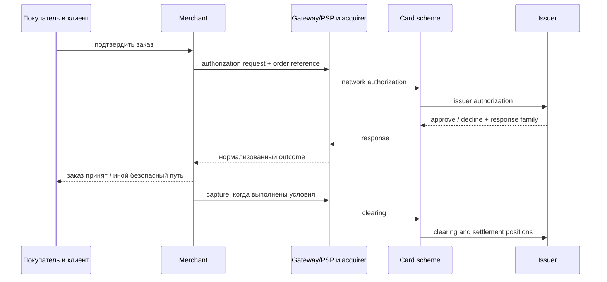
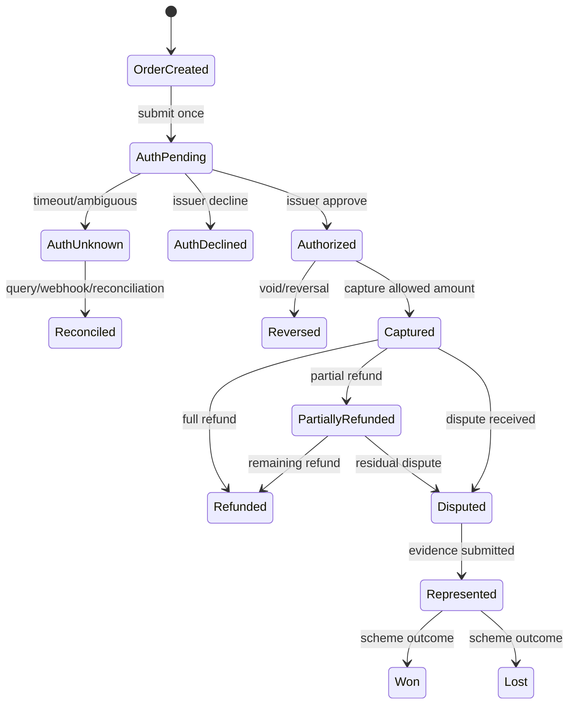
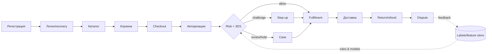
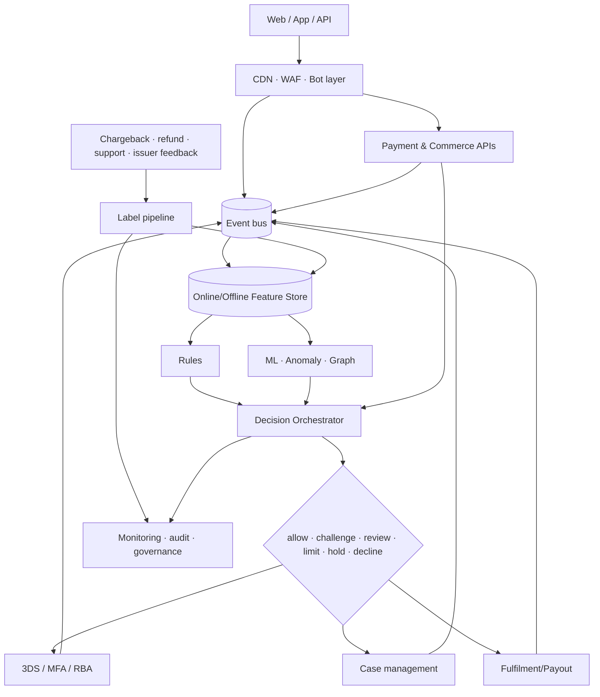
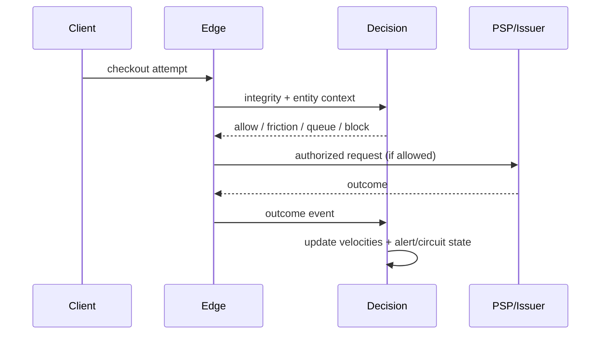

# Как читать эту книгу

Антифрод — не кнопка «заблокировать мошенника», а управляемая система решений при неполной информации. Эта книга ведёт от экономики одного заказа до архитектуры, операций и дорожной карты. Начинайте с глав 1–6, выберите целевой стек в главе 15, пройдите кейсы и runbooks в главах 17–18, а затем превратите практикумы главы 24 и чек-листы главы 26 в задачи.

**Граница материала.** Руководство исключительно защитное. Модели атак описаны ровно настолько, чтобы распознать риск и поставить контроль. Здесь намеренно нет операционных инструкций по кардингу, card testing, покупке или проверке карт, обходу 3-D Secure (3DS), AVS/CVV, device fingerprinting, антибота, WAF, KYC и лимитов, stealth-настроек или способов повысить «траст» злоумышленника.


## Пять маршрутов чтения

Книга устроена как система, а не как каталог продуктов. Всем читателям полезны главы 1–6 и итоговый аудит готовности; дальше маршрут зависит от роли.

| Роль | Сначала | Затем | Практический результат |
|---|---|---|---|
| Владелец небольшого магазина | 1–3, 7, 12, 15, 17–18, 26 | профиль малого магазина и emergency baseline | карта убытков, вопросы PSP, минимальный набор контролей и dashboard |
| Product/risk manager | 1–7, 9, 12–15, 17–18, 21, 23–24, 26 | кейсы, экономика решений, governance и roadmap | risk appetite, action policy, Definition of Done и доказательства эффекта |
| Разработчик/SRE/security | 2, 4–8, 10–11, 18, 22, 24, 26 | data contracts, payment states, runbooks и тесты | реализуемая архитектура, API, наблюдаемость и безопасная деградация |
| Аналитик/ML/оператор | 4, 7–9, 12–14, 17–18, 22, 24 | labels, review SOP, граф, ML validation и incidents | словарь признаков, очередь cases, модельная карточка и QA |
| Руководитель/аудитор | 1, 7, 12–18, 21, 23–26, 29 | нормативная карта, RACI, vendor scorecard и operating rhythm | решения о бюджете, ответственности, остаточном риске и evidence |

Не читайте главы о моделях раньше, чем определены денежные состояния и события. Модель, обученная на неразличимых `authorization failed`, `merchant declined` и `customer abandoned`, автоматизирует путаницу.

## Как устроена каждая глава

Сначала даётся интуиция и русский смысл, затем английский термин и точный контракт. Крупные учебные блоки содержат цель, контрольные вопросы, Definition of Done либо итоговый критерий. Таблицы с **владельцем** называют роль, ответственную за результат, а не поставщика технологии. Примеры полностью синтетические: имена, суммы, идентификаторы и события вымышлены.

## Статус утверждений

* **[ОБЯЗ.]** — требование применимого закона, договора или стандарта; применимость подтверждает юрист, эквайер либо QSA.
* **[ПРАКТ.]** — устоявшаяся отраслевая практика, но не универсальная обязанность.
* **[РЕК.]** — авторская рекомендация: её следует проверить экспериментом.
* **[ПРИМЕР]** — реализация конкретного провайдера, не независимый факт и не рекомендация купить продукт.

Ссылки вида **[S12]** раскрыты в самостоятельной таблице «Встроенная библиография и контроль актуальности» после главы 26. Каждый ключ ведёт к первичному publisher или официальному document/rule hub. Срез — **2026-07-21**. Стандарты, правила платёжных систем и законы меняются: перед внедрением повторно проверьте применимость и effective date.

# 1. Деньги, риск и экономика мошенничества

## 1.1 Интуитивная модель

У заказа есть не только выручка. Есть себестоимость товара, доставка, комиссия, стоимость проверки, цена трения для честного клиента и будущая ценность клиента (LTV). Мошеннику нужна воспроизводимая прибыль; защитнику — сделать ожидаемую прибыль атаки отрицательной, не разрушив конверсию.

**Ожидаемая стоимость решения:** `EC(action) = P(fraud | context, action) × fraud loss + P(good | context, action) × false-positive loss + action cost + latency cost`.

где `F` — fraud, `G` — честный клиент, `L_F` — полный убыток от пропущенного fraud, `L_FP` — потеря от ложного отказа, `C_a` — стоимость действия, `x` — наблюдаемые признаки. Выбираем действие с минимальным ожидаемым ущербом, соблюдая закон, правила схем и ограничения сервиса.

**Мини-пример.** Товар стоит 10 000 ₽, валовая маржа 2 500 ₽. При мошенничестве магазин теряет товар, логистику 600 ₽, операционные 400 ₽ и возможную комиссию спора 1 000 ₽: `L_F = 12 000 ₽`, а не маржа. Ложный decline хорошего постоянного клиента может стоить 2 500 ₽ сейчас плюс часть LTV. Поэтому одинаковый risk score может вести к hold для физического товара и к challenge для цифрового.

## 1.2 Кто несёт убыток

| Событие | Возможный прямой носитель | Скрытые последствия |
|---|---|---|
| Неавторизованный платёж | эмитент, эквайер или мерчант — зависит от юрисдикции, аутентификации, правил схемы и доказательств | комиссии, мониторинговые программы, резерв, потеря товара |
| Friendly/first-party fraud | часто мерчант до успешного представления доказательств | support, логистика, репутация |
| ATO | клиент и сервис; распределение зависит от фактов и права | компенсации, recovery, уведомления |
| Refund abuse | мерчант/маркетплейс/продавец | потеря товара и refund, рост ручного труда |
| Merchant abuse | покупатель, эквайер, платформа | регуляторный и репутационный риск |

**Красный флаг:** команда оптимизирует только chargeback rate. Отказы и 3DS могут снизить его, одновременно уничтожив approval rate и LTV.

# 2. Как проходит интернет-платёж

**Цель главы:** научиться отличать решения магазина, банка, 3DS и антибота, видеть денежное состояние заказа и не превращать повторную попытку в источник ущерба.

## 2.1 Участники: одна покупка, несколько систем

Покупатель взаимодействует с **клиентом** — браузером или мобильным приложением. Клиент обращается к серверу **торговца** (merchant). Торговец формирует заказ и через платёжный шлюз либо платёжного провайдера (**gateway/PSP**) отправляет платёж. **Эквайер** (acquirer) обслуживает торговца. **Платёжная система** (card scheme/network) маршрутизирует сообщения и задаёт правила. **Эмитент** (issuer) выпустил карту и решает, разрешить ли авторизацию. Участники могут технически совмещать роли, но ответственность надо определять по договору и фактической функции, а не по логотипу SDK.



Торговец знает аккаунт, корзину, товар, адрес, доставку и историю поведения. Эмитент знает счёт, карту и собственные риски, но не весь контекст магазина. Поэтому `issuer approved` значит «эмитент разрешил сумму в данном сообщении», а не «заказ честный». И наоборот, `issuer declined` не доказывает мошенничество: возможны недостаток средств, ограничение продукта или техническая причина.

## 2.2 Жизненный цикл денег

1. **Авторизация (authorization)** — запрос эмитенту зарезервировать доступность суммы. Успешная авторизация обычно создаёт временный hold на счёте держателя, но ещё не всегда является окончательным списанием.
2. **Capture** — подтверждение торговцем суммы к финансовой обработке. Возможны full/partial capture согласно договору и правилам.
3. **Clearing** — обмен финансовыми данными и расчёт позиционных обязательств.
4. **Settlement** — расчёты между участниками; payout торговцу — отдельное договорное событие и может иметь собственный срок/резерв.
5. **Reversal/void** — отмена неиспользованной или ошибочной авторизации, когда это допускает текущее состояние.
6. **Refund** — отдельное возвращение средств после capture; это не то же самое, что reversal.
7. **Dispute/chargeback** — формальный спор по правилам схемы. Он может вести к списанию, обмену доказательствами и representment.
8. **Representment** — представление эквайером/торговцем доказательств в ответ на спор; дальнейшие стадии и названия scheme-specific.



`AuthUnknown` нельзя автоматически считать decline или повторять. Сначала идемпотентный запрос статуса, webhook и reconciliation: иначе можно создать двойную авторизацию. Hard issuer decline не следует слепо ретраить, менять маршрут или маскировать. Разрешённые retry/dunning для soft/technical outcomes определяет документированная политика PSP, эквайера и схемы; торговец ограничивает число и время попыток, сохраняет исходную причинную цепочку и прекращает повторы при неопределённости.

## 2.3 Семь разных «остановок»

| Механизм | Кто решает | Что означает | Денежное состояние | Что видит клиент |
|---|---|---|---|---|
| Issuer decline | эмитент | авторизация не одобрена | capture невозможен | нейтральное сообщение и допустимые варианты оплаты |
| Merchant risk decline | policy торговца | магазин не принимает риск заказа | авторизация могла не отправляться либо должна быть корректно reversed | безопасное объяснение без раскрытия правил и appeal |
| 3DS challenge | issuer ACS в протоколе 3DS | нужна аутентификация держателя | до/вокруг авторизации по интеграции | интерфейс issuer, затем возврат результата |
| CAPTCHA/bot challenge | edge/bot layer торговца | проверка автоматизации/целостности клиента | денег не касается | доступный альтернативный путь |
| Account MFA/re-auth | сервис торговца | подтверждается управление аккаунтом | денег не касается напрямую | passkey/MFA/recovery сервиса |
| Authorization hold | issuer/accounting | сумма временно зарезервирована | `Authorized`, не fulfilment approval | может отображаться в банке |
| Order/fulfilment hold | торговец | заказ или выдача ожидает review/условия | auth/capture состояние хранится отдельно | срок, статус, поддержка и отмена |

**3DS и account MFA не взаимозаменяемы.** 3DS относится к аутентификации держателя карты в платёжной цепочке. Passkey или MFA сервиса защищает аккаунт магазина. Успех одного не доказывает безопасность другого: захваченный аккаунт может пройти cardholder authentication законным держателем в неподходящем контексте, а безопасный аккаунт не превращает чужую карту в допустимый платёж.

## 2.4 Варианты интеграции

| Способ | Где вводятся платёжные данные | Преимущество | Риск/обязанность |
|---|---|---|---|
| Redirect/hosted checkout | страница PSP | минимальный прямой контакт merchant-систем | проверить redirect integrity, return/webhook state, vendor и PCI scope |
| Iframe/hosted fields | поля PSP внутри страницы | управляемый UX, tokenization | parent page и сторонние scripts всё ещё значимы; SAQ/applicability уточнять |
| Direct API | merchant environment | полный контроль | наибольший PCI/security scope; не выбирать без зрелой программы |
| Wallet | wallet/provider cryptogram/token | меньше ручного ввода, device authentication | корректно различать wallet outcome и merchant risk; не считать гарантией |
| Card-on-file | PSP/network/merchant token | последующие платежи | consent, lifecycle, credential-on-file flags, recovery/ATO risk |

**PSP token** — указатель конкретного провайдера. **Network token** выпускается в экосистеме платёжной сети и имеет domain/lifecycle controls. **PAN hash** — производное от номера; это не платёжный токен, может оставаться персональным/карточным данным и опасен для linkability. Не стройте cross-merchant identity на PAN hash без строгой правовой и PCI-оценки.

Для recurring payments различайте customer-initiated transaction (**CIT**) и merchant-initiated transaction (**MIT**), исходную установку мандата/credential и последующие сообщения. Account updater или lifecycle update помогает обновлять реквизит, но не даёт разрешения на новую покупку и не заменяет consent. Dunning — контролируемое повторное взыскание по договорённой подписке; оно подчиняется scheme/PSP правилам, остановке после hard decline и customer cancellation.

## 2.5 Кто что решает

| Вопрос | Главный источник истины | Антифрод получает |
|---|---|---|
| Существует ли заказ и какова цена? | merchant order service | server-calculated amount, items, version |
| Разрешена ли карта/сумма? | issuer response через цепочку | normalized response family, network reference |
| Пройдена ли 3DS-аутентификация? | 3DS components/issuer | authenticated outcome, protocol/version references |
| Можно ли отдать товар? | merchant risk + fulfilment policy | payment, account, delivery, graph, review outcome |
| Состоялся ли capture/refund? | PSP/acquirer ledger + reconciliation | immutable monetary event |
| Кто выиграл dispute? | scheme/acquirer process | reason/stage/outcome/evidence timestamp |

### Проверьте себя

Вы должны уметь нарисовать для своей интеграции: кто принимает PAN; кто создаёт order ID; где идемпотентность; кто инициирует 3DS; когда capture; что происходит при timeout; где reconciliation; кто снимает order hold. Если ответ «PSP всё делает», запросите точный state contract и ответственность сторон.

# 3. Карта угроз: язык без паники

| Класс | Что происходит на защитном уровне | Наблюдаемые сигналы | Базовые контрмеры |
|---|---|---|---|
| CNP/card fraud | платёж без физического предъявления карты инициирует неуполномоченное лицо | несогласованность аккаунта, устройства, сети, адресов и истории; issuer response | токенизация, RBA/3DS, velocity, hold, подтверждение fulfilment |
| Card testing/enumeration | автоматизированный поток пытается выяснить пригодность реквизитов или существование сущностей | много малых/неуспешных попыток, распределённые связи, всплеск issuer declines | edge bot controls, многомерные velocity, единообразные ответы, circuit breaker [S08][S09] |
| ATO/credential stuffing | переиспользованные учётные данные ведут к захвату аккаунта | новый контекст, login velocity, recovery/change anomalies | passkeys/MFA, breached-password checks, device binding, recovery hardening [S10][S15] |
| Bot abuse | автоматизация захватывает дефицит, контент, промо или checkout | неестественная последовательность и целостность клиента | bot management, очереди, quotas, progressive friction |
| Stolen/synthetic identity | чужая или составная идентичность создаёт доверие/кредит | несогласованность источников, тонкий файл, shared attributes | пропорциональный KYC, документ/источник, граф, ручная проверка |
| Triangulation | покупатель, витрина-посредник и пострадавший мерчант образуют цепочку | повторяющиеся адреса/товары, сторонние контакты, disputes | seller due diligence, graph links, подтверждение доставки |
| Reshipping/mules | промежуточный получатель перемещает товар/деньги | кластер адресов и получателей, смена маршрута | address intelligence, hold, ограничения смены доставки |
| Promotion/referral abuse | формально допустимые действия масштабируются вопреки смыслу акции | связанные аккаунты, устройства, платёжные/доставочные атрибуты | eligibility, graph caps, delayed reward, clawback по условиям |
| Refund/return abuse | возврат денег/товара искажён или дублирован | refund velocity, несоответствие SKU/веса/треков | dual control, refund-to-origin, warehouse evidence |
| Chargeback/friendly fraud | держатель оспаривает распознанную покупку или злоупотребляет спором | история клиента, delivery/use evidence, descriptor confusion | ясный descriptor, receipts, evidence pack, early resolution |
| Gift-card fraud | ликвидный цифровой эквивалент покупают/крадут/обналичивают | высокая скорость, transfer/redemption graph | balance protection, delayed activation, limits, MFA |
| BNPL fraud | риск идентичности и кредита сочетается с payment fraud | новые identities, устройства, repayment links | KYC/credit controls, cross-merchant graph, staged limits |
| Marketplace fraud | злоупотребляет покупатель, продавец или сговор | seller graph, off-platform pressure, payout anomalies | onboarding, escrow/holds, payout risk, content moderation |
| API/payment-link/mobile | злоупотребление бизнес-логикой, ссылками или мобильной средой | token/link reuse, object access, attestation gaps | scoped tokens, API authz, replay defense, app integrity [S11][S12] |
| Social engineering | человек убеждает жертву или оператора выполнить действие | необычное изменение реквизитов, urgency, operator override | out-of-band verification, scripts, cooling-off, training |
| Merchant abuse | недобросовестный продавец не поставляет, маскирует MCC/товар | жалобы, fulfillment gap, резкий payout profile | KYB, reserves, monitoring, suspension, reporting |

Таксономии пересекаются: ATO может закончиться gift-card purchase, а затем refund abuse. Поэтому классифицируйте **событие**, **актор**, **инструмент**, **цель** и **потери** отдельно.

# 4. Fraud journey: защищаем весь путь



| Стадия | Что защищаем | Сигналы | Решение/контроль |
|---|---|---|---|
| Регистрация | уникальность и добросовестность аккаунта | email/phone age и verification, device/account graph, velocity | allow, verify, limit, deny automation |
| Логин | сессию и секреты | failed/success patterns, device binding, IP/ASN risk | passkey/MFA, revoke sessions, notify |
| Recovery | канал восстановления | смена SIM/почты, новый device, support interaction | cooling-off, strong re-auth, dual control |
| Каталог | дефицит и scraping | browse cadence, inventory targeting | queue, per-account quota, bot controls |
| Корзина | промо и business logic | coupon graph, quantity, repeated edits | reserve briefly, eligibility, recalc server-side |
| Checkout | данные заказа | billing/shipping/contact consistency | progressive friction, review, limit |
| Авторизация | платёж | issuer response, token, prior attempts | allow/decline/route законным способом; не повторять слепо |
| 3DS/step-up | аутентификацию | RBA inputs, challenge outcome, exemptions | challenge либо alternate safe path [S05][S06] |
| Fulfilment | необратимость | risk maturity, stock type, delivery channel | hold, split shipment, manual review |
| Доставка | передачу ценности | reroute, proof, recipient mismatch | restrict edits, signed/OTP delivery соразмерно риску |
| Return/refund | деньги и товар | return history, warehouse evidence | refund to original method, dual approval |
| Dispute | доказательства и обучение | reason code, delivery/use/contact history | evidence pack, accept/represent, label correction |

**Принцип обратимости:** чем необратимее действие (мгновенная выдача цифрового кода, payout), тем раньше и сильнее контроль. Авторизация банка не доказывает добросовестность заказа.

# 5. Сигналы: что они значат и чего не доказывают

Один сигнал редко является доказательством. Хорошая комбинация: независимые источники + временной контекст + объяснимое действие.

| Семейство | Полезный смысл | Ограничения/ложные срабатывания | Privacy и безопасная комбинация |
|---|---|---|---|
| Account/identity | возраст, подтверждения, стабильность, история | новый честный клиент выглядит «тонко»; семьи делят данные | минимизация, цель и срок; сочетать с поведением, не с демографическими стереотипами |
| Device/browser integrity | устойчивость контекста, tampering/automation hints | обновления, privacy browsers, shared devices | псевдонимизация, rotation; не считать fingerprint личностью |
| IP/network/ASN | география, hosting/proxy/TOR/VPN reputation | CGNAT, корпоративные VPN, мобильные сети | coarse location, короткий retention; повышать неопределённость, а не автоматически decline |
| Поведение/biometrics | последовательность навигации и взаимодействия | accessibility, возраст, моторные различия; sensitive profiling | DPIA/оценка, агрегация, запрет дискриминации; step-up вместо отказа |
| Velocity | частота по account/device/card-token/address/IP/SKU | распродажи, NAT, call center | окна нескольких размеров, peer baseline, граф; без единственного глобального порога |
| Payment/order | сумма, корзина, BIN country, issuer outcome, token history | путешествия, подарки, cross-border | не хранить лишний PAN; сочетать с customer history |
| Shipping | расстояние, reroute, pickup, повторное использование | офисы, общежития, forwarding legitimate | нормализация адреса, graph degree, delivery evidence |
| Email/phone | verification, tenure/reputation, change events | recycled numbers, aliases, новые домены | consent/legal basis, не передавать raw data без необходимости |
| Graph/link analysis | общие сущности и кольца | домохозяйства и корпоративные адреса создают hubs | типизированные рёбра, time decay, исключения legitimate hubs, analyst explanation |
| Consortium data | внешний опыт по сущности | непрозрачные labels, разные рынки, stale data | договор, provenance, dispute/correction, локальная валидация |

## 5.1 Качество признака

Для каждого признака заведите паспорт: определение, владелец, источник, event time и processing time, freshness, missing semantics, допустимые значения, PII-класс, retention, offline/online parity, known bias, мониторинг. Значение `missing` не равно `false`: отсутствие AVS в регионе не означает mismatch.

## 5.2 Граф без магии

Узлы: account, device pseudonym, payment token, address, phone, order, seller. Рёбра: «использовал», «доставил», «получил payout» с временем и типом. Полезны degree, число новых соседей, компоненты, motifs и расстояние до подтверждённого fraud. Снижайте вес старых связей; исключайте легитимные hubs (отель, офис); позволяйте аналитику увидеть путь объяснения.

# 6. Эталонная real-time архитектура



## 6.1 Контракты и отказоустойчивость

**[РЕК.] Decision API** принимает `event_id`, event time, customer/order references, контекст и purpose; возвращает decision, reason codes, policy/model versions, expiry и correlation ID. Идемпотентность предотвращает двойные решения. Денежные значения — integer minor units + currency.

Определите fail-safe по операции: при недоступности антифрода низкорисковый просмотр может fail-open, payout и дорогой цифровой товар — hold/fail-closed. Нужны таймаут, bulkhead, circuit breaker, деградационная policy и очередь повторной оценки. Логи решений неизменяемы и не содержат секретов/PAN.

## 6.2 Слои

1. **Edge/WAF/bot:** volumetric и protocol defense, client integrity, rate policy. WAF не знает весь бизнес-контекст.
2. **События:** единая схема и часы, server-side facts, consent/purpose metadata.
3. **Feature store:** одинаковое вычисление online/offline, freshness и point-in-time joins.
4. **Rules:** точные политики, аварийные controls, compliance gates.
5. **Models/anomaly/graph:** ранжируют неопределённость; не заменяют ограничения.
6. **Orchestrator:** выбирает действие и управляет конфликтами.
7. **3DS/RBA/step-up:** получает минимально нужный контекст и возвращает outcome.
8. **Case management:** очередь, SLA, evidence, dual control.
9. **Feedback:** disputes, refunds и outcomes с задержкой, качеством и provenance.
10. **Monitoring/audit:** бизнес-, fairness-, drift-, latency- и security-наблюдаемость.


## 6.3 Реализуемая модель данных

**Цель раздела:** дать команде минимальный общий язык, из которого можно построить stream processing, признаки, аудит и reconciliation без PAN/CVV.

### Словарь сущностей

| Сущность | Устойчивый ключ | Владелец | Чувствительные поля | Важные связи |
|---|---|---|---|---|
| Customer/account | внутренний random ID | identity service | контакты, status, recovery | sessions, orders, authenticators |
| Session | random opaque ID | auth service | auth strength, timestamps | account, device pseudonym |
| Device context | rotating pseudonym | risk/client integrity | browser/app integrity signals | sessions, attempts; не «личность» |
| Order | merchant order ID | order service | товары, контакты, адрес | customer, payment attempts, shipment |
| Payment attempt | unique attempt ID | payment service | PSP token reference, outcome | order, auth, 3DS, capture |
| Payment instrument reference | PSP/network token alias | vault/PSP | token metadata; никогда CVV | attempts/accounts graph |
| Shipment/entitlement | fulfilment ID | fulfilment | адрес/получатель или digital entitlement | order, evidence, returns |
| Refund | refund ID | finance/payment | amount/reason/approver | capture, return, operator |
| Dispute | case/network reference | disputes team | reason, evidence, outcome | payment/order/customer |
| Risk decision | decision ID | decision platform | features references, reasons | event, policy/model versions |
| Case | case ID | operations | notes/evidence pointers | decisions, analyst, outcome |

Ключи наружу должны быть непредсказуемыми. Raw email/phone/address живут в ограниченном PII vault или исходной системе; антифрод получает нормализованные либо псевдонимизированные представления по цели. Токенизация не отменяет access control и retention.

### Канонический конверт события

Все доменные события используют один envelope. Payload меняется по `event_type`, но смысл полей фиксирован schema registry. Событие — факт в прошедшем времени, а не команда. Пример не содержит PAN, CVV, полного адреса или секретов:

```json
{
  "event_id": "evt_01J_SYNTHETIC_0001",
  "event_type": "payment.authorization.completed",
  "schema_version": "2.1.0",
  "occurred_at": "2026-07-21T10:15:31.412Z",
  "ingested_at": "2026-07-21T10:15:31.690Z",
  "producer": "payment-service",
  "tenant_id": "shop_demo",
  "correlation_id": "corr_demo_order_4711",
  "entities": {
    "account_id": "acc_demo_84",
    "order_id": "ord_demo_4711",
    "payment_attempt_id": "pay_demo_03",
    "instrument_ref": "tokref_demo_rotating"
  },
  "payload": {
    "amount_minor": 129900,
    "currency": "RUB",
    "outcome": "approved",
    "response_family": "approved",
    "three_ds": {"status": "authenticated", "protocol": "2.3.1.1"}
  },
  "privacy": {"class": "restricted", "purpose": "fraud_prevention", "retention_policy": "risk_events_v3"}
}
```

`occurred_at` — когда факт произошёл в домене. `ingested_at` — когда платформа его получила. **Decision time** — cutoff, после которого признаки не могли влиять на конкретное решение. Храните также processing time для диагностики. Большая разница показывает задержку; событие, пришедшее позже decision time, годится для labels и последующих решений, но не должно «путешествовать назад» в offline training join.

### Decision API

```json
{
  "request_id": "req_demo_9001",
  "idempotency_key": "risk:checkout:ord_demo_4711:v4",
  "event_ref": "evt_demo_checkout_9001",
  "decision_point": "pre_fulfilment",
  "occurred_at": "2026-07-21T10:15:32.000Z",
  "entities": {"account_id": "acc_demo_84", "order_id": "ord_demo_4711"},
  "context": {"amount_minor": 129900, "currency": "RUB", "product_profile": "physical_standard"}
}
```

```json
{
  "decision_id": "dec_demo_5521",
  "request_id": "req_demo_9001",
  "action": "hold",
  "state": "awaiting_review",
  "expires_at": "2026-07-21T10:45:32Z",
  "reason_codes": ["NEW_RELATIONSHIP", "LINK_REQUIRES_REVIEW"],
  "customer_fallback": "support_or_cancel",
  "versions": {"policy": "checkout-17", "model": "order-risk-8", "features": "online-42"},
  "decided_at": "2026-07-21T10:15:32.041Z"
}
```

API возвращает stable machine codes, не prose и не скрытые attacker-facing details. Повтор с тем же idempotency key и тем же payload возвращает тот же logical decision. Тот же ключ с другим payload — ошибка конфликта. TTL имеет владельца и terminal fallback: истёкший hold не может висеть бесконечно.

### Payment и order state machines

Payment state и order state разделены. `Authorized` не переводит заказ автоматически в `Fulfilled`. Пример допустимых переходов:

| Из состояния | Событие | В состояние | Guard |
|---|---|---|---|
| order.created | risk allow | order.accepted | current version, no active hold |
| order.created | risk hold | order.held | reason, owner, expiry required |
| order.held | analyst release | order.accepted | RBAC, evidence, decision version |
| order.held | expiry | order.cancelled или fallback review | product policy; customer notification |
| payment.auth_pending | PSP approve | payment.authorized | dedup by PSP/network reference |
| payment.auth_pending | hard decline | payment.declined | no blind retry |
| payment.auth_pending | timeout | payment.unknown | reconciliation before new attempt |
| payment.authorized | capture command | payment.captured | amount ≤ authorized and order eligible |
| payment.captured | refund command | payment.partially_refunded/refunded | idempotency, amount remaining, approval |

Команда создаёт намерение, событие подтверждает факт. Webhook не принимается на доверии: signature, freshness, replay/dedup и допустимый переход. Состояние нельзя «перепрыгнуть» только потому, что клиент прислал `paid=true`.

### Идемпотентность, dedup, replay и reconciliation

* **Idempotency** предотвращает повторный эффект одной команды. Scope включает merchant, operation и business object; срок покрывает максимальную неопределённость.
* **Deduplication** распознаёт повторную доставку события по `event_id` и provider reference. Exactly-once transport не заменяет exactly-once business effect.
* **Replay** нужен для восстановления stream projection и historical evaluation. Consumer детерминирован, schema version известна, side effects отключаются либо защищены отдельным ключом.
* **Reconciliation** сравнивает merchant ledger с PSP/acquirer reports: missing capture, duplicate, unknown authorization, refund mismatch. Разница создаёт case, а не молчаливую правку прошлого.
* **Ordering** нельзя предполагать глобально. Используйте sequence/version внутри entity; позднее событие либо корректно применимо, либо попадает в quarantine.

### Матрица качества данных и отсутствия

| Поле/признак | Проверка | Значение missing | Деградация | Alert/owner |
|---|---|---|---|---|
| event time | parse, future/old bound, clock skew | producer failure | processing-time feature только если разрешено | SRE + producer |
| instrument reference | format, vault lookup | payment path/region may not supply | не строить token velocity; повысить uncertainty | payments |
| 3DS outcome | enum + protocol | не применялся, не завершён или integration gap — разные enums | scheme/market policy | payments/risk |
| device context | freshness, SDK version | privacy/accessibility/web fallback | не считать suspicious; использовать account/order | client platform |
| issuer response | mapping coverage | timeout/unknown, не decline | payment unknown + reconciliation | payments |
| address graph | normalization version | digital/no shipping или failure | product-specific feature off | fulfilment/data |
| model score | range/version/freshness | service/model unavailable | documented fallback policy | ML/SRE |
| dispute label | source/reason/maturity | censored/not yet observed | exclude from mature good set | disputes/data |

Missingness может сама коррелировать с каналом, но сначала устраняют instrumentation failure. Нельзя наказывать пользователей за privacy setting, если продукт обещает его поддержку.

### Online/offline parity

Feature definition задаётся один раз: имя, тип, entity, event-time window, filter, aggregation, freshness, missing value, privacy class и version. Offline materialization использует point-in-time cutoff. Online store хранит value + computed_at + source watermark. Перед release сравнивайте пары `(entity, decision_time)` на историческом replay: значение, missingness и rounding. Разница выше tolerance блокирует rollout.

Паритет не значит одинаковое хранилище. Online оптимизирован на latency, warehouse — на историю. Контракт одинаков, реализации сверяются. Backfill никогда не меняет то, что «видела» старая модель: старое решение хранит feature snapshot/reference и version.

## 6.4 Расширенная архитектура и доступность

| Компонент | Назначение | Отказ | Защита/доказательство |
|---|---|---|---|
| Edge/API gateway | protocol, authn/z, bot/capacity | overload or bypass | config version, request correlation, rate telemetry |
| Schema registry/stream | contracts and delivery | malformed/late/lag | compatibility gates, DLQ, watermark |
| Online feature store | fresh counters/features | stale/unavailable | freshness per feature, regional replica |
| Offline store/warehouse | labels/training/replay | late partition/backfill | immutable raw zone, lineage, point-in-time tests |
| Policy/rule store | approved decision logic | bad rollout | signed version, shadow/canary, kill switch |
| Model registry/serving | scores/model cards | latency/drift | champion fallback, artifact hash |
| Graph/entity resolution | typed links | false merges/stale edges | provenance, time decay, hub exceptions |
| PII/token vault | restricted resolution | breach/unavailable | encryption, JIT access, audit, minimised cache |
| Immutable decision log | why/what/version | audit gap | append-only, integrity, retention/legal hold |
| Case management | human review | queue overload | SLA priority, RBAC, dual control |
| Reconciliation | monetary truth | mismatch backlog | daily/intraday reports, owner, ageing |
| Observability | service/data/business health | blind spot | independent alerts and synthetic probes |

| Flow | Default outage posture | Queue limit | Recovery rule |
|---|---|---|---|
| browse/search | fail-open with edge safety | shed expensive features | no retroactive block |
| registration/login | degraded allow or account step-up by risk | bounded auth queue | revoke anomalous sessions if evidence emerges |
| payment authorization | do not invent result; payment `unknown` | provider limits | reconcile before retry |
| physical fulfilment | bounded hold for material risk | capacity tied to SLA | release/cancel with customer notice |
| instant digital/gift value | fail-closed or short queue according to policy | strict expiry | human/strong step-up or cancel |
| refund/payout | fail-closed/dual approval | finance-owned queue | reconcile before release |

HA требует не только второй сервер: feature freshness, policy version, keys, stream offsets и payment state должны согласовываться. Региональный failover без token vault или актуальных counters может дать формально зелёный endpoint с опасным решением. Тестируйте целый decision path.

# 7. Решения и risk-based step-up

| Действие | Когда уместно | Цена ошибки | Guardrail |
|---|---|---|---|
| Allow | риск и неопределённость малы | fraud loss | post-event monitoring; лимит необратимости |
| Challenge | идентичность можно подтвердить | abandonment/friction | доступный альтернативный путь; не зацикливать |
| Review | машина не видит важный контекст | очередь и задержка | SLA, приоритет по expected loss, reason codes |
| Limit | риск растёт с объёмом/скоростью | недополученная выручка | ясное восстановление, time-bound |
| Hold | ценность ещё обратима | fulfilment delay | expiry, уведомление, владелец release |
| Decline | риск/запрет высок и альтернативы нет | false positive и trust | общий безопасный текст; appeal/recovery |

### Матрица «сигнал × действие × цена ошибки»

| Комбинация | Предпочтение | Почему | Что проверить |
|---|---|---|---|
| Новый device + привычный аккаунт + низкая сумма | allow или мягкий step-up | device change сам по себе слаб | recovery/change events |
| Новый аккаунт + связанный fraud graph + мгновенный товар | hold/review/decline по policy | необратимость и сильная связь | legitimate shared hub |
| Hosting ASN + успешная сильная auth + стабильная история | не auto-decline; limit/monitor | network signal неоднозначен | session integrity |
| Резкий refund velocity + новый оператор | hold + dual review | insider/process risk | системный сбой/кампания |
| Распределённый authorization failure spike | queue/circuit breaker + issuer-aware control | защищает PSP/issuer и данные | outage, BIN-level incident |

Политика конфликта: обязательный запрет выше модели; затем incident controls; затем risk decision. Challenge не должен превращать несогласие модели в бесконечную стену.

## 7.1 Action/state matrix

| Current state | Action | Next state | TTL/clock | Owner | Reversible? | Customer fallback |
|---|---|---|---|---|---|---|
| pending risk | allow | accepted | до material change | policy owner | да до fulfilment | cancel/order support |
| pending risk | challenge | awaiting step-up | journey-specific | identity/payments | да | accessible alternate verification |
| pending risk | review | queued | case SLA | fraud ops | да | status, cancel, appeal |
| accepted | limit | accepted_limited | policy window | product/risk | частично | transparent limit/recovery |
| accepted | hold | fulfilment_held | product TTL | fulfilment/risk | да до release | ETA, cancel/refund |
| held | release | accepted/fulfil | audit immediately | authorised reviewer | далее может стать нет | notification |
| held | decline/cancel | cancelled | terminal | policy/reviewer | reversal/refund may be required | appeal/alternative |
| captured | hold payout/refund | finance_held | finance SLA | finance risk | да до transfer | support/status |
| fulfilled | recall/disable entitlement where lawful | exceptional | incident policy | legal/product | часто частично | human resolution |

TTL — это clock source, pause conditions, escalation, expiry transition и notification, а не только число. Необратимость включает товар, цифровую ценность, personal-data disclosure и customer trust. Material change суммы, получателя, товара, delivery или payout destination требует новой ревизии намерения и нового decision.

## 7.2 Числовой cohort: экономика четырёх actions

Синтетический cohort содержит 10 000 заказов по 5 000 ₽ с contribution margin 1 200 ₽. До нового control ожидается 100 fraud orders с полным loss 5 800 ₽, то есть 580 000 ₽. Policy challenges 500 заказов: 420 завершают проверку; среди завершивших 60 fraud остаются остановлены, 360 good проходят. Из 80 abandoned 70 были good: friction cost при потере contribution составляет 84 000 ₽.

Review получает 120 заказов по 180 ₽, то есть стоит 21 600 ₽; он находит ещё 25 fraud и возвращает в good flow 30 первоначально подозрительных заказов. Дополнительный false decline — 10 good orders, или 12 000 ₽ contribution. Консервативный prevented loss: `85 × 5 800 = 493 000 ₽`. Прямые и оценочные costs: `84 000 + 21 600 + 12 000 = 117 600 ₽`. Синтетический net benefit равен 375 400 ₽ до payment fees, residual fraud и долгосрочного LTV.

Sensitivity обязательна. Если good abandonment в эквивалентных заказах удвоится, friction cost также удвоится. Если digital resale и dispute fees увеличат loss, benefit вырастет. Отчёт показывает диапазоны, challenge completion, review overturn, appeal/recovery и LTV через согласованные горизонты; policy нельзя выбирать только по gross prevented amount.

# 8. Правила и velocity controls

## 8.1 Жизненный цикл правила

`proposal → peer review → simulation → shadow → canary → active → monitor → retire`.

Каждое правило имеет ID, гипотезу, owner, scope, версию, start/end, источники, действие, reason code, expected impact, kill switch и rollback. Изменения проходят four-eyes; emergency rule автоматически истекает.

**Синтетический защитный пример:** «если за короткое окно для одного payment token наблюдается аномальное число разных account, а за более длинное окно растёт доля отказов авторизации, отправить поток в progressive friction и alert». Числа намеренно определяются вашей базовой линией, а не публикуются как универсальный порог.

## 8.2 Velocity правильно

* считайте по нескольким сущностям и их связям, а не только IP;
* используйте короткие и длинные окна, seasonal baseline и event time;
* разделяйте `attempt`, `authorization`, `capture`, `refund`;
* храните distinct counts и доли outcomes;
* защищайте counters от race conditions и retry duplication;
* наблюдайте matched, acted, incremental fraud caught, false positives, latency;
* выключайте правило автоматически при budget breach.

**Anti-pattern:** сотни перекрывающихся правил без attribution. Решение — decision trace и holdout там, где это этично и безопасно.

# 9. ML без магии

## 9.1 Labels и задержка

Chargeback приходит спустя недели или месяцы; отсутствие chargeback сегодня не равно good. Храните `label_observed_at`, reason, source и confidence. Разделяйте unauthorized fraud, first-party fraud, policy abuse и operational error. Используйте maturity window; не обучайте на незрелых «хороших» заказах.

**Leakage:** признак содержит будущее, например итог спора при оценке checkout. Делайте point-in-time join: модель видит только то, что существовало в момент решения. Feedback решения тоже создаёт selection bias: declined заказ не показывает контрфактический outcome.

## 9.2 Дисбаланс и метрики

Accuracy бесполезна: при fraud 0,2% модель «всё good» имеет 99,8%. Смотрите:

* `precision = TP/(TP+FP)` — доля fraud среди срабатываний;
* `recall = TP/(TP+FN)` — найденная доля fraud;
* PR-AUC — качество ранжирования редкого класса;
* approval/false-positive rate по сегментам;
* expected cost/profit на выбранных действиях;
* calibration: среди score 0,10 действительно около 10% целевого outcome.

Калибруйте на свежем representative наборе. ROC-AUC можно показать дополнительно, но он скрывает цену большого числа FP при редком fraud.

## 9.3 Cost-sensitive решения

Модель выдаёт вероятность, policy переводит её в действие с учётом суммы, маржи, обратимости и цены friction. Порог не один: challenge и decline имеют разные cost curves. Проверяйте sensitivity к ошибке в cost assumptions.

## 9.4 Evaluation

1. Time-based train/validation/test, без случайного перемешивания будущего в прошлое.
2. Offline: PR curves, calibration, сегменты, latency replay.
3. Shadow: новый challenger ничего не решает.
4. Canary: малый контролируемый трафик с guardrails.
5. Champion–challenger и rollback.
6. Online: incremental loss, approvals, customer contacts, зрелые labels.

Мониторьте data quality, feature drift, score drift, calibration drift и concept drift. Drift — сигнал расследовать, не автоматическое доказательство атаки.

## 9.5 Explainability, fairness, adaptation

Reason codes должны объяснять действие оператору без раскрытия защитной логики клиенту. Проверяйте disparate impact по законно допустимым сегментам; не используйте protected attributes как удобные proxies. Ограничьте доступ к model artifacts. Предполагайте, что противник адаптируется: меняйте набор независимых сигналов и проверяйте controls на синтетическом purple-team стенде.

Graph ML полезен для колец, но наследует ошибки связей. Начинайте с понятных graph features; затем сравните GNN с простым baseline по incremental value, latency и объяснимости.

## 9.6 Практический ML pipeline и model card

Начинайте с интерпретируемого baseline: regularized logistic regression или scorecard поверх проверенных features. Затем сравните gradient-boosted decision trees (**GBDT**) на том же temporal split. Сложность оправдана только incremental expected value после latency/ops costs.

Разделяйте по времени и, где нужно, по entity group, чтобы один account/token/address ring не оказался train и test. Labels бывают mature, delayed, censored и positive-unlabeled (**PU**): подтверждённые positives известны, часть «good» лишь не наблюдалась. Документируйте sampling и weighting; не делайте sampled precision production precision без correction.

Calibration проверяется reliability curve/Brier-style measure и по сегментам. PR-AUC сопровождается precision/recall на action regions, bootstrap confidence intervals и абсолютными counts. Off-policy evaluation ограничена: declined traffic не имеет наблюдаемого outcome, а historical policy изменила population. Используйте shadow, safe review samples и controlled experiments, не обещайте точный counterfactual.

**Model card:** purpose/out-of-scope; target/label/maturity; data period/population; features/privacy; split/leakage tests; metrics/confidence; calibration; action policy owner; fairness/segment results; latency/capacity; failure modes; monitoring; approval; rollback; expiry. **Champion–challenger report** добавляет paired cohort differences, queue/friction, projected costs, shadow anomalies и launch gates.

Adversarial adaptation отслеживается через feature-family dependence, graph displacement и reason distribution, но model internals/thresholds не раскрываются клиенту. Данные и rule changes версионируются вместе: drift может быть результатом собственного rollout.

# 10. Платёжная и account security

## 10.1 3DS2 и RBA

EMV 3-D Secure передаёт данные между 3DS Server, Directory Server и Access Control Server; issuer выполняет risk-based authentication и при необходимости challenge [S05]. **[ПРАКТ.]** Передавайте качественные, правдивые данные; используйте challenge соразмерно риску и требованиям рынка. 3DS не заменяет merchant fraud controls: аутентифицированный пользователь может злоупотреблять собственным аккаунтом, а fulfillment risk остаётся.

В Европейской экономической зоне Strong Customer Authentication и exemptions регулируются PSD2/RTS; применение и liability нельзя сводить к лозунгу «3DS = liability shift» [S24]. Сверяйтесь с эквайером и правилами каждой схемы.

## 10.2 Tokenization, network tokens, CVV/AVS

Токен снижает распространение PAN; network token может быть связан с merchant/device и обновляться жизненным циклом сети. Это уменьшает exposure, но украденная активная сессия всё ещё опасна. **[ОБЯЗ.]** PCI DSS запрещает хранить sensitive authentication data после авторизации, включая card verification code, даже в зашифрованном виде [S01]. AVS доступен не везде и даёт match/mismatch/unknown, а не доказательство личности. CVV/AVS — сигналы и controls, не самостоятельная стратегия.

**PCI scope reduction:** hosted fields/redirect/tokenization могут уменьшить область, но не отменяют ответственности. Для e-commerce PCI DSS 4.0.1 требования 6.4.3 и 11.6.1 требуют управления/инвентаризации/авторизации payment-page scripts и механизма обнаружения несанкционированных изменений; точная применимость зависит от SAQ/архитектуры [S01][S03].

## 10.3 Passkeys, MFA, binding и recovery

WebAuthn использует origin-bound public-key credentials и помогает против phishing; FIDO passkeys улучшают пользовательский путь [S14][S15]. Поддерживайте несколько аутентификаторов, безопасную регистрацию нового и отзыв старого. Device binding — связь ключа/приложения с аккаунтом, но migration и accessibility требуют recovery.

Recovery часто слабее login. Требуйте strong re-auth для смены payout/payment/recovery attributes; уведомляйте старые каналы; вводите cooling-off для необратимых действий; защищайте операторский override dual control. NIST SP 800-63B-4 задаёт актуальные требования к authenticator management и phishing-resistant options [S13].

## 10.4 Secure APIs

* OAuth/OIDC scopes и audience, короткоживущие tokens; mTLS/подпись где модель угроз требует.
* Проверка object- и function-level authorization на сервере [S11].
* Idempotency key, nonce/timestamp/replay protection для денежных команд.
* Сервер вычисляет сумму, скидку, получателя и состояние; клиент не источник истины.
* Secrets не в mobile/web bundle и логах; key rotation и least privilege.
* Webhook signature, freshness, deduplication и state-machine validation.

# 11. Bot management и защита от card testing

OWASP относит carding и credential stuffing к automated threats [S08][S09]. Защита слоистая:

1. **Edge:** capacity limits, WAF/protocol validation, reputation как слабый сигнал.
2. **Client integrity:** tamper/automation indicators с graceful fallback для accessibility/privacy.
3. **Entity/graph velocities:** account, session, device pseudonym, token, address, BIN/issuer aggregate и связи.
4. **Progressive friction:** задержка, очередь, challenge или re-auth растут с уверенностью; честному клиенту есть путь восстановления.
5. **Payment orchestration:** не превращать retries в amplifier; учитывать issuer/BIN-level всплеск, idempotency и безопасный backoff.
6. **Circuit breaker:** временно ограничить наиболее вредную операцию, сохранив просмотр/поддержку.
7. **Observability:** attempt→auth outcome funnel, decline families, issuer concentration, unique entities, edge-to-PSP correlation.

Не публикуйте фиксированные пороги. Выводите их из нормального профиля и защищайте конфигурацию. Единообразные ответы и timing уменьшают enumeration; наружу — correlation ID, внутрь — точная причина. Координируйтесь с PSP/эквайером: массовые попытки вредят всей цепочке.



# 12. Метрики и экономика

## 12.1 Канонические определения

Определите numerator, denominator, event time, maturity и currency.

* `fraud rate = confirmed fraud amount / eligible processed amount`;
* `chargeback rate` — считать ровно по определению схемы/эквайера: denominators и окна различаются;
* `approval rate = approved auth attempts / eligible auth attempts` (очищайте технические повторы);
* `false-positive rate = good orders declined / all mature good orders` — наблюдается неполно;
* `review rate`, `review yield`, `review SLA breach`;
* `loss per order = mature fraud loss / eligible orders`;
* `3DS challenge rate`, completion, abandonment и post-auth fraud;
* dispute win rate — отдельно submitted и eligible, по зрелым исходам;
* p50/p95/p99 decision latency и timeout rate.

**Expected net value заказа:**

`revenue − COGS − payment − fulfilment − review − expected fraud/dispute loss − expected friction/LTV loss`.

## 12.2 Пример dashboard

| Панель | Срезы | Guardrail |
|---|---|---|
| Authorization funnel | issuer/BIN country, PSP, device, new/returning | approval и technical error |
| Fraud & disputes | cohort week, reason, product, delivery | maturity coverage |
| Decisions | policy/model version, reason, action | FP proxy, overturn rate |
| 3DS | frictionless/challenge/outcome | abandonment, latency |
| Ops | queue, age, analyst, decision | SLA, QA disagreement |
| System | API p95/p99, timeouts, feature freshness | fail-open/closed counts |
| Customer | contacts, appeals, repeat purchase | segment fairness/LTV |

Показывайте абсолютные числа рядом с процентами. Сравнивайте cohort по моменту покупки, а не только дату получения chargeback.

## 12.3 Второй числовой пример: dashboard одной зрелой недели

Синтетическая неделя содержит **20 000 valid submitted orders**. Action mix: 18 400 direct allow, 1 000 step-up, 400 review и 200 merchant decline — сумма снова равна 20 000, поэтому denominator проверяем. Step-up завершили 850 клиентов: `completion = 850 / 1 000 = 85%`; 150 abandoned показываются отдельно. Review закрыл 360 cases до SLA: `SLA attainment = 360 / 400 = 90%`; итогом всего окна стали 280 release и 120 cancel/decline.

После удаления technical duplicates к issuer отправлено 19 480 authorization attempts: direct allow, успешно продолженные step-up и released review. Issuer approved 18 506: `authorization approval = 18 506 / 19 480 = 95,0%`. Это не merchant allow rate и не conversion. Captured 18 300 orders, fulfilled — 18 150. Разница между approved, captured и fulfilled получает собственные reason families; её нельзя прятать в слове «отказ».

К моменту maturity подтверждены 54 unauthorized-fraud orders. Count rate среди fulfilled: `54 / 18 150 ≈ 0,30%`. Их сумма — 324 000 ₽, а eligible fulfilled amount — 90 750 000 ₽, поэтому amount fraud rate: `324 000 / 90 750 000 ≈ 0,36%`. Восемьдесят disputes нельзя автоматически назвать fraud: часть относится к service/processing issues и остаётся отдельными labels.

Операционная цена: `400 × 180 ₽ = 72 000 ₽` review cost. По appeals, repeat outcomes и разрешённой sample оценено, что 120 abandoned step-up были good; при contribution margin 1 200 ₽ friction proxy равен 144 000 ₽. Ещё 70 merchant declines оценены как good: false-decline contribution proxy — 84 000 ₽. Совокупный видимый control cost равен 300 000 ₽ до support и LTV.

Этот dashboard **не** объявляет все 120 cancelled review и 200 declines предотвращённым fraud loss. Для prevented loss нужен безопасный experiment, causal/counterfactual model или консервативная probability-weighted оценка с uncertainty. Руководитель видит рядом counts, rates, maturity coverage, currency, policy/model versions и confidence range. Если следующая неделя имеет другой mix новых клиентов или цифровых товаров, raw сравнение корректируется по заранее утверждённым сегментам, чтобы общий показатель не скрыл ухудшение внутри каждого сегмента.

# 13. Anti-fraud operations

## 13.1 Роли и контроль доступа

| Роль | Ответственность |
|---|---|
| Product/risk owner | risk appetite, экономика, приоритеты |
| Fraud analyst | cases, patterns, rules proposal |
| Data/ML | features, evaluation, models, monitoring |
| Engineering/SRE | decision platform, reliability, deployment |
| Security | app/API/bot security, incident response |
| Payments/finance | PSP, reconciliation, disputes |
| Legal/privacy/compliance | basis, notices, DPIA, rights, retention |
| Support/fulfilment | customer verification и evidence |
| Internal audit/QA | независимая проверка governance |

Least privilege, just-in-time access, masked data, session logging, no bulk export по умолчанию. Rule/model deploy и крупный refund/payout — разделение обязанностей.

## 13.2 Manual review SOP

1. Подтвердить decision point, SLA/TTL и денежное состояние.
2. Проверить data freshness и системный incident; не решать по пустому экрану.
3. Прочитать timeline и reasons, затем независимые evidence.
4. Проверить graph provenance и legitimate hubs.
5. Контактировать клиента только через утверждённый канал/скрипт; никогда не просить CVV, пароль, OTP или полный PAN.
6. Выбрать allow/release, hold, decline/cancel, escalate либо request permitted evidence.
7. Записать structured outcome, evidence pointers, uncertainty и customer action.

Evidence hierarchy: server/PSP signed state и reconciliation; verified authenticator/session facts; fulfilment records; customer-confirmed contact; third-party reputation; analyst inference. Case-note template: `case_id; decision/TTL; monetary state; checked sources+freshness; supporting/contradicting evidence; action; reason; customer contact; second approver; follow-up`. Free text минимален.

Reviewer UI — high-value target: SSO/passkey, phishing-resistant admin auth, JIT/RBAC, masked fields, no bulk export, content isolation for seller/customer attachments, safe link preview, malware scan, dual control payout/refund, session recording/audit. QA случайно стратифицирует cases, считает disagreement и overturn, проводит calibration sessions; throughput не должен поощрять поверхностный decline.

## 13.3 Incident response

`detect → triage → contain → preserve → coordinate → recover → learn`.

* Назначьте incident commander и каналы с PSP/эквайером/security/privacy.
* Зафиксируйте временную линию, версии rules/models, samples и decision IDs.
* Containment должен иметь owner, expiry и customer fallback.
* Не уничтожайте evidence; соблюдайте retention/legal hold.
* После восстановления отделите attacker adaptation, outage и data-quality incident.

Purple-team выполняет только синтетические сценарии в изолированной среде: нагрузка, replay, stale features, compromised account simulation, review social-engineering drill. Никаких реальных карт/чужих аккаунтов.

## 13.4 Privacy и регулирование РФ

**[ОБЯЗ.]** 152-ФЗ требует законной цели, соразмерности и безопасности обработки персональных данных; конкретные обязанности зависят от роли, данных и трансграничной передачи [S31]. При автоматизированном решении с юридическими последствиями проверьте статью 16 и обеспечьте предусмотренные законом объяснение/возражение. Локализацию данных граждан РФ и уведомления Роскомнадзора оцените с юристом по действующей редакции.

**[ОБЯЗ.]** Для переводов денежных средств 161-ФЗ и акты Банка России устанавливают обязанности операторов, включая противодействие операциям без добровольного согласия клиента; с 25 июля 2024 действуют дополнительные нормы о признаках и базе данных Банка России, а актуальный перечень признаков следует брать с официальной страницы регулятора [S27][S28][S29]. Для участника НСПК действуют правила платёжной системы «Мир» и бюллетени — договорные документы, которые надо получать в актуальной редакции через НСПК [S30].

Не смешивайте: PCI DSS защищает платёжные данные; privacy law — права и законность обработки; anti-fraud law/rules — обязанности конкретного участника. Выполнение одного не означает выполнение остальных.

# 14. Governance и безопасная эксплуатация

**Rule/model registry:** owner, purpose, data, version, approvals, validation, limitations, effective dates, rollback, dependent services. Изменение risk appetite утверждает бизнес и risk; технический deploy не должен незаметно менять политику.

**Audit trail:** входные references (не секреты), feature timestamps, решение, scores, reasons, versions, overrides, actor и final outcome. Retention — не «навсегда»: матрица по цели, закону, схеме и спору; автоматическое удаление и legal hold.

**Release gates:** schema compatibility; point-in-time correctness; offline/online parity; latency budget; segment metrics; privacy/security review; shadow/canary; alert/rollback; runbook. Emergency change получает постфактум review и expiry.

# 15. Три целевых стека

## 15.1 Маленький магазин

* Hosted checkout/fields у надёжного PCI-совместимого PSP; не принимать PAN на свой сервер.
* PSP fraud tooling + 3DS, базовые server-side order/velocity rules.
* MFA/passkeys для админов, сильный recovery, WAF/CDN managed layer.
* Ручная очередь дорогих/необратимых заказов; refund только исходным способом.
* Еженедельный dashboard: approval, fraud/dispute, review, support и latency.

Не стройте ML: сначала качественные события, reconciliation, правила и feedback.

## 15.2 Растущий e-commerce

Добавьте event bus, online counters, feature registry, decision orchestrator, case system, graph features, shadow models, bot management, multi-PSP observability и formal governance. Держите vendor score как один вход, а финальную policy — у себя.

## 15.3 Крупный marketplace/fintech

Разделяйте buyer, seller, payment, payout, AML/compliance и platform-abuse решения, но связывайте их типизированным графом. Нужны high-availability feature platform, real-time graph, experiment governance, region/data residency, модельный риск, 24×7 operations, insider-risk controls, consortium interfaces и независимая валидация.

## 15.4 Build vs buy

| Критерий | Buy сильнее, если… | Build сильнее, если… |
|---|---|---|
| Скорость | нужен быстрый baseline | уникальная логика уже формализована |
| Данные | полезна внешняя сеть | богатый proprietary journey |
| Команда | мало специалистов | есть 24×7 engineering/data/risk |
| Контроль | стандартные workflows | нужна точная latency/policy/data residency |
| Стоимость | объём мал/средний | scale оправдывает полную TCO |

Часто выигрывает hybrid. Считайте TCO: лицензия, integration, review, false positives, egress, retraining, exit. Проверяйте data ownership, sub-processors, retention/deletion, explainability, SLA, portability, incident notification и возможность shadow/holdout. Маркетинговый «AI catches X%» без denominator, maturity и независимого теста — не доказательство.

# 16. Anti-patterns: чего не делать

- blacklist как вечная истина; IP/VPN или страна как единственная причина decline;
- «успешный 3DS значит безопасно»;
- хранение CVV/CVC/CID после авторизации; хранение полного PAN без доказанной необходимости, применимого PCI scope и требуемой защиты;
- CAPTCHA на каждом шаге, недоступная честным пользователям;
- повтор authorization без idempotency, backoff и reconciliation;
- обучение на analyst decisions как на автоматическом ground truth;
- одна метрика без denominator, cohort maturity и customer impact;
- rule без owner, expiry, kill switch, rollback и attribution;
- vendor score без локальной проверки, degraded mode и права на объяснение;
- чрезмерный сбор device/behavior данных «на всякий случай»;
- раскрытие точной причины, feature или threshold наружу;
- автоматический refund или payout на новый инструмент без state validation и полномочий.

# 17. Три полноценных синтетических end-to-end кейса

Кейсы показывают не «как выглядит мошенник», а как зрелая команда отделяет факт от гипотезы, выбирает обратимое действие, сохраняет evidence и исправляет систему. Все значения controls остаются в локальной policy.

## 17.1 [СИНТЕТИЧЕСКИЙ КЕЙС] Распределённый card testing на checkout

### Контекст и ценность

Растущий интернет-магазин принимает карты через PSP. PAN не попадает на сервер merchant; там остаются order/session references, PSP token и нормализованные outcomes. Защищаются доступность checkout, отношения с PSP/issuer, расходы на authorization attempts и платёжная экосистема. У компании есть edge telemetry, server-side attempt events, Decision API и feature freshness monitoring.

### Обнаружение и альтернативные гипотезы

Dashboard показывает несогласованность: общий edge traffic изменился умеренно, а доля authorization failures и число новых payment/order contexts заметно отклонились от локальной сезонной baseline. Поток распределён, поэтому per-IP alarm почти ничего не объясняет. Одновременно часть counters приходит с задержкой.

Incident commander сначала рассматривает безопасные объяснения: PSP/issuer outage, marketing campaign, сломанный release checkout, duplicate webhook или retry amplifier. Только после проверки этих вариантов событие классифицируется как вероятный automated abuse. Такой порядок защищает от массового false positive во время технической деградации.

### Timeline, evidence и решение

Команда связывает edge request, order, risk decision и PSP outcome по correlation ID. Сегменты строятся по provider, issuer aggregate, session/device pseudonym, account, product и app version. Technical errors стабильны, а рост концентрируется на связанных entities и distinct attempts. Ни IP, ни new account не вызывают decline в одиночку.

Orchestrator переводит затронутый путь в progressive queue/limit. На наиболее вредной операции включается time-bound circuit breaker с owner и expiry. Browsing, существующие orders и support остаются доступны. Retry amplifier отключается; `unknown` outcomes уходят в reconciliation. Internal threshold выведен из локального distribution и не появляется в книге или customer message.

### Customer fallback и восстановление

Честный покупатель видит нейтральное сообщение о временной проверке, correlation reference и согласованный следующий шаг. Для стабильного account доступен targeted step-up либо безопасный retry после известного state. Support не сообщает, какой feature вызвал control.

Сохраняются policy/model versions, aggregate timeline, decision IDs, PSP responses и circuit-state changes без PAN/CVV. После стабилизации ограничения снимаются canary-этапами; команда наблюдает displacement, good conversion и issuer impact. Confirmed cases получают label card-testing/automation; outages и duplicate attempts — отдельные operational labels.

### Postmortem

Корневая проблема состояла не только в abuse, но и в слабом retry contract. До инцидента dashboard видел IP и RPS, но не полный `edge → attempt → risk → authorization` funnel. Backlog: issuer-aware panel, retry/reconciliation contract test, feature freshness gate, автоматический expiry emergency controls и повторный synthetic drill.

## 17.2 [СИНТЕТИЧЕСКИЙ КЕЙС] ATO через recovery

### Контекст и ценность

Сервис поддерживает password login, passkeys/MFA для части клиентов и support-assisted recovery. После входа можно изменить contact/delivery attributes и получить мгновенную digital value. Главный риск — последовательность изменений, а не отдельный успешный login.

### Обнаружение

Login успешен, но session context новый. Затем происходят recovery-channel change, регистрация нового authenticator, попытка изменить recipient и получить необратимую ценность. Та же последовательность возможна у честного клиента после потери телефона, поэтому permanent block по new device был бы чрезмерным.

Identity service публикует типизированные events; fraud engine учитывает order и доступность старого factor. Policy требует transaction-bound re-auth старым доступным authenticator либо специализированный support verification. Новая session ограничивается только в high-risk actions; browsing и обращение в support сохраняются. Существующие sessions показываются владельцу и могут быть отозваны.

### Review и customer recovery

Если старый канал недоступен, создаётся case с timeline, provenance и допустимыми сценариями. Оператор не видит payment secrets и не импровизирует вопросы из общедоступной биографии клиента. Override recovery/payout attributes требует reason code и второго подтверждения. Старый канал получает уведомление без внутренних risk details.

Честный пользователь может оспорить hold, восстановить account и зарегистрировать новый factor после time-bound cooling-off, соразмерного необратимости операции. Accessibility path предусмотрен заранее. В этом кейсе владелец подтверждает, что recovery не инициировал: подозрительные sessions и новый authenticator отозваны, digital fulfilment не выпущен.

### Labels и postmortem

Label относится к `ATO/recovery_abuse`, а не ко всем новым devices. Event source, observed time, confidence и revision сохраняются. Postmortem находит разрыв между login risk, recovery service и transaction risk. Команда вводит общий change-event graph, release check перед digital value, QA support overrides и dashboard recovery appeals/overturn. Отдельный тест проверяет честную смену устройства и невозможность бесконечного challenge.

## 17.3 [СИНТЕТИЧЕСКИЙ КЕЙС] Refund/payout anomaly на marketplace

### Контекст и обнаружение

Marketplace принимает деньги buyer, подтверждает seller fulfilment, оформляет refunds и позже выполняет seller payout. Refund и payout принадлежат разным сервисам, но могут привести к двойной потере, если их states не согласованы.

После изменения operator credential растёт поток refund requests по кластеру orders. Почти одновременно seller меняет payout instrument. Возможны fraud, insider abuse, массовая компенсация, warehouse lag или ошибка автоматизации. Policy не объявляет человека злоумышленником по имени credential.

### Triage и containment

Finance, Marketplace Risk и SRE строят timeline `order → delivery → return → refund command → ledger → reserve → payout`. Проверяются duplicate events, retries, release version, actor permission и reconciliation lag. Graph связывает orders, seller и new payout attribute, но исключает known legitimate hub.

Только затронутые refunds/payouts переходят в reversible hold с owner, expiry и dual approval. New payout destination требует strong re-auth. Уже подтверждённые законные refunds честным buyers не отменяются без причины; клиенты получают статус и ожидаемый срок. Нормальные продажи и support продолжаются.

### Evidence, recovery и обучение

Сохраняются immutable ledger references, actor/session log, policy versions, approval chain, order/delivery/warehouse evidence и communications. Документы и payment data не копируются в свободный текст. Legal/privacy оценивают уведомление и legal hold по фактам и роли организации.

В кейсе найдены две разные причины: configuration bug создавал duplicates, а отдельное payout change не прошло положенный control. `Operational_error` и `suspected_abuse` получают разные labels/confidence. После reconciliation законные refunds завершаются, duplicates отзываются, payouts выпускаются партиями.

Postmortem добавляет единую money state machine, separation of duties, change-event alert и invariant: совокупные денежные переходы не могут превысить допустимую сумму состояния. Synthetic drill повторяет crash, duplicate webhook и смену payout attribute.

## 17.4 Проверка десяти обязательных элементов

| Обязательный элемент | Card testing | ATO/recovery | Refund/payout/marketplace |
|---|---|---|---|
| 1. Бизнес-контекст и ценность | checkout, PSP/issuer capacity | account и instant digital value | buyer, seller, ledger и payout |
| 2. Безопасная threat model | distributed automated abuse | compromise через recovery chain | abuse, insider либо system error |
| 3. Timeline событий | edge→order→decision→PSP | login→recovery→authenticator→transaction | order→delivery→refund→ledger→payout |
| 4. Signals и ограничения | funnel+graph; outage/release alternatives | session/change sequence; честная смена устройства | actor/graph/state; campaign и warehouse lag |
| 5. Rule/model/graph contribution | orchestrator, velocity, circuit | change-event policy и shared decision context | typed graph и state guards |
| 6. Action, fallback и цена ошибки | selective queue/limit; good checkout сохраняется | hold sensitive actions; accessibility recovery | selective hold; lawful refunds продолжаются |
| 7. Operations и evidence | IC, PSP coordination, decision references | governed support review и dual control | finance/risk/SRE, ledger and approval chain |
| 8. Outcome, label и метрики | confirmed automation отдельно от outage | ATO/recovery label, appeal metrics | operational error отдельно от suspected abuse |
| 9. Recovery и postmortem | canary removal, retry contract repair | owner recovery и cross-service integration | reconciliation и money-state invariant |
| 10. Маркировка | synthetic heading | synthetic heading | synthetic heading |

## Итоги главы

- Incident начинается с альтернативных гипотез и data-quality checks, а не с уверенности в атакующем.
- Containment ограничивает только затронутую необратимую операцию и сохраняет customer fallback.
- Operational error, abuse и unknown получают разные labels; postmortem меняет contracts и controls.


# 18. Семь полных defensive runbooks

Каждый runbook явно содержит девять обязательных полей: trigger, false alarms, owner/RACI, triage, reversible containment, customer fallback/comms, evidence, recovery/expiry и postmortem. В рабочей закрытой версии к ним добавляются контакты, SLA, конфигурации и authority matrix. Временный control без expiry и ответственного за закрытие считается незавершённым containment.

## 18.1 Card testing / card enumeration

- **Trigger:** отклонение attempt→authorization funnel, issuer failures, unique entities или graph concentration от локальной сезонной baseline.
- **False alarms:** PSP/issuer status, deployment, campaign traffic, duplicate/retry, outcome mapping и feature freshness.
- **Owner/RACI:** Fraud incident commander; Payments и SRE обязательные участники.
- **Triage:** связать edge/order/decision/PSP events; сегментировать provider, issuer, product, entity; проверить capacity и unknown states.
- **Reversible containment:** progressive queue/friction, entity/graph velocity, safe backoff и time-bound circuit breaker только на вредном пути.
- **Customer fallback:** оставить browsing/support; дать correlation reference и доступный step-up/retry после известного state.
- **Evidence:** aggregate timeline, policy/version changes, circuit state и PSP outcomes без sensitive data.
- **Recovery/expiry:** до expiry owner закрывает либо документированно продлевает controls; reconcile unknowns, canary-снять ограничения, наблюдать displacement и good conversion.
- **Postmortem:** исправить retry amplification, dashboard, synthetic test и expiry control.

## 18.2 ATO и recovery abuse

- **Trigger:** сочетание new session context, recovery/authenticator change и high-risk transaction; customer confirmation или support anomaly.
- **False alarms:** lost phone, travel, accessibility, corporate network, legitimate shared-device case.
- **Owner/RACI:** Identity/Security IC совместно с Fraud и Support.
- **Triage:** timeline login, sessions, recovery, contact/payment/delivery changes и operator overrides.
- **Reversible containment:** revoke/step-up suspicious session, hold irreversible actions, cooling-off для новых recovery/payout attributes; не блокировать личность навсегда.
- **Customer fallback:** old-channel notice, session view, appeal/recovery и alternative authenticator.
- **Evidence:** event IDs, authenticator lifecycle, support case и decision versions без secrets.
- **Recovery/expiry:** до expiry owner закрывает либо документированно продлевает holds; вернуть account подтверждённому владельцу, отозвать unknown factors, staged снять limits.
- **Postmortem:** связать login/recovery/transaction risk; QA overrides и recovery metrics.

## 18.3 Payment-page compromise / e-skimming suspicion

- **Trigger:** unauthorized payment-page script/content change, integrity alert, unknown network destination или подтверждённый security report.
- **False alarms:** approved deployment, tag-manager change, CDN/cache variation; сверить ticket и inventory.
- **Owner/RACI:** Security IC; Payments, Web Engineering, Privacy/Legal и PSP.
- **Triage:** affected page versions, period, flows, hosted-component boundary, script authorization и telemetry integrity.
- **Reversible containment:** остановить affected path/script, перейти на tested hosted checkout, rotate keys/tokens where threat model requires.
- **Customer fallback:** безопасный alternate checkout и approved support notice; не принимать card data через оператора.
- **Evidence:** immutable build hashes, headers, inventory, logs и change history.
- **Recovery/expiry:** temporary isolation имеет owner/expiry; clean build, independent verification, staged release и усиленный monitoring.
- **Postmortem:** root cause, third-party owner, notification assessment, release gates и integrity drill.

## 18.4 Массовая refund/payout anomaly

- **Trigger:** отклонение count/value/links refunds или payouts, new actor, duplicate transition или destination change.
- **False alarms:** return campaign, warehouse/reconciliation lag, lawful compensation или release bug.
- **Owner/RACI:** Finance/Risk IC; Support, Marketplace Operations, SRE и Legal/Privacy.
- **Triage:** order/delivery/return/ledger/payout states, actor, approvals, retry и graph.
- **Reversible containment:** selective hold, dual approval, re-auth new payout attribute; подтверждённые lawful refunds сохраняются.
- **Customer fallback:** статус и срок; приоритет клиентам, чьи средства ошибочно удержаны.
- **Evidence:** ledger refs, decision IDs, actor sessions, approvals и communications с provenance.
- **Recovery/expiry:** каждый hold имеет finance-owned expiry; reconciliation, cancel duplicates, release confirmed operations небольшими партиями.
- **Postmortem:** state invariants, separation of duties, operator QA и money-flow test.

## 18.5 PSP/issuer outage или деградация

- **Trigger:** рост timeout, technical decline, latency или unknown outcomes по provider/issuer без такого же роста merchant risk evidence.
- **False alarms:** card-testing incident, собственный network/DNS failure, сломанный outcome mapping или expired credential.
- **Owner/RACI:** Payments/SRE IC; Fraud контролирует fallback impact.
- **Triage:** provider status, reference samples, route/region/version, idempotency и reconciliation queue; отделить hard decline от technical outcome.
- **Reversible containment:** pause unsafe retry; включить approved degradation policy. Alternate provider используется по договорам, не для обхода issuer decision.
- **Customer fallback:** сообщить о технической невозможности, сохранить basket и не обещать отсутствие списания при `unknown`.
- **Evidence:** business references, timestamps, response families, config/version без payment secrets.
- **Recovery/expiry:** degraded routing имеет expiry; reconcile unknowns, staged вернуть routing, проверить duplicate capture/refund.
- **Postmortem:** error budget, SLA, status inquiry и failover tabletop.

## 18.6 Всплеск false positives

- **Trigger:** approval/conversion падают, appeals/support/review overturn растут после policy/model/data change.
- **False alarms:** реальный fraud surge, product/marketing mix, issuer outage или immature cohort.
- **Owner/RACI:** Risk/Product IC; Data/ML, Support, Payments и Engineering.
- **Triage:** champion/version/reasons, missingness, calibration, segments и full change timeline.
- **Reversible containment:** rollback/reduce canary; заменить decline на review/step-up для safe segment; отключить expired emergency rule.
- **Customer fallback:** быстрый appeal и повторная проверка без повторного наказания.
- **Evidence:** decision traces, cohort metrics, artifact/config hashes, appeals и contacts.
- **Recovery/expiry:** rollback/emergency policy имеет expiry; shadow fix, QA sample, staged rollout с approval/fraud guardrails.
- **Postmortem:** affected cohort, lost value, root cause, tests и segment release gate.

## 18.7 Stale features, model drift или data-quality incident

- **Trigger:** freshness/schema alert, missing shift, online/offline mismatch, calibration drift или unexplained action distribution.
- **False alarms:** seasonality, new legitimate region/product, traffic mix или подтверждённая новая fraud pattern.
- **Owner/RACI:** Data/SRE IC; Model Risk/Fraud утверждают fallback.
- **Triage:** lineage source event→feature→score→action; event/processing time, late/duplicate records, schema и training-serving parity.
- **Reversible containment:** freshness gate, verified rules/PSP baseline, hold только irreversible high-risk actions; missing не становится `false`.
- **Customer fallback:** минимальное friction и working review/retry path.
- **Evidence:** schema registry, lineage, samples, versions и deployment timeline без лишней PII.
- **Recovery/expiry:** fallback имеет owner/expiry; backfill/recompute с point-in-time test, shadow comparison, canary и affected-decision reconciliation.
- **Postmortem:** data contract, owner/SLO, drift decision tree и regression/load/failure-injection tests.

## Итоги главы

- Runbook является проверяемым operational contract, а не списком общих советов.
- Любое containment имеет owner, expiry, evidence и измерение вреда честным клиентам.
- Recovery и postmortem обязательны так же, как обнаружение и ограничение инцидента.

# Часть V. Внедрение, источники и навигация

# 19. ATO, session и account recovery

**Credential stuffing** — автоматизированное использование ранее скомпрометированных пар логин/пароль. **Session theft** — злоупотребление уже выданной сессией. **Support social engineering** — давление на оператора, чтобы изменить recovery или снять контроль. Их telemetry и containment различаются.

## 19.1 Жизненный цикл authenticator

| Операция | Контроль | Событие | Последующее действие |
|---|---|---|---|
| Enrollment | recent strong auth; bind origin/account; notify | authenticator.enrolled | list/revoke UI |
| Replacement | authenticate existing factor или governed recovery | authenticator.replaced | revoke old; cooling-off sensitive actions |
| Lost device | revoke sessions/credentials selectively | authenticator.reported_lost | alerts and recovery case |
| Recovery | evidence hierarchy, rate/velocity, second channel | recovery.started/completed | notify old channels; audit |
| Admin/support override | JIT role, script, dual control | override.requested/approved | QA and expiry |

После password reset отзывайте релевантные sessions, refresh tokens и recovery links; объясняйте пользователю active sessions. Sensitive changes — payout, email/phone recovery, authenticator, shipping after payment, gift transfer — требуют fresh re-auth и иногда cooling-off. Notification сообщает факт, время, способ отменить/получить помощь, но не секретные risk reasons.

Appeal — нормальный control, а не лазейка. Он имеет identity-safe path, SLA, отделённого reviewer и audit. Accessibility и отсутствие второго устройства учитываются заранее. Support нельзя вынуждать выбирать между «нарушить policy» и «бросить клиента»: предусмотрите escalation.

## 19.2 Что должно существовать до инцидента

Полный operational response находится в runbook 18.2. До его запуска identity owner обеспечивает реестр active sessions/authenticators, selective revoke, old-channel notification, governed recovery, accessible appeal, high-risk change events и audit support overrides. Product owner определяет sensitive actions и cooling-off, SRE — availability/fallback, а fraud operations — связь recovery с payment, fulfilment и payout decisions.

# 20. Dispute и chargeback lifecycle

**Цель:** отличать клиентскую путаницу, service failure, неавторизованную операцию и deliberate first-party misuse; собирать доказательства в момент journey, а не после письма эквайера.

Типовой путь: inquiry/notification → pre-dispute resolution, если доступно → chargeback/dispute с reason и deadline → accept либо representment → возможная следующая стадия/arbitration по scheme rules → financial reconciliation. Термины, сроки, admissible evidence и fees различаются между Visa, Mastercard, American Express, JCB, «Мир», рынками и продуктами. Проверяйте текущий rulebook и указание эквайера для каждого case.

**Liability shift не гарантия.** Успешная 3DS-аутентификация может изменить распределение ответственности для определённых reason codes и условий, но не отменяет service/processing disputes, исключения, неверные данные, first-party abuse и обязанность соблюдать правила.

## 20.1 Evidence matrix

| Профиль | Базовые доказательства | Специфические | Слабые/опасные |
|---|---|---|---|
| Physical goods | receipt, auth/3DS refs, address as permitted, tracking | signed/OTP delivery, reroute history, item/weight | один IP или «наш score высокий» |
| Instant digital | receipt, entitlement issuance | account auth, download/use timestamps, device continuity | избыточный fingerprint dump без provenance |
| Subscription | clear consent/terms, initial credential setup | renewal notices, usage, cancellation/refund handling, CIT/MIT references | скрытый descriptor/неясная cancellation |
| Marketplace | buyer receipt, seller listing, payment/delivery | buyer-seller messages, escrow/payout state, platform resolution | неподтверждённые свободные notes продавца |
| Gift card | purchase/auth, delivery channel | activation/redemption/transfer audit | раскрытие полного кода в case export |

Ясный billing descriptor, receipt сразу после покупки, доступная cancellation и support уменьшают честную путаницу. Deliberate misuse нельзя определять только потому, что delivery proof существует: проверяется reason-specific standard. Pre-dispute инструменты — пример operational channel, не обещание выиграть и не причина игнорировать complaint.

Labeling: `dispute_received` — событие, не fraud label; `unauthorized_confirmed`, `service_issue`, `processing_error`, `first_party_suspected` имеют разные confidence. Representment win показывает исход процедуры, но не обязательно ground truth. Все labels содержат `observed_at`, scheme/reason, evidence provenance и maturity.


# 21. Операционные профили и оценка риска

## 21.1 Как приоритизировать угрозы

Risk assessment начинается не с списка атак, а с **ценностей и необратимых действий**. Для каждого flow определите asset, actor, precondition, loss event, existing control, detectability и recovery. Оцените частоту диапазоном, а impact — деньгами, клиентами, законом, capacity и репутацией. Не умножайте произвольные баллы как точную математику: используйте ordinal heatmap для разговора и expected-loss диапазон для бюджета.

Шаги: (1) inventory journeys; (2) tabletop threat scenarios; (3) исторические internal data с maturity; (4) external context без копирования benchmark; (5) control effectiveness evidence; (6) inherent и residual risk; (7) risk acceptance owner/date; (8) quarterly и incident-driven review. Приоритет получает высокий avoidable loss, а не модное название угрозы.

### Threat-control crosswalk

| Threat | Journey | Signals | Controls | Action | Metric | Owner |
|---|---|---|---|---|---|---|
| Card testing | checkout/auth | funnel, decline families, graph velocities | queue, progressive friction, circuit breaker | limit/challenge/decline operation | attempts, PSP cost, good approval | fraud + payments |
| ATO | login/recovery/change | session/device change, recovery events | passkey/MFA, revoke, cooling-off | challenge/hold sensitive action | takeover confirmed, recovery success | identity/security |
| E-skimming | payment page | script inventory/integrity, CSP reports, change events | authorize scripts, tamper detection, CSP/SRI where applicable | remove/isolate/incident | unauthorized change MTTD | appsec/web owner |
| Refund abuse | return/refund | return graph, warehouse evidence, operator anomalies | refund-to-origin, dual control | review/hold | net refund loss, SLA | finance/ops |
| First-party dispute | after fulfilment | delivery/use/support/descriptor | receipt, support, evidence pack | pre-dispute/represent | mature loss, confusion contacts | disputes/product |
| Promo abuse | signup/order/reward | account/device/payment/address graph | eligibility, delayed reward | limit/hold reward | incremental promo margin | growth/risk |
| Seller/payout abuse | onboarding/fulfil/payout | seller/buyer graph, complaints, payout changes | KYB as applicable, reserve, re-auth | hold/review payout | buyer loss, payout ageing | marketplace risk |
| API business abuse | API/payment link | object auth, token/link reuse, velocities | scoped token, state machine, replay defense | deny/expire link | unauthorized transitions | engineering/security |

## 21.2 Control profiles

* **Physical goods:** delivery/edit/reroute и warehouse evidence; hold соотнесён с carrier cutoff.
* **Instant digital:** высокая необратимость; strong account state, short bounded hold, entitlement audit; не отправлять secret в логи/support.
* **Gift cards:** purchase, activation, transfer, balance view и redemption — разные decision points; delayed activation и graph caps по policy.
* **Promo/referral:** server eligibility, household/graph ambiguity, reward delay, прозрачные terms и appeal.
* **Subscriptions/CIT/MIT:** consent, descriptor, renewal notices, cancellation, credential flags, controlled dunning и account updater lifecycle.
* **BNPL:** identity/credit/payment layers разделены; staged exposure, affordability/legal assessment по роли, repayment graph.
* **Marketplace:** buyer, seller, collusion, delivery, dispute, reserve и payout; seller score не отменяет конкретный order risk.
* **Mobile/payment link:** app/link integrity, scoped audience/amount/order, expiry, one-time semantics, replay protection и safe deep-link handling.

# 22. Глубина rules, velocity и privacy engineering

## 22.1 Настройка rules и velocity по локальной baseline

Соберите несколько полных сезонных циклов, исключите known incidents/data gaps, сегментируйте только устойчиво объяснимыми dimensions. Используйте median/MAD, trimmed statistics и percentiles вместо mean при тяжёлых хвостах. Для малой выборки не создавайте точный сегмент: объединяйте с parent cohort или направляйте review. Threshold proposal включает confidence band, estimated queue и worst-case approval impact.

Hysteresis задаёт разные условия включения и выключения, чтобы control не «дребезжал». Shadow измеряет matches; replay — historical counterfactual с selection-bias caveat; canary ограничивает трафик и loss budget. Review-capacity budget превращает overflow в заранее выбранный fallback, а не бесконечную очередь. Rollback проверяется до activation.

Tests: unit boundary/missing/currency/timezone; property tests state invariants; golden decisions; historical replay; synthetic graph; load p99; clock skew; duplicate/out-of-order; vendor/feature outage; policy conflict; rollback и chaos drill. Production test data маркируется и не вызывает деньги/доставку.

## 22.2 Privacy engineering

| Класс | Примеры | Доступ | Retention principle |
|---|---|---|---|
| Public/internal | product/rule docs | workforce by need | business lifecycle |
| Personal | account/contact/order | purpose-scoped services | legal/business minimum |
| Restricted behavioral/network | device pseudonym, IP, behavior aggregates | risk/security JIT | short and reviewed |
| Payment restricted | tokens/references, limited card metadata | payment/risk roles | PCI/scheme/dispute purpose |
| Highly restricted | identity docs/biometrics if applicable | isolated vault/reviewers | shortest statutory/verified need |

DPIA checklist: purpose/legal basis; necessity and less intrusive alternative; data subjects and vulnerable groups; automated effect/appeal; sources/accuracy/correction; sharing/subprocessors/consortium; cross-border/localisation; retention/deletion/legal hold; security/access; bias/accessibility; incident duties. Pseudonymisation снижает прямую идентификацию, но linkable graph остаётся персональными данными по контексту. Consortium signal требует provenance, correction path и local validation.

# 23. Vendor selection и доказательство ценности

Weighted scorecard (веса задаёт команда до demo): detection incremental value 20%; false-positive/friction 15%; data/privacy/residency 15%; security/assurance 10%; latency/availability/fallback 10%; integration and explainability 10%; operations/case tooling 5%; pricing under normal and attack traffic 5%; portability/exit 10%. Не копируйте веса без risk assessment.

PoC: freeze historical/maturity definitions; map events; run data-quality phase; shadow current traffic; compare vendor + current policy with current policy alone; segment and confidence intervals; include outages/missingness/latency; manual-review capacity; legal/privacy/security sign-off. Incremental value — fraud caught vendor-only минус additional FP/friction/review/fees. Vendor-selected test set недопустим как единственное evidence.

SLA охватывает p95/p99, decision correctness replay, feature freshness, incident notice, support severity и change notice. Узнайте цену rejected/attack calls, enrichment, storage, reviews и egress. Exit plan до contract: schema/document export, decision/rule/case/audit history, deletion certificate, token portability limits, replacement shadow period, feature fallback, key/domain transition и staff runbook.


# 24. Проектный практикум: от пустой доски до production

**Цель:** собрать главы в последовательность решений, которую команда может выполнить на синтетическом стенде и затем перенести в production через change process.

## 24.1 Workshop 1 — карта денег и решений

Соберите product, payments, finance, support, fulfilment, security и data. Возьмите один physical, один digital и один refund journey. На доске отмечайте не микросервисы, а факты: customer intent, order creation, payment attempt, 3DS, authorization, capture, delivery, cancellation, refund, dispute. Для каждого факта укажите систему истины, ID, event time, необратимость и способ reconciliation.

Затем цветом нанесите решения: edge bot, account auth, merchant risk, issuer, 3DS, analyst, fulfilment. Если один прямоугольник называется просто `blocked`, разделите его. Выход: state diagram и таблица конфликтов. Acceptance criteria: timeout ведёт в `unknown`; hard decline не повторяется; authorized не означает fulfilled; каждый hold имеет TTL/owner; клиент видит безопасный fallback.

Вопросы facilitator: может ли checkout client изменить сумму? Что произойдёт при двух webhook? Как снимается unused authorization? Может ли analyst release цифровой товар после expiry? Кто обнаружит capture без order? Где customer оспорит ошибочный merchant decline?

## 24.2 Workshop 2 — event and entity contract

Выберите 15 критических events: session issued/revoked, authenticator enrolled/replaced, checkout submitted, risk decided, 3DS completed, authorization completed/unknown, capture, fulfilment, return received, refund, dispute received/outcome. Для каждого заполните producer, schema owner, entities, enum outcomes, occurred/ingested time, privacy class, retention, idempotency и consumer.

Создайте пять нарочно плохих сообщений: missing event time, reused event ID with changed payload, unknown currency, late outcome, schema enum not recognized. Consumer должен quarantine или безопасно деградировать, а не молча трактовать значение как `good`. Проверка offline/online: для десяти entity/time pairs вычислите velocity/age/history обеими реализациями и объясните любую разницу.

Deliverables: entity dictionary, JSON schema, compatibility policy, DLQ runbook, data-quality dashboard и reconciliation query. DoD: engineer, analyst и auditor одинаково отвечают, какие сведения существовали в момент решения.

## 24.3 Workshop 3 — threat scenarios и control claims

Запишите сценарий в форме: «актор с предпосылкой вызывает loss event в journey; мы ожидаем signals; control изменяет probability/impact; residual risk принадлежит owner». Примеры: automated payment attempts истощают issuer/merchant capacity; session compromise меняет payout; third-party script получает payment-page data; ошибочная refund automation создаёт двойной возврат.

Для каждого control запретите слова «предотвращает fraud» без механизма. Rate control ограничивает объём определённой операции; passkey снижает phishing/replay class для account authentication; 3DS даёт issuer cardholder authentication outcome; hold сохраняет обратимость; review добавляет evidence с capacity/consistency cost. Зафиксируйте assumptions и falsification signal.

Threat register содержит inherent risk, existing evidence, residual диапазон, treatment, owner и review trigger. Не ставьте одинаковый «high» card testing и rare seller payout, если loss/capacity/roles различны. DoD: топ-риски связаны с roadmap и метриками, low risks имеют явное принятие, а не забыты.

## 24.4 Workshop 4 — policy table-top

Раздайте команде синтетические cards: trusted returning physical order; new digital order with missing device; issuer outage; campaign burst; graph link through office hub; recovered account attempting payout; stale model score. Команда должна вернуть action, state, TTL, owner, fallback, required evidence и monitoring.

Facilitator меняет одно условие: товар уже captured; support queue переполнена; feature freshness нарушена; customer needs accessibility path. Хорошая policy меняет действие осознанно. Плохая отвечает «decline if score high». Сравните решения с cost matrix, review capacity и legal/contract constraints.

DoD: policy priority documented; no infinite challenge; queue overflow has fallback; expiry generates state transition; reason codes полезны оператору, но external message не раскрывает threshold.

## 24.5 Workshop 5 — incident drill

Сценарий раскрывается порциями. Сначала authorization decline spike. Через десять минут PSP status unknown; затем обнаружен merchant retry release; после rollback часть потока остаётся и имеет distributed graph. IC должен удерживать две гипотезы: self-amplification и abuse. Наблюдатель отмечает время detection, ownership, evidence, customer harm и reversible containment.

Вставки: delayed webhooks, stale feature, support report о double holds, смена атакуемого endpoint. Команда применяет circuit/queue без реальных PSP calls, запускает reconciliation, сообщает provider references и следит за displacement. Recovery разрешён только после state consistency и good-traffic guardrails.

After-action report: timeline facts/inferences; impact and maturity; root/contributing causes; controls that helped/hurt; customer remediation; actions with owner/date/test. «Злоумышленники стали умнее» не root cause. DoD: runbook обновлён, regression scenario добавлен, emergency policy expired.

## 24.6 Workshop 6 — model and rule release review

Data team приносит temporal split, entity overlap analysis, label maturity coverage, PR curves, calibration, confidence intervals и cost sensitivity. Ops показывает projected review queue/TTL. Security/privacy показывает features purpose/access. SRE показывает p99 and fallback. Risk owner подписывает action regions, а independent reviewer — validation limitations.

Challenger сначала shadow. Изменение reason distribution или missingness исследуется до canary. Canary имеет traffic/time/loss/FP/latency guardrails и automatic stop. Rollback включает model, policy, feature definition и cache; откат только binary без feature compatibility недостаточен.

Model/rule release packet: immutable artifact hashes; code/data/schema versions; test results; model card; policy diff; approvals; dashboard; rollback command/runbook; expiry/review date. DoD: другой on-call может восстановить champion без автора модели и объяснить affected decisions по decision log.

## 24.7 Workshop 7 — customer and operator journey

Пройдите путь честного клиента с privacy browser, shared household, travel, new device, disability/accessibility needs и слабой связью. Что он видит при challenge, hold, decline, recovery и appeal? Измерьте не только completion, но время, support contacts, repeat purchase и доступность альтернативы.

Теперь пройдите analyst UI: внешнее имя файла и ссылка могут быть phishing; seller notes могут содержать hostile content; PII export может создать insider risk. Проверьте content isolation, masked data, safe links, JIT, dual control, audit и logout/session expiry. Analyst не должен использовать личные мессенджеры и не должен просить секреты.

DoD: customer messages юридически и UX проверены; appeal не возвращает internal thresholds; allowed-contact matrix опубликована; reviewer UI проходит security test; QA disagreement имеет coaching/escalation, а не наказание за сложные cases.

## 24.8 Production acceptance pack

Перед запуском accountable owner получает один пакет:

* data/payment/decision diagrams и role memo;
* threat register и action/state/cost matrices;
* schemas, feature passports, policy/model cards;
* PCI/privacy/security applicability and evidence;
* seven runbooks, RACI и contact tree;
* test results: unit, replay, synthetic, load, chaos, rollback;
* dashboard definitions, maturity/uncertainty and alert ownership;
* vendor SLA/export/exit documents;
* customer fallback, recovery and appeal paths;
* 30/60/90/180 roadmap с закрытыми prerequisites.

Production readiness — не отсутствие открытых пунктов. Это явное решение: blockers закрыты; residual risks приняты уполномоченным владельцем до даты; monitoring ловит breach; rollback/recovery проверены. После запуска первая review date назначена заранее.

# 25. Россия, стандарты и роли: карта применимости

**Контрольная дата модуля:** 2026-07-21. Эта глава отвечает не на вопрос «какие аббревиатуры знает команда», а на вопрос «какая норма, договор или рекомендация относится к конкретной функции и как это доказать». Применимость определяется фактическими операциями, лицензиями, договорами, потоками account data и персональных данных, а также ролью в платёжной системе. Названия `PSP`, `gateway`, «агрегатор» и «антифрод-провайдер» сами по себе ничего не доказывают.

## 25.1 Как читать нормативные статусы

- **[ДЕЙСТВУЕТ]** — финальная норма или документ уже применяются на контрольную дату в заявленной области.
- **[ПРИНЯТО, НЕ ВСТУПИЛО]** — документ опубликован, но обязательная дата ещё не наступила. Его учитывают в transition plan, не в текущем attestation.
- **[DRAFT]** — проект для обсуждения. Он полезен для архитектурного планирования, но не выдаётся за финальный стандарт.
- **[ДОБРОВОЛЬНОЕ РУКОВОДСТВО]** — инженерный ориентир. Обязательным он становится лишь через закон, договор, отраслевое правило или внутреннюю policy.
- **[ДОГОВОРНОЕ/СХЕМНОЕ]** — правило платёжной системы, бренда или эквайринга. Это не всеобщий закон, но оно может быть обязательным для участника по договорной цепочке.
- **[VENDOR EXAMPLE]** — документация конкретного сервиса. Она показывает способ реализации, но не доказывает независимую эффективность и не заменяет требования принимающей стороны.

Рабочая последовательность такова: сначала зафиксировать функцию, затем роль, после этого источник обязанности, событие-триггер, срок, владельца и evidence. Если два подразделения спорят, «является ли компания PSP», полезнее нарисовать, кто принимает распоряжение, кто передаёт авторизационное сообщение, кто хранит или может изменить PAN-flow, кто определяет цели обработки данных и кто включён в реестр участников. Так коммерческий ярлык превращается в проверяемые факты.

## 25.2 Version map на 2026-07-21

| Семейство | Актуальный статус | Источник истины | Что это меняет в работе |
|---|---|---|---|
| PCI DSS | **[ДЕЙСТВУЕТ] v4.0.1** | PCI SSC Document Library и официальный resource hub [S01][S04] | v4.0 выведен из обращения 31.12.2024; поддерживаемой веткой является v4.0.1 |
| PCI DSS future-dated requirements | **[ДЕЙСТВУЕТ] с 31.03.2025** | Текст v4.0.1 и e-commerce guidance [S01][S02] | Отложенные требования, включая защиту payment page в применимом scope, больше не имеют статуса best practice-only |
| SAQ A | **[ДЕЙСТВУЕТ] редакция января 2025** | SAQ A, PCI SSC FAQ 1588 и FAQ 1604 | Пункты 6.4.3, 11.6.1 и связанный 12.3.1 удалены из самой анкеты, но не из PCI DSS; добавлен критерий защиты сайта от script attacks |
| SAQ A ASV | **[ДЕЙСТВУЕТ] разъяснение июня 2026** | PCI SSC FAQ 1604 [S45] | Внешнее ASV-сканирование merchant e-commerce pages учитывается и при redirect, и при embedded iframe |
| EMV 3-D Secure | **[ДЕЙСТВУЕТ] семейство v2.3.1.1 и применимые bulletins** | EMVCo 3DS hub/specification library [S05][S06] | Финальная публичная ветка отделяется от будущих проектов и от конкретной scheme-программы |
| EMV 3DS 2.4 | **[DRAFT] v2.4.0.0-1.0 Draft 1 от 03.06.2026** | Карточка draft у EMVCo | Завершение comment period 01.07.2026 не превратило проект в production specification |
| NIST Digital Identity | **[ДЕЙСТВУЕТ] семейство SP 800-63-4/63A-4/63B-4/63C-4** | Для authentication и recovery — финальный NIST SP 800-63B-4 [S13] | Authentication-specific утверждения привязываются к 63B-4, а не только к зонтичному документу |
| W3C WebAuthn | **Candidate Recommendation Snapshot Level 3 от 26.05.2026** | W3C Recommendation track [S14] | Это актуальная спецификация проектирования; статус CR сохраняется в требованиях и реестре версий |
| OWASP Top 10 | **выпуск 2025** | OWASP Top 10 | Awareness-list, а не доказательство полноты тестирования |
| OWASP ASVS | **5.0.0 от 30.05.2025** | OWASP ASVS project [S07] | Проверяемые требования с закреплённым префиксом версии, потому что номера меняются |
| OWASP API Security Top 10 | **выпуск 2023** | OWASP API Security Project [S11] | Текущий awareness-набор для API, не замена ASVS и threat model |
| OWASP Automated Threats | **handbook v1.2, 2018** | OWASP Automated Threats Project [S08][S09] | Устоявшаяся OAT-таксономия остаётся полезной, но не называется исследованием 2026 года |
| Международные card schemes | **динамические rule hubs и программы** | Visa, Mastercard, AmEx и JCB [S18][S19][S20][S21][S40][S41][S42] | Версия EMVCo не заменяет брендовые поля, сертификацию, региональные даты и dispute/liability rules |
| ПС «Мир» | **Правила 4.3 от 03.12.2025; Программа безопасности от 12.03.2026** | НСПК и документы, доведённые через эквайера [S30][S54] | Схемные обязанности применяются по роли и договору; тарифные редакции проверяются отдельно |

Version map — не декоративная таблица. В control registry для каждого зависимого процесса хранятся `document`, `version`, `effective_date`, `applicable_role`, `owner`, `evidence`, `last_verified_at` и `next_review_at`. Динамический landing page без сохранённой редакции недостаточен для аудита: команда сохраняет допустимую копию или хеш полученного документа, но продолжает ссылаться на официальный publisher.

## 25.3 PCI DSS и SAQ A без двух противоположных мифов

PCI DSS относится к среде, где account data хранится, обрабатывается или передаётся, а также к системам, способным повлиять на безопасность cardholder data environment. Однако способ подтверждения — ROC, конкретный SAQ, AOC и ASV scans — назначается принимающей стороной: платёжным брендом, эквайером, payment facilitator либо иной compliance-enforcing entity. Поэтому неверны обе крайности: «сертифицированный PSP полностью отменяет PCI для merchant» и «любой сайт обязан проходить все пункты полного аудита».

Аутсорсинг способен существенно уменьшить техническую область, но merchant продолжает отвечать за выбранную интеграцию, собственную страницу до и вокруг оплаты, поставщика, договорное распределение обязанностей и актуальность подтверждений TPSP. Для доказательства scope нужны data-flow diagram, перечень доменов, список компонентов, shared-responsibility matrix и письменное определение принимающей стороны. Маркетинговая фраза «PCI compliant checkout» не заменяет эти артефакты.

PAN и CVV нельзя объединять в одну категорию. PAN может храниться лишь при доказанной необходимости и соблюдении требований к защите, отображению, доступу и сроку. CVV/CVC/CID относится к sensitive authentication data: после завершения авторизации его хранение запрещено, включая зашифрованный вид [S01]. Логи, traces, support tickets и data lake проектируются так, чтобы SAD и secrets туда не попадали. Если полный PAN действительно попал в конкретное хранилище, само это хранилище и его зависимости оцениваются на включение в scope; «мы назвали колонку token» не меняет природу данных.

В январе 2025 PCI SSC обновил SAQ A для merchants, полностью передавших функции обработки account data валидированным третьим сторонам. Из формы были удалены 6.4.3, 11.6.1 и 12.3.1, но базовый стандарт не отменён. Вместо прямых ответов merchant подтверждает eligibility criterion: его сайт не подвержен атакам через скрипты, способным повлиять на e-commerce system. [Официальное сообщение PCI SSC об изменении SAQ A](https://blog.pcisecuritystandards.org/important-updates-announced-for-merchants-validating-to-self-assessment-questionnaire-a) следует читать вместе с конкретной анкетой и решением эквайера.

[PCI SSC FAQ 1588](https://www.pcisecuritystandards.org/faqs/1588/) разделяет hosted iframe и настоящий redirect. Критерий script attacks относится к странице merchant со встроенной платёжной формой или страницей TPSP. Для корректного redirect или payment link, полностью уводящего клиента к TPSP, этот конкретный критерий применяется иначе. Для iframe merchant либо использует защитные техники, соответствующие риску 6.4.3/11.6.1, либо получает допустимое подтверждение TPSP о том, что корректно внедрённое решение уже включает их. Окончательную приемлемость SAQ определяет сторона, которой attestation предоставляется.

[PCI SSC FAQ 1604](https://www.pcisecuritystandards.org/faqs/1604/), опубликованный в июне 2026 года, отдельно указывает на внешние ASV scans для e-commerce webpages merchant в SAQ A. Это относится и к страницам, перенаправляющим клиента, и к страницам с embedded iframe. Скан для целей PCI выполняет Approved Scanning Vendor одобренным решением. Команда не подменяет ASV обычным vulnerability scanner report и не трактует outsourcing payment processing как отсутствие собственной attack surface [S45].

Минимальная доказательная папка merchant включает:

1. схему payment flow с trust boundaries и точкой первого ввода PAN;
2. перечень страниц, доменов, redirects, iframes и third-party scripts;
3. владельца и основание загрузки каждого script на payment journey;
4. способ контроля целостности и обнаружения несанкционированных изменений;
5. CSP и browser controls как дополнительные, а не единственные меры;
6. актуальный AOC TPSP, scope statement и матрицу общей ответственности;
7. выбранный SAQ, merchant level и письменное подтверждение эквайера;
8. результаты ASV в требуемом объёме и доказательства remediation;
9. runbook e-skimming: affected pages/versions, период, ключи и токены, containment, evidence и уведомления;
10. quarterly owner review, потому что tag manager, CDN и checkout меняются быстрее годового attestation.

## 25.4 EMV 3DS, карточные схемы и liability

EMV 3-D Secure передаёт контекст между merchant/3DS Requestor, 3DS Server, Directory Server и issuer ACS, чтобы эмитент мог аутентифицировать держателя. Результат может быть frictionless либо challenge. Это слой аутентификации перед авторизацией, а не универсальный антифрод. Успешный 3DS не обязывает issuer одобрить платёж, не доказывает экономическую добросовестность заказа и не гарантирует liability shift для каждой причины спора [S05][S06].

На дату среза стабильной публичной веткой следует считать v2.3.1.1 вместе с применимыми specification bulletins. EMVCo показывает 2.4 как draft; его можно включать в backlog совместимости, но нельзя маркировать как действующее обязательное production requirement. Для каждого production flow реестр версий хранит четыре независимых значения: версию EMVCo protocol; версии и сроки approval у 3DS Server/SDK/ACS; версию программы card scheme; фактическую конфигурацию и rollout у эквайера. Надпись «поддерживаем 3DS 2» не отвечает ни на один из этих вопросов.

Visa Secure, Mastercard Identity Check, American Express SafeKey, J/Secure и MirAccept используют общую технологическую основу, но добавляют собственные программы, поля, сертификацию, региональные даты, исключения и dispute rules [S18][S19][S20][S21]. Публичная product page подтверждает назначение программы, но не является достаточным источником для liability. Merchant хранит применимую редакцию scheme rules, письменные инструкции эквайера, регион, merchant category и перечень reason codes. Поскольку rule hubs динамические, версия и дата получения становятся частью evidence [S40][S41][S42].

Правильное место 3DS в action policy — targeted authentication с измерением outcomes. Команда отслеживает долю frictionless/challenge, completion, issuer approval после результата, conversion, fraud и disputes по зрелым cohort. Нельзя оптимизировать только challenge rate: больше challenges не обязательно означает меньше совокупного ущерба. Отдельно проверяются технические `unavailable`, клиентские `abandoned`, issuer declines и merchant holds; склейка их в один `failed` лишает команду причинности.

## 25.5 NIST, WebAuthn, OAuth и OWASP: какой документ для какой задачи

NIST SP 800-63-4 — зонтичный документ: 63A-4 относится к identity proofing и enrollment, 63B-4 — к authentication и жизненному циклу authenticator, 63C-4 — к federation и assertions. Для утверждений о паролях, recovery, phishing resistance и authenticator binding здесь используется финальный SP 800-63B-4 [S13]. В федеральной сфере США нормативные слова применяются в установленной области; для российского коммерческого сайта это добровольное руководство, пока оно не включено в договор или внутренний стандарт.

WebAuthn Level 3 имеет статус Candidate Recommendation Snapshot от 26.05.2026 [S14]. Passkeys дают origin-bound public-key authentication и уменьшают зависимость от shared secrets [S15], но не исключают session theft, social engineering после входа, злоупотребление доверенным устройством или first-party fraud. Поэтому passkey rollout всегда включает enrollment, добавление нового authenticator, recovery, session revocation, смену важных атрибутов и step-up для конкретной операции. OAuth/OIDC профиль одновременно сверяется с действующим OAuth 2.0 Security Best Current Practice RFC 9700 [S12].

OWASP-документы отвечают на разные вопросы. Top 10 — awareness-list. ASVS 5.0.0 содержит проверяемые application requirements, причём номер пункта фиксируется вместе с версией [S07]. API Security Top 10 2023 помогает не забыть object-level authorization, broken authentication, function-level authorization и unrestricted business flows [S11]. Automated Threats даёт язык для carding и credential stuffing [S08][S09], а отдельная Cheat Sheet — layered controls для ATO [S10]. Возраст handbook не скрывается: стабильная классификация 2018 года полезна, но не является обзором угроз 2026 года.

ENISA и Europol дают региональный контекст и наблюдения об организованной преступности [S16][S17], однако их проценты нельзя переносить на конкретный магазин без denominator, периода и сопоставимой методики. NIST CSF, ISO/IEC 27001, CISA Secure by Design и NCSC logging guidance помогают выстроить governance и инженерную дисциплину [S34][S36][S43]. Они не выдают готовые fraud thresholds. CVSS 4.0 применяется к тяжести уязвимостей и не должен превращаться в шкалу fraud score [S44].

## 25.6 Российская матрица применимости по фактической роли

| Фактическая роль | 152-ФЗ | PCI DSS и scheme rules | 161-ФЗ и акты Банка России | Ошибка автоматической квалификации |
|---|---|---|---|---|
| Сайт без карточной оплаты | Применим, если организация определяет цели обработки идентифицируемых пользователей | Обычно нет, пока система не хранит, не передаёт account data и не влияет на CDE | Обычно нет прямой роли в НПС | Форма регистрации не превращает сайт в субъекта 821-П |
| Merchant/ТСП с внешней payment page | Обычно оператор ПД по аккаунту, заказу, доставке и antifraud | Возможен SAQ A; scope и ASV подтверждает принимающая сторона | Обычно не оператор перевода; обязанности приходят через эквайера и правила ПС | Redirect не отменяет безопасность собственной страницы и SAQ A ASV |
| Merchant с iframe или собственным checkout | Оператор ПД; PSP может работать по поручению и для собственных целей | Scope выше; eligibility/SAQ определяется архитектурой | Checkout сам по себе не делает merchant банком | Нельзя выбирать SAQ по названию интеграции |
| Технический PSP/gateway | Может быть лицом по поручению и отдельным оператором для иных целей | Обычно service-provider scope, если сервис касается account data или влияет на CDE | Не обязательно субъект 161-ФЗ; требуется законная функция в переводе | Слово PSP не доказывает лицензию или статус оператора перевода |
| Antifraud SaaS | Роль определяется целями, инструкциями клиента, reuse и retention | Может влиять на CDE даже без хранения PAN; scope подтверждается отдельно | Обычно не прямой адресат банковских обязанностей | Risk score не делает провайдера оператором платёжной системы |
| Платёжный агрегатор | Оператор или обработчик по фактическим целям | Merchant/service-provider scope по потокам | Прямая роль возможна для банковского платёжного агента, выполняющего функцию агрегатора по закону и договору | Marketplace, SaaS-агрегатор и платёжный агрегатор не синонимы |
| Банк-эквайер | Оператор ПД для эквайринга и antifraud | Acquirer obligations по PCI и scheme rules | Оператор по переводу; прямые обязанности 161-ФЗ и применимых актов | Передача frontend подрядчику не снимает надзорную роль |
| Банк-эмитент | Оператор ПД для обслуживания и risk decisions | Issuer-specific obligations | Оператор по переводу; применяет предусмотренные признаки и процедуры | 3DS outcome не заменяет issuer authorization/risk decision |
| Иной оператор по переводу | Оператор ПД в своей деятельности | Зависит от карточного потока | Прямая роль по 161-ФЗ и актам Банка России | Коммерческий бренд не важнее лицензии и функции |
| Оператор платёжной системы | Оператор ПД в соответствующих процессах | Устанавливает scheme/security obligations | Прямая роль по 161-ФЗ | Правила системы не становятся законом для неучастников |
| Оператор услуг платёжной инфраструктуры: ОЦ, ПКЦ, РЦ | Оператор либо лицо по поручению по архитектуре | Scope при account data или влиянии на CDE | Прямой адресат требований в предусмотренном объёме | Обычный хостер не становится ОУПИ без соответствующей функции |

Матрица — начальная маршрутизация, а не окончательное заключение. Одна организация может совмещать роли, а один поставщик — быть лицом по поручению для merchant telemetry и самостоятельным оператором для собственной отчётности или security purpose. Решение записывается по dataset и business process, а не одной строкой «vendor — processor» на все отношения.

## 25.7 152-ФЗ: антифрод-данные, инциденты и локализация

Организация является оператором персональных данных, когда самостоятельно или совместно определяет цели обработки, состав данных и действия с ними. Лицо, обрабатывающее данные по поручению, действует в границах поручения. Договор описывает перечень данных и операций, цели, конфиденциальность, меры защиты, доказательства исполнения, subprocessors, удаление и порядок сообщения об инциденте. Если поставщик переиспользует telemetry для собственной цели, эту цель нельзя прятать в общей фразе «улучшение сервиса»; роль и основание анализируются отдельно [S31][S32].

IP-адрес, device identifier, cookie ID, телефон, история заказов, адрес доставки и связанный risk score могут быть персональными данными, когда прямо или косвенно относятся к определяемому лицу. Поведенческая telemetry не становится автоматически биометрическими персональными данными: специальный режим зависит от природы данных и их использования для установления личности. Псевдонимизация уменьшает риск, но не выводит dataset из режима закона, если обратная связь с человеком реально доступна.

Для каждой antifraud feature реестр фиксирует цель, конкретное правовое основание, источник, получателей, retention, точность, процедуру исправления и human escalation для существенно затрагивающего решения. Согласие не является универсальным основанием «на всё». Отдельного анализа требует статья 16 о решениях, основанных исключительно на автоматизированной обработке и создающих юридические последствия либо иным образом существенно затрагивающих права и законные интересы. Не всякая модель попадает под эту формулу, но любое существенное автоматическое действие должно иметь явно описанные факты, владельца и доступный путь пересмотра.

**Инциденты 24/72 — [ДЕЙСТВУЕТ].** После изменений, внесённых 266-ФЗ, при неправомерной или случайной передаче, предоставлении, распространении либо доступе, повлёкших нарушение прав субъектов, оператор уведомляет Роскомнадзор: в течение 24 часов — о факте, предполагаемых причинах и вреде, мерах и контактном лице; в течение 72 часов — о результатах внутреннего расследования и известных виновных лицах. Это сроки оператора перед регулятором. Подрядчику задаётся более короткий contractual SLA, чтобы оператор успел провести оценку; нельзя механически утверждать, что любой processor всегда сам подаёт оба уведомления. Первичный текст изменения: [266-ФЗ от 14.07.2022](https://publication.pravo.gov.ru/Document/View/0001202207140080).

**Локализация — [ДЕЙСТВУЕТ] с 01.07.2025.** В редакции, введённой 23-ФЗ от 28.02.2025, при сборе данных граждан РФ, в том числе через Интернет, запись, систематизация, накопление, хранение, уточнение и извлечение с использованием баз данных за пределами РФ не допускаются, кроме прямо названных законом случаев. Последующая трансграничная передача не тождественна первичному сбору, но требует отдельного анализа статьи 12 и уведомительной процедуры. Источник изменения: [23-ФЗ от 28.02.2025](https://publication.pravo.gov.ru/document/0001202502280034).

Технический вывод: российский intake endpoint и первичная запись картируются отдельно от зарубежной аналитики. Проверяется не только адрес основного SQL-кластера, но и CDN, tag manager, crash analytics, support desk, session replay и antifraud SaaS: где реально совершаются перечисленные операции, какой payload уходит и кто его получает. Для каждого transfer хранится цель, страна, получатель, набор данных, основание, срок и evidence удаления. Официальные формы и разъяснения находятся на [портале персональных данных Роскомнадзора](https://pd.rkn.gov.ru/).

## 25.8 161-ФЗ, Банк России и НСПК

**161-ФЗ — [ДЕЙСТВУЕТ].** Закон о национальной платёжной системе определяет роли операторов по переводу, операторов платёжных систем и операторов услуг платёжной инфраструктуры. Требования о проверке признаков переводов без добровольного согласия и информационном обмене адресованы соответствующим субъектам, а не каждому merchant [S27]. Изменения, действующие с 25.07.2024, закрепили предусмотренные законом проверки и процедуры; точная обязанность зависит от роли, типа распоряжения и фактов операции. Официальная актуальная точка входа: [раздел Банка России по 161-ФЗ](https://www.cbr.ru/PSystem/acts/161-fz/).

**ОД-2506 — [ДЕЙСТВУЕТ] с 01.01.2026.** Приказ Банка России от 05.11.2025 заменил ОД-1027 и расширил перечень признаков перевода без добровольного согласия клиента с шести до двенадцати. Источники риска охватывают базу Банка России, сведения государственной системы, параметры устройства, нетипичность операции, внутренние перечни, подтверждённые сведения о противоправных действиях, сигналы операторов связи и владельцев информационных ресурсов, признаки вредоносного ПО и изменения параметров сессии. Подпункт 1.2 применяется с 01.03.2026. Признаки внедряет оператор по переводу; merchant передаёт качественный контекст, но не выдаёт договорное сотрудничество за прямую банковскую обязанность. Источники: [ОД-2506](https://www.cbr.ru/Crosscut/LawActs/File/10123) и [разъяснение Банка России](https://cbr.ru/Reception/TopicalMessage/Page/11403) [S28].

**7282-У — [ДЕЙСТВУЕТ] с 02.05.2026.** Указание от 13.01.2026 зарегистрировано 15.04.2026, опубликовано 21.04.2026 и вступило в силу через десять дней. Оно задаёт порядки направления и получения информации и реализации мер для прямо перечисленных субъектов, включая операторов по переводу, операторов платёжных систем и услуг инфраструктуры, операторов электронных платформ и иных адресатов. С даты действия оно заменило 6828-У; старое указание нельзя оставлять как текущий control. Официальная публикация: [Вестник Банка России №13/2026](https://cbr.ru/Queries/XsltBlock/File/131643/-1/2602) [S51].

**821-П — [ДЕЙСТВУЕТ] с 01.04.2024.** Положение от 17.08.2023 устанавливает требования защиты информации при переводах для перечисленных субъектов НПС и порядок контроля Банка России. Оно заменило 719-П. Для обычного merchant или технического подрядчика прямую применимость нельзя выводить из одного факта участия в checkout: сначала устанавливаются роль из пункта 1.1, совмещение функций и договорная цепочка. Официальная публикация: [Вестник Банка России №76/2023](https://www.cbr.ru/Queries/XsltBlock/File/87500/-1/2472) [S26].

**7220-У — [ПРИНЯТО, НЕ ВСТУПИЛО] на дату среза.** Указание от 28.10.2025 зарегистрировано 06.02.2026 и опубликовано, но вступает в силу 01.10.2026. Оно меняет 821-П, включая субъектный состав, терминологию, оценки и приложение со сроками сообщения об инцидентах. До 1 октября его нельзя отражать как уже обязательную редакцию; в roadmap с горизонтом после этой даты нужен отдельный transition owner. Официальная публикация: [Вестник Банка России №6/2026](https://www.cbr.ru/Queries/XsltBlock/File/185926/-1/2595) [S33].

**851-П — [ДЕЙСТВУЕТ] на дату среза.** Положение от 30.01.2025 устанавливает обязательные требования защиты информации для кредитных организаций и иностранных банков, работающих в РФ через филиалы, при банковской деятельности в целях противодействия переводам без согласия клиента. Этот субъектный состав нельзя автоматически переносить на merchant, gateway или технического подрядчика. Официальная публикация: [Вестник Банка России №16/2025](https://www.cbr.ru/Queries/XsltBlock/File/131643/-1/2547) [S53].

**НСПК/ПС «Мир» — [ДОГОВОРНОЕ/СХЕМНОЕ].** АО «НСПК» является оператором ПС «Мир». На контрольную дату опубликованы Правила ПС «Мир» 4.3 от 03.12.2025, Программа безопасности от 12.03.2026 и отдельные тарифные материалы с более поздними редакциями. Программа связывает уровень ТСП, форму PCI DSS assessment и ASV-scanning с объёмом и средой операций. Это обязанность по правилам системы и договорной цепочке, а не федеральный закон для любого сайта; уровень и форму подтверждает эквайер. Источники: [правила и тарифы НСПК](https://www.nspk.ru/cards-mir/terms-and-tariffs/) [S30] и [Программа безопасности](https://www.nspk.ru/cards-mir/security/security-program) [S54].

## 25.9 Матрица `роль × событие × срок × evidence × owner`

| Роль и источник | Событие-триггер | Требуемое действие и срок | Минимальное evidence | Владелец исполнения |
|---|---|---|---|---|
| Оператор ПД; 152-ФЗ [S31][S32] | Инцидент, подпадающий под установленный критерий уведомления | Первичное уведомление в 24 часа; результаты расследования в 72 часа | timeline, категории данных и субъектов, причины, вред, меры, contact, investigation record | DPO/privacy lead совместно с incident commander и legal |
| Лицо по поручению | Обнаружен возможный инцидент в данных заказчика | Договорный SLA существенно короче внешнего срока оператора | первичный факт, affected tenant/dataset, время, containment, контакт и последующие updates | vendor incident lead и account owner |
| Оператор ПД при интернет-сборе граждан РФ | Новый endpoint, SDK, поставщик, регион хранения или изменение payload | До запуска проверить первичную локализацию и отдельно cross-border transfer | data-flow, locations, subprocessors, transfer register, уведомление и договор | privacy architect, product owner, procurement |
| Merchant/ТСП; PCI/scheme [S01][S02][S03] | Запуск или изменение checkout, iframe, redirect, tag manager | До production подтвердить scope; затем выполнять периодические attestation/ASV по назначенной программе | diagram, script inventory, AOC TPSP, responsibility matrix, SAQ decision, ASV report | PCI owner, engineering owner, эквайер liaison |
| Merchant; scheme rules [S18][S19][S20][S21][S40][S41][S42] | Подключение бренда, региона, MCC или новой 3DS-конфигурации | До rollout получить применимые правила и параметры; пересматривать при bulletin/rule update | версия scheme guide, письмо эквайера, certification, config snapshot, dispute mapping | payments owner и acquiring relationship owner |
| Оператор по переводу; 161-ФЗ/ОД-2506 [S27][S28] | Получено распоряжение, к которому применима проверка | До исполнения проверить действующие признаки и выполнить предусмотренную процедуру | decision trace, источники сигналов, timestamp, communication и outcome | fraud risk owner оператора и operations |
| Прямо названный субъект; 7282-У [S51] | Получение/выявление сведений, для которых установлен обмен | Передать/получить сведения и выполнить меры в применимом формате и сроке | message ID, schema/version, send/receive receipt, action record | NPS compliance owner и security operations |
| Субъект 821-П [S26][S33] | Изменение защищаемого процесса или инцидент | Применить текущую редакцию; подготовить отдельный переход к 7220-У на 01.10.2026 | role assessment, control mapping, test, incident record, transition plan | CISO/информационная безопасность и NPS compliance |
| Кредитная организация/названный филиал; 851-П [S53] | Изменение охваченной банковской технологии или защищаемой информации | Применить требования в установленной субъектной и функциональной области | role assessment, control mapping, evaluation and incident evidence | CISO банка и профильный compliance owner |
| Участник ПС «Мир» [S30][S54] | Подключение ТСП, смена уровня, среды или объёма | Выполнить актуальные scheme/PCI требования по договору и указанию эквайера | merchant level, SAQ/ROC/AOC, ASV, письмо эквайера, дата правил | acquiring owner и merchant compliance |

Срок в матрице всегда хранится вместе с начальным событием. «24 часа» бесполезно без определения, кто и когда установил факт, запускающий обязанность. Evidence не копируется в свободный текст целиком: реестр содержит неизменяемые ссылки на материалы, access control и retention. Owner — конкретная роль с заместителем, а не «IT» или «безопасность вообще».

## 25.10 Ролевые чек-листы

### Обычный сайт или merchant

1. Нарисовать отдельные data flows для аккаунта, заказа, антифрода, платежа, доставки, возврата и поддержки.
2. Установить, где браузер впервые передаёт PAN и кто способен изменить payment form.
3. Получить у эквайера письменное определение SAQ, merchant level, ASV и применимых правил card schemes.
4. Проверить первичную локализацию всех собираемых данных граждан РФ, включая telemetry SDK и third-party scripts.
5. Закрепить цели antifraud processing, основания, retention, доступ, correction и human escalation.
6. Иметь 24/72 runbook, где внутренний intake и сообщение подрядчика происходят намного раньше внешнего срока.
7. Хранить evidence выдачи и общения так, чтобы оно помогало спору, но не превращалось в бесконтрольный архив ПД.

### Технический PSP/gateway или antifraud SaaS

1. Разделить PCI service-provider scope, роль по 152-ФЗ и возможную роль по 161-ФЗ: один статус не выводится из другого.
2. Зафиксировать datasets, где сервис следует поручению, и datasets, где сам определяет purpose, reuse и retention.
3. Не обещать «нулевой PCI scope» без подтверждения архитектуры и принимающей стороны.
4. Предоставлять AOC, responsibility matrix, incident SLA, subprocessor list, locations, deletion evidence и exit procedure.
5. Если выполняется функция НПС, подтвердить юридическое основание, реестр и конкретные применимые пункты 821-П/7282-У.
6. Версионировать Decision API, reason codes и data contract, чтобы compliance evidence переживало обновление модели.

### Платёжный агрегатор или marketplace

1. Подтвердить, является ли организация банковским платёжным агентом с функцией агрегатора либо лишь marketplace/technical platform.
2. Сопоставить договор с оператором по переводу, приём средств, идентификационные функции и передачу merchant data.
3. Проверить официальный перечень и документы, а не полагаться на название продукта.
4. Разделить merchant-of-record risk, риск подключённых ТСП, seller risk и обязанности каждого перед эквайером.
5. Для payout destination, refund и seller onboarding определить разные decision points, owners и evidence.

### Эквайер, эмитент или иной оператор по переводу

1. Применять актуальные признаки ОД-2506 и документировать источник каждого сигнала.
2. Использовать 7282-У как действующий порядок в применимой части; убрать 6828-У из current controls.
3. Вести отдельный transition plan к 7220-У на 01.10.2026, не смешивая будущие требования с текущим attestation.
4. Связать 3DS authentication, authorization, post-authorization monitoring и feedback от confirmed fraud/disputes.
5. Проверять data lineage, latency, fallback, override, уведомление клиента и доказательства выполнения процедуры.
6. Разделять отказ по закону или scheme rule, issuer decline, model action и операционную ошибку в reason taxonomy.

### Оператор платёжной системы или услуг инфраструктуры

1. Зафиксировать точный вид деятельности: оператор системы, операционный, платёжный клиринговый или расчётный центр; совмещение ролей оценить отдельно.
2. Применить 821-П в текущей редакции и подготовить изменение, вступающее 01.10.2026.
3. Обеспечить форматы, сроки, подтверждения доставки и reconciliation обмена по 7282-У для охваченных функций.
4. Разделить публичные rules, закрытые technical specifications и evidence доведения изменений до участников.
5. Проводить тесты degraded mode так, чтобы отказ компонента не создавал молчаливое разрешение необратимых операций.

## 25.11 Реестр «принято» против «действует»

| Документ или событие | Публикация/принятие | Статус на 2026-07-21 | Корректное использование |
|---|---|---|---|
| PCI DSS v4.0.1 | 11.06.2024 | **[ДЕЙСТВУЕТ]**, единственная поддерживаемая версия после 31.12.2024 | Current compliance baseline в применимом scope |
| SAQ A January 2025 revision | объявлена 30.01.2025 | **[ДЕЙСТВУЕТ]** | Использовать новую eligibility логику вместе с FAQ и решением эквайера |
| PCI FAQ 1604 | июнь 2026 | **[ДЕЙСТВУЕТ]** как официальное разъяснение | Учитывать ASV для merchant e-commerce pages |
| EMV 3DS 2.4 Draft 1 | 03.06.2026 | **[DRAFT]** | Планировать совместимость, не заявлять production mandate |
| 266-ФЗ, incident notification | 14.07.2022 | **[ДЕЙСТВУЕТ]** | Поддерживать роль и runbook 24/72 |
| 23-ФЗ, новая формула локализации | 28.02.2025 | **[ДЕЙСТВУЕТ] с 01.07.2025** | Проверять первичный интернет-сбор и отдельный cross-border flow |
| Изменения 161-ФЗ по 369-ФЗ | 24.07.2023 | **[ДЕЙСТВУЕТ] с 25.07.2024** | Применять по роли оператора и фактам операции |
| ОД-2506 | 05.11.2025 | **[ДЕЙСТВУЕТ] с 01.01.2026**, подпункт 1.2 — с 01.03.2026 | Current list признаков для адресованных операторов |
| 7282-У | опубликовано 21.04.2026 | **[ДЕЙСТВУЕТ] с 02.05.2026** | Current порядок; 6828-У больше не current |
| 821-П | 17.08.2023 | **[ДЕЙСТВУЕТ] с 01.04.2024** | Current security baseline для названных субъектов |
| 7220-У | опубликовано в феврале 2026 | **[ПРИНЯТО, НЕ ВСТУПИЛО] до 01.10.2026** | Transition backlog, не текущий attestation |
| Программа безопасности ПС «Мир» | редакция 12.03.2026 | **[ДОГОВОРНОЕ/СХЕМНОЕ]** | Выполнять по роли, уровню ТСП и договору с эквайером |

## 25.12 Процедура обновления карты

1. Указывать версию и дату доступа; фраза «по PCI» или «по закону» без редакции недостаточна.
2. Для закона отделять исходный акт, текущую редакцию, акт изменения и effective date.
3. Для будущей нормы хранить publication date и effective date как разные поля.
4. Для scheme rule хранить регион, участника, применимый документ эквайера и дату вступления, а не только глобальную product page.
5. Перепроверять карту ежеквартально и перед внешним аудитом, новым PSP, изменением checkout, новым SDK или трансграничным data flow.
6. Создавать change ticket, если publisher меняет версию, URL или статус; owner оценивает controls, договоры, evidence и обучение команды.
7. При конфликте обзорного текста с официальной нормой, стандартом, scheme rule или письменным указанием принимающей стороны приоритет имеет первичный документ в применимой редакции.

Надёжная программа находится на пересечении четырёх слоёв: закон и регуляторная роль; правила платёжной системы и договор с эквайером; PCI/EMV assurance; privacy и security controls конкретного потока. Ни один слой не поглощает остальные. Merchant не становится банком из-за checkout, gateway не становится оператором перевода из-за API, а PCI DSS не превращается в российский федеральный закон.

## 25.13 Паспорт применимости для одного продукта

Нормативная карта становится рабочей только после привязки к продукту. Для каждого checkout, wallet, marketplace payout, refund service или account-recovery flow создаётся короткий паспорт. Он не повторяет весь закон: он показывает, почему команда считает конкретное требование применимым или неприменимым и где лежит доказательство.

| Поле паспорта | Что записать | Признак слабого ответа |
|---|---|---|
| Product boundary | Домены, приложения, backend services, PSP, эквайер, схемы и регионы | «Весь сайт» без списка компонентов и владельцев |
| Money flow | Кто создаёт order, authentication, authorization, capture, refund, settlement и payout | Одна стрелка «деньги в банк» без состояний и unknown outcome |
| Data flow | Где собираются account data, ПД, device/behavior telemetry; получатели и locations | Перечислена только основная база, забыты SDK, logs и support |
| Role conclusion | Merchant, оператор ПД, лицо по поручению, участник НПС, service provider — отдельно по процессам | Роль выведена из торгового названия поставщика |
| Authority | Закон/акт, scheme rule, договор, стандарт или добровольная рекомендация | Все документы названы «регуляторными требованиями» |
| Trigger and clock | Событие, запускающее обязанность, точка отсчёта и календарь escalation | Есть число часов, но нет условия старта и ответственного |
| Control and evidence | Контроль, owner, система записи, immutable reference, retention и проверка | «Мониторим» без артефакта, запроса и критерия успеха |
| Exceptions | Законные исключения, outage mode, ручной override, approval и expiry | Постоянное исключение без владельца и даты пересмотра |
| Source state | ID библиографии, версия, effective date, дата доступа и next review | Случайная копия PDF без publisher и редакции |

Паспорт проходит пять последовательных проверок. На **функциональной** проверке payments и engineering подтверждают схему состояний и фактические интеграции. На **data**-проверке privacy и security сопоставляют payload, locations, processors, retention и доступ. На **ролевой** проверке legal/compliance отделяют прямого адресата нормы от договорного участника. На **control**-проверке owner демонстрирует работающий артефакт, а не только policy. На **операционной** проверке support, fraud operations и incident team разыгрывают безопасный синтетический сценарий: кто замечает событие, кто запускает часы, кто принимает решение, кто связывается с контрагентом и как фиксируется завершение.

Результаты имеют четыре допустимых состояния: `applicable`, `not_applicable_with_reason`, `contractually_inherited` и `pending_authoritative_confirmation`. Последнее состояние не прячется в комментарии: у него есть временное консервативное действие, owner и срок получения ответа у эквайера, QSA, регуляторного специалиста или владельца договора. `Not applicable` также требует фактов и пересмотра после изменения архитектуры. Например, перевод PAN-collection с redirect на iframe, включение нового аналитического SDK или переход поставщика в другой регион автоматически открывает повторную оценку.

Перед релизом sampling берёт несколько строк из control register и проходит цепочку в обе стороны. От нормы команда должна дойти до роли, продукта, контроля и свежего evidence. От production event — до версии policy, применённого решения, источника обязанности и ответственного. Разрыв в любой стороне означает не обязательно отсутствие защиты, но отсутствие доказуемого управления. Такой дефект получает owner и срок наравне с техническим дефектом.

Паспорт пересматривается после изменения payment page, нового card scheme или региона, смены PSP/эквайера, изменения purpose/retention, нового subprocessors, существенного incident и публикации документа из version watch. Quarterly review проверяет отсутствие изменений, но не заменяет event-driven review. Так команда не ждёт годового аудита, чтобы узнать, что действующий control описывает уже несуществующую архитектуру.

# 26. Практические чек-листы

## 26.1 Запуск за 7 дней

**День 1:** владелец, risk appetite, карта payment/data flow, контакты PSP/эквайера.  
**День 2:** server-side события attempt/auth/capture/refund/dispute; correlation/idempotency.  
**День 3:** PSP 3DS и managed controls; запрет CVV storage; секреты/логи.  
**День 4:** velocity на account/token/device/address + retry circuit breaker.  
**День 5:** high-value/instant fulfilment hold-review, refund-to-origin, dual approval.  
**День 6:** dashboard и alerts; incident runbook; безопасные customer messages.  
**День 7:** синтетический tabletop, rollback, review итогов и backlog.

## 26.2 30/60/90/180

| Срок | Результат |
|---|---|
| 0–30 | inventory, baseline metrics, hosted payments, essential rules, case queue, incident contacts, PCI/privacy gap assessment |
| 31–60 | event schema, multidimensional velocity, graph MVP, 3DS analysis, QA, rule registry, feedback ingestion |
| 61–90 | decision orchestrator, feature registry, shadow model, cost dashboard, bot layered defense, vendor RFP if needed |
| 91–180 | champion–challenger, calibrated action policy, mature labels, automated governance, purple-team synthetic drills, independent validation |

## 26.3 Readiness audit

- [ ] Все денежные состояния образуют серверную state machine и идемпотентны.
- [ ] Data-flow показывает PAN/token, PII, third parties и retention.
- [ ] Известны PCI SAQ/scope и QSA/acquirer interpretation.
- [ ] CVV не хранится после авторизации; secrets не попадают в логи.
- [ ] Есть account/device/token/address/issuer aggregate velocities.
- [ ] Решение возвращает version/reasons/correlation ID.
- [ ] Fail-open/closed определён для каждой операции.
- [ ] 3DS outcomes связаны с order и downstream fraud.
- [ ] Refund/payout имеют dual control и cooling-off по риску.
- [ ] Labels имеют source, confidence, observed time, maturity.
- [ ] Правила имеют owner, expiry, shadow/canary, kill switch.
- [ ] Модель проверена time split, PR, calibration, cost и сегментами.
- [ ] Manual review имеет SLA, QA и запрет свободного копирования PII.
- [ ] Customer appeal/recovery доступен и измеряется.
- [ ] Incident runbook проверен синтетически.

## 26.4 Incident playbook (карточка)

1. Объявить severity, IC, affected journey и временную шкалу.
2. Проверить data quality/outage до вывода «атака».
3. Сегментировать по entity graph, issuer/PSP, product и outcome.
4. Включить минимальное обратимое containment с expiry/owner.
5. Сообщить PSP/эквайеру/security/privacy/legal по критериям.
6. Сохранить evidence и версии; не собирать лишние секреты.
7. Наблюдать approval, good friction, capacity и displacement.
8. Восстановить поэтапно; закрыть emergency controls.
9. Postmortem без поиска виноватого: root/contributing causes, actions, owners.

## 26.5 Vendor RFP

- Какие labels, regions, segments и maturity стоят за заявленной эффективностью?
- Можно ли провести shadow test на наших данных и измерить incremental value?
- Какие input/output, reason codes, confidence, latency percentiles и uptime?
- Как устроены missing data, calibration, drift, model/rule changes и rollback?
- Где данные, кто subprocessor, срок, deletion/export, training use и breach notice?
- Поддерживаются tokenization, 3DS, webhooks, idempotency, graph и case export?
- Как обрабатываются accessibility, privacy browsers, shared devices и appeals?
- Есть ли audit logs, RBAC/SSO/MFA, dual control и pen-test reports?
- Что происходит при outage и расторжении; можно ли выгрузить history/features?
- Полная TCO: calls, reviews, chargebacks, overages, professional services?


## 26.6 Дорожная карта с владельцами и Definition of Done

Семидневный план выше — **emergency baseline**, а не production maturity и не обещание соответствия. Он снижает очевидный риск, пока команда строит доказуемую систему.

| Срок | Работа | Owner | Prerequisite | Artifact | Definition of Done |
|---|---|---|---|---|---|
| 0–7 дней | payment/data flow и emergency controls | payments+risk | PSP/acquirer contacts | diagram, state list, runbook | unknown payment не ретраится; CVV не хранится; rollback tested |
| 0–30 | baseline metrics и event contract | product/data | entity owners | schema registry, metric dictionary | attempt→dispute correlation на sample; maturity shown |
| 0–30 | hosted payment/PCI/privacy gap | security/legal | contracts/data map | gap register | scope/applicability owner and due dates accepted |
| 31–60 | multidimensional velocity | fraud engineering | quality events | feature specs, shadow report | missing/freshness monitored; capacity impact known |
| 31–60 | case SOP and dispute evidence | fraud ops | state/evidence access | SOP, templates, QA sample | analyst disagreement and TTL dashboard live |
| 61–90 | decision orchestration | platform/risk | policy registry | API, action matrix, immutable log | idempotency, failover, expiry and customer fallback tested |
| 61–90 | card-testing/ATO/e-skimming drills | security+payments | synthetic environment | seven runbooks/drill records | containment/recovery without real payment; actions closed |
| 91–120 | ML baseline/challenger | ML+risk | mature labels/parity | model card, shadow report | temporal/entity leakage tests, calibration/cost CI accepted |
| 121–180 | vendor/graph/HA maturity | architecture/procurement | measurable internal baseline | PoC scorecard, exit plan, failover report | incremental value and data portability demonstrated |

### Workstream: product и экономика

**30 дней:** утвердить loss taxonomy, reversible points, risk appetite и owners. DoD: finance воспроизводит expected loss для cohort; dashboard не смешивает authorization declines с merchant declines. **60 дней:** action policy с TTL/fallback и review capacity. DoD: каждый terminal action имеет appeal/support. **90 дней:** sensitivity и segment review. DoD: policy council принимает остаточный риск и дату пересмотра. **180 дней:** LTV/causal evidence. DoD: quarterly decision memo показывает fraud, approvals, friction и uncertainty.

### Workstream: engineering и payments

**30 дней:** order/payment state machine, idempotency, webhook validation, reconciliation. DoD: duplicate/late/timeout tests не создают двойной effect. **60 дней:** schema/stream/online counters и data-quality SLO. DoD: lineage и missing semantics видимы. **90 дней:** HA decision path and degraded policies. DoD: regional/dependency drill проходит recovery gate. **180 дней:** capacity/chaos and immutable audit. DoD: evidence связывает source event, feature version, decision, money и outcome.

### Workstream: identity/security/privacy

**30 дней:** admin MFA/passkeys, recovery map, script inventory и PII classes. DoD: old authenticator/session revoke и JIT access работают. **60 дней:** sensitive-change cooling-off, CSP/tamper controls и DPIA. DoD: false-alarm paths/accessibility checked. **90 дней:** ATO/e-skimming runbooks. DoD: synthetic drills и notification decision tree reviewed. **180 дней:** vendor/consortium/cross-border and retention deletion evidence. DoD: deletion/export test and processor inventory complete.

### Workstream: fraud operations/data/ML

**30 дней:** case queue, SLA, reason vocabulary, chargeback ingestion. DoD: QA sample and mature-label coverage published. **60 дней:** graph MVP with provenance/hub handling; baseline rules in shadow. DoD: review overturn and incremental matches measured. **90 дней:** interpretable model baseline and parity report. DoD: no entity/time leakage; confidence intervals and calibration reported. **180 дней:** champion–challenger and drift response. DoD: rollback demonstrated and model card approved independently.

## 26.7 Release and test checklist

- [ ] Unit tests cover every rule branch, boundary, missing value, currency and timezone.
- [ ] State-machine property tests reject impossible transitions and over-refund/capture.
- [ ] Historical replay uses point-in-time data and documents selection bias.
- [ ] Synthetic dataset contains normal, campaign, outage, ATO, distributed graph and refund anomaly.
- [ ] Load test reports p50/p95/p99 and queue/circuit behavior, not only average.
- [ ] Duplicate, late, out-of-order, clock-skew and replay events preserve one business effect.
- [ ] Feature/model/vendor/PSP outage follows the flow-specific fallback matrix.
- [ ] Rollback restores policy plus compatible feature/schema versions.
- [ ] Chaos drill checks customer fallback, reconciliation and evidence preservation.
- [ ] Production synthetic probes cannot capture money, issue goods or contact real users.

# Встроенная библиография и контроль актуальности

Каждый ключ **[S01]–[S54]** самодостаточно раскрыт в этой таблице; соседний research-файл для чтения и проверки ссылки не требуется. Все URL ведут к первичному publisher либо официальному rule/document hub и проверены на дату среза. Динамический hub требует повторного получения действующей редакции; vendor и scheme product pages не используются как независимое доказательство эффективности.

| Ключ | Publisher и документ | Статус/назначение | Официальный источник |
|---|---|---|---|
| [S01] | PCI SSC, PCI DSS v4.0.1 | Действующая версия; SAD/CVV, payment-page requirements, governance | [PCI DSS v4.0.1 PDF](https://docs-prv.pcisecuritystandards.org/PCI%20DSS/Standard/PCI-DSS-v4_0_1.pdf) |
| [S02] | PCI SSC, Payment Page Security and Preventing E-Skimming, 10.03.2025 | Действующее guidance по 6.4.3/11.6.1; не заменяет PCI DSS | [Официальная публикация PCI SSC](https://blog.pcisecuritystandards.org/new-information-supplement-payment-page-security-and-preventing-e-skimming) |
| [S03] | PCI SSC, Payment Page Security/E-skimming guidance | Динамический официальный ресурс | [PCI SSC guidance library](https://www.pcisecuritystandards.org/document_library/?category=guidance) |
| [S04] | PCI SSC, PCI DSS resource hub | Версии, переход и материалы стандарта | [PCI DSS resource hub](https://www.pcisecuritystandards.org/standards/pci-dss/) |
| [S05] | EMVCo, EMV 3-D Secure | Архитектура, RBA, frictionless/challenge | [EMVCo 3DS technology hub](https://www.emvco.com/emv-technologies/3-d-secure/) |
| [S06] | EMVCo, EMV 3DS Specifications | Динамическая библиотека версий и bulletins | [EMV 3DS specifications](https://www.emvco.com/specifications/emv-3-d-secure/) |
| [S07] | OWASP, ASVS 5.0.0 | Проверяемый application-security baseline | [OWASP ASVS](https://owasp.org/www-project-application-security-verification-standard/) |
| [S08] | OWASP, Automated Threats to Web Applications v1.2 | Таксономия automated abuse, включая carding | [OWASP Automated Threats](https://owasp.org/www-project-automated-threats-to-web-applications/) |
| [S09] | OWASP, OAT-008 Credential Stuffing | Определение и defensive controls | [OAT-008](https://owasp.org/www-project-automated-threats-to-web-applications/assets/oats/EN/OAT-008_Credential_Stuffing.html) |
| [S10] | OWASP, Credential Stuffing Prevention Cheat Sheet | Layered ATO prevention | [OWASP Cheat Sheet](https://cheatsheetseries.owasp.org/cheatsheets/Credential_Stuffing_Prevention_Cheat_Sheet.html) |
| [S11] | OWASP, API Security Top 10 — 2023 | Awareness taxonomy для API risks | [OWASP API Security 2023](https://owasp.org/API-Security/editions/2023/en/0x11-t10/) |
| [S12] | IETF, OAuth 2.0 Security BCP, RFC 9700 | Действующий RFC/BCP | [RFC 9700](https://www.rfc-editor.org/rfc/rfc9700.html) |
| [S13] | NIST, SP 800-63B-4, July 2025 | Финальные Authentication and Authenticator Management guidelines | [NIST SP 800-63B-4](https://doi.org/10.6028/NIST.SP.800-63B-4) |
| [S14] | W3C, Web Authentication Level 3 | Candidate Recommendation Snapshot | [WebAuthn Level 3](https://www.w3.org/TR/webauthn-3/) |
| [S15] | FIDO Alliance, Passkeys | Официальный отраслевой обзор | [FIDO passkeys](https://fidoalliance.org/passkeys/) |
| [S16] | ENISA, Threat Landscape 2025 | Официальный европейский threat context | [ENISA Threat Landscape 2025](https://www.enisa.europa.eu/publications/enisa-threat-landscape-2025) |
| [S17] | Europol, IOCTA 2026, 28.04.2026 | Актуальный контекст организованной киберпреступности и online fraud | [Europol IOCTA 2026](https://www.europol.europa.eu/publication-events/main-reports/iocta-2026-evolving-threat-landscape) |
| [S18] | Visa, Visa Secure | Scheme implementation example | [Visa Secure](https://usa.visa.com/run-your-business/small-business-tools/payment-technology/visa-secure.html) |
| [S19] | Mastercard, cybersecurity and fraud prevention | Scheme implementation access point | [Mastercard cybersecurity and fraud prevention](https://www.mastercard.com/global/en/business/cybersecurity-fraud-prevention.html) |
| [S20] | American Express, SafeKey | Scheme implementation example | [American Express SafeKey](https://www.americanexpress.com/us/merchant/safekey.html) |
| [S21] | JCB, J/Secure 2.0 | Scheme implementation example | [J/Secure](https://www.global.jcb/en/products/security/jsecure/) |
| [S22] | PayPal, Checkout Standard | Явно маркированный vendor implementation example | [PayPal Checkout Standard](https://developer.paypal.com/studio/checkout/standard/) |
| [S23] | Stripe, Radar | Явно маркированный vendor example | [Stripe Radar docs](https://docs.stripe.com/radar) |
| [S24] | EUR-Lex, Delegated Regulation (EU) 2018/389 | SCA/RTS; применимость зависит от EEA flow | [EUR-Lex 2018/389](https://eur-lex.europa.eu/eli/reg_del/2018/389/oj) |
| [S25] | EUR-Lex, GDPR 2016/679 | Privacy principles и automated decisions в своей юрисдикции | [GDPR official text](https://eur-lex.europa.eu/eli/reg/2016/679/oj) |
| [S26] | Банк России, Положение №821-П от 17.08.2023 | Действует с 01.04.2024 для прямо названных субъектов НПС | [Вестник Банка России №76/2023](https://www.cbr.ru/Queries/XsltBlock/File/87500/-1/2472) |
| [S27] | РФ, 161-ФЗ «О национальной платёжной системе» | Официальная карточка; проверять текущую редакцию | [Официальный правовой портал](https://pravo.gov.ru/proxy/ips/?docbody=&nd=102149279) |
| [S28] | Банк России, приказ №ОД-2506 от 05.11.2025 | Действует с 01.01.2026; подпункт 1.2 — с 01.03.2026 | [ОД-2506](https://www.cbr.ru/Crosscut/LawActs/File/10123) |
| [S29] | Банк России, база и процедуры информационного обмена | Официальные разъяснения; применимость по роли | [FAQ Банка России по ИБ](https://cbr.ru/faq/information_security/) |
| [S30] | НСПК, Правила ПС «Мир» 4.3 от 03.12.2025 | Официальный scheme hub; применимость договорная | [Правила и тарифы ПС «Мир»](https://www.nspk.ru/cards-mir/terms-and-tariffs/) |
| [S31] | РФ, 152-ФЗ «О персональных данных» | Официальная карточка; проверять текущую редакцию | [Официальный правовой портал](https://pravo.gov.ru/proxy/ips/?docbody=&nd=102108261) |
| [S32] | Роскомнадзор, портал персональных данных | Формы, документы и regulator guidance | [Портал персональных данных](https://pd.rkn.gov.ru/authority/p146/) |
| [S33] | Банк России, Указание №7220-У от 28.10.2025 | Вступает в силу 01.10.2026; не действует на дату среза | [Вестник Банка России №6/2026](https://www.cbr.ru/Queries/XsltBlock/File/185926/-1/2595) |
| [S34] | ISO/IEC, ISO/IEC 27001:2022 | Governance context; полный текст лицензируется | [ISO 27001 overview](https://www.iso.org/standard/27001) |
| [S35] | IETF, HTTP Message Signatures, RFC 9421 | Стандартизованный вариант integrity по threat model | [RFC 9421](https://www.rfc-editor.org/rfc/rfc9421.html) |
| [S36] | CISA, Secure by Design | Официальное руководство по secure defaults и ownership | [CISA Secure by Design](https://www.cisa.gov/securebydesign) |
| [S37] | PCI SSC, Tokenization Product Security Guidelines | Концепции tokenization и scope caveats | [PCI SSC tokenization guidance](https://www.pcisecuritystandards.org/documents/Tokenization_Product_Security_Guidelines.pdf) |
| [S38] | EMVCo, EMV Payment Tokenisation | Network/payment-token lifecycle | [EMVCo Payment Tokenisation](https://www.emvco.com/emv-technologies/payment-tokenisation/) |
| [S39] | Visa Protect, account-attack/enumeration context | Scheme/vendor example; не независимое доказательство | [Visa Protect](https://corporate.visa.com/en/solutions/visa-protect.html) |
| [S40] | Mastercard, Security Rules and Procedures hub | Динамические scheme rules | [Mastercard rules hub](https://www.mastercard.us/en-us/business/overview/support/rules.html) |
| [S41] | Visa, Core Rules and Product/Service Rules | Динамические scheme rules | [Visa rules hub](https://usa.visa.com/support/consumer/visa-rules.html) |
| [S42] | American Express, Merchant Regulations | Динамические merchant obligations | [AmEx Merchant Regulations](https://www.americanexpress.com/us/merchant/merchant-regulations.html) |
| [S43] | UK NCSC, Logging and monitoring collection | Операционный logging baseline | [NCSC logging and monitoring](https://www.ncsc.gov.uk/collection/10-steps/logging-and-monitoring) |
| [S44] | FIRST, CVSS v4.0 Specification | Контекст severity уязвимости, не fraud score | [CVSS v4.0 specification](https://www.first.org/cvss/v4.0/specification-document) |
| [S45] | PCI SSC, FAQ 1604, June 2026 | SAQ A ASV scans для redirect и embedded iframe; требования 11.3.2/11.3.2.1 | [PCI SSC FAQ 1604](https://www.pcisecuritystandards.org/faqs/1604/) |
| [S46] | EMVCo, EMV 3DS Protocol and Core Functions v2.3.1.1 | Стабильная опубликованная ветка; 2.4 Draft не GA | [EMVCo 3DS v2.3.1.1 library](https://www.emvco.com/specifications/emv-3-d-secure/?version=2.3.1.1) |
| [S47] | EMVCo, EMV Payment Tokenisation Specification v2.4, 09.07.2026 | Текущая опубликованная спецификация tokenisation | [EMV Payment Tokenisation specifications](https://www.emvco.com/specifications/emv-payment-tokenisation/) |
| [S48] | EMVCo, EMV Secure Remote Commerce specifications | Текущая библиотека SRC; drafts отслеживаются отдельно | [EMV SRC specifications](https://www.emvco.com/specifications/emv-secure-remote-commerce/) |
| [S49] | W3C, Web Authentication Level 2, Recommendation, 08.04.2021 | Стабильная W3C Recommendation рядом с Level 3 CR | [WebAuthn Level 2](https://www.w3.org/TR/webauthn-2/) |
| [S50] | NIST, SP 800-61 Rev.3, April 2025 | Финальное руководство по incident-response lifecycle | [NIST SP 800-61 Rev.3](https://doi.org/10.6028/NIST.SP.800-61r3) |
| [S51] | Банк России, Указание №7282-У от 13.01.2026 | Действует с 02.05.2026; заменило 6828-У для охваченных процедур | [Вестник Банка России №13/2026](https://cbr.ru/Queries/XsltBlock/File/131643/-1/2602) |
| [S52] | PCI SSC, Document Library/e-commerce resources | Динамический официальный источник действующих материалов | [PCI SSC Document Library](https://www.pcisecuritystandards.org/document_library/) |
| [S53] | Банк России, Положение №851-П от 30.01.2025 | Действует для кредитных организаций и названных филиалов в установленной области | [Вестник Банка России №16/2025](https://www.cbr.ru/Queries/XsltBlock/File/131643/-1/2547) |
| [S54] | НСПК, Стандарт ПС «Мир». Программа безопасности, 12.03.2026 | Текущий scheme standard; договорное, не универсальное требование | [Программа безопасности ПС «Мир»](https://www.nspk.ru/cards-mir/security/security-program) |

## Ссылки повышенной изменчивости

Для SAQ A одного общего PCI hub недостаточно: перед assessment отдельно проверяются [Document Library](https://www.pcisecuritystandards.org/document_library/?class=pcidss&doc=pci_dss), [статус PCI DSS v4.0.1](https://blog.pcisecuritystandards.org/just-published-pci-dss-v4-0-1), [FAQ 1588](https://www.pcisecuritystandards.org/faqs/1588/) и [FAQ 1604](https://www.pcisecuritystandards.org/faqs/1604/). Для 3DS дополнительно проверяются [EMVCo approved products](https://www.emvco.com/approved-products/?type=3-d_secure), certification status компонентов и закрытые guides эквайера. Для российских требований сверяются [акты Банка России](https://www.cbr.ru/information_security/acts/), [реестры НПС](https://cbr.ru/registries/nps/) и актуальные [правила и тарифы НСПК](https://www.nspk.ru/cards-mir/terms-and-tariffs/).

Source QA считается завершённым, когда URL открывается; publisher первичен; версия, дата публикации и effective date записаны раздельно; claim поддержан документом; draft/retired/vendor/scheme статус виден; применимая роль названа; динамический документ имеет дату повторной проверки; ссылка работает из самостоятельного PDF/EPUB. Статистика сопровождается периодом, denominator и методикой. Практика без обязательного источника маркируется `[ПРАКТ.]` или `[РЕК.]`, а учебный сценарий — `[СИНТЕТИЧЕСКИЙ КЕЙС]`.

## Краткие итоги книги

1. Денежное, order, authentication и fraud states должны быть раздельны и согласованы через события.
2. Один сигнал не доказывает fraud; сочетайте независимые families, provenance, missingness и customer fallback.
3. Card testing требует funnel+graph+payment наблюдаемости и координации, а не одного IP limit.
4. Account passkeys/MFA и cardholder 3DS решают разные задачи.
5. Rules и models становятся production controls только после owner, version, shadow/canary, capacity и rollback.
6. Disputes — delayed, scheme-specific feedback, а не простой binary ground truth.
7. Обязательства следуют роли, закону/акту/договору; магазин не становится банком из-за checkout.
8. Зрелость подтверждается тестами, reconciliation, audit trail, recovery и метриками честных клиентов.

# 27. FAQ

**Нужен ли ML маленькому магазину?** Обычно нет. Хорошая интеграция PSP, 3DS, события, velocity и операции дают больше контролируемой пользы.

**Можно ли блокировать VPN/TOR?** Как единственную причину — плохая практика: есть честные privacy и corporate use cases. Используйте как неопределённый сигнал и выбирайте step-up.

**3DS устраняет chargeback?** Нет. Он помогает аутентификации и может влиять на liability по конкретным правилам, но не решает first-party, fulfilment и все reason codes.

**AVS/CVV mismatch — decline?** Не универсально. Доступность и смысл различаются по рынкам/issuer; учитывайте unknown и сочетайте сигналы. CVV после авторизации не хранить.

**Почему bank approval недостаточно?** Issuer отвечает на authorization, располагая не всем контекстом аккаунта, товара, доставки и поведения.

**Что сказать отклонённому клиенту?** Нейтрально: операция не завершена, безопасный путь повторной проверки/support и correlation reference. Внутреннюю rule logic не раскрывать.

**Как измерить false positives, если declined order не получил label?** Прямо — нельзя. Используйте appeals, reattempt outcomes, controlled safe experiments, review samples и causal methods; отмечайте uncertainty.

**Что хранить для dispute?** Минимально достаточные, законно полученные order/auth/delivery/use/contact records с provenance и integrity; требования reason-code и схемы уточняйте у эквайера.

**Антифрод и AML — одно?** Нет. Fraud защищает от обмана/неавторизованного действия, AML — от отмывания и иных финансовых преступлений по отдельным обязанностям. Сигналы пересекаются, governance и цели различны.

# 28. Расширенный глоссарий

- **Acquirer/эквайер** — участник, обслуживающий merchant в карточном платеже.
- **ACS** — issuer-side компонент EMV 3DS.
- **ATO** — account takeover, захват аккаунта.
- **Authorization** — запрос issuer разрешить конкретную операцию.
- **AVS** — проверка элементов billing address там, где поддерживается.
- **BIN/IIN** — идентификатор issuer/product в PAN; полный PAN для него в analytics не нужен.
- **Capture** — подтверждение получения ранее авторизованной суммы в разделённом flow.
- **Chargeback/dispute** — процесс оспаривания по правилам конкретной схемы/провайдера.
- **Clearing** — обмен финансовыми данными и расчёт позиций до settlement.
- **CNP** — card-not-present, карта физически не предъявляется.
- **CVV/CVC/CID** — card verification code; sensitive authentication data.
- **Decision point** — момент journey, где система выбирает разрешённое действие.
- **Decision trace** — запись входного snapshot, policy/model versions, action, reason и последующего outcome.
- **Device binding** — связь authenticator/device context с account; не абсолютное доказательство личности.
- **Entity resolution** — вероятностное сопоставление наблюдений одной сущности с confidence и provenance.
- **EMV 3DS** — протокол обмена данными и issuer authentication в e-commerce.
- **Feature** — вычисляемый point-in-time вход rule/model.
- **Feature store** — serving/materialization слой признаков; online и offline реализации обязаны сохранять один контракт.
- **First-party/friendly fraud** — злоупотребление реального клиента/держателя либо неправомерный dispute.
- **Graph** — типизированная сеть entities и edges во времени.
- **Holdout** — группа без candidate policy для оценки эффекта; дизайн обязан оставаться безопасным.
- **Idempotency** — повтор logical command возвращает тот же результат без второго эффекта.
- **Issuer/эмитент** — участник, обслуживающий карту/платёжный инструмент клиента.
- **Merchant/ТСП** — торговец, принимающий оплату за товары или услуги по своей договорной роли.
- **KYC/KYB** — проверка клиента/организации по применимым требованиям.
- **Label maturity** — момент, когда outcome достаточно дозрел для оценки/обучения.
- **Liability shift** — условное изменение распределения ответственности по конкретным rules; не универсальная гарантия.
- **Network token** — token карточной сети вместо PAN с lifecycle controls.
- **PAN** — основной номер карты.
- **Passkey/WebAuthn** — origin-bound public-key credential.
- **Point-in-time join** — соединение только данных, доступных до historical decision time.
- **PSP** — payment service provider.
- **QSA/SAQ** — роли/артефакты оценки применимости PCI DSS.
- **RBA** — risk-based authentication.
- **Refund** — отдельная операция возврата после capture; не то же самое, что reversal.
- **Reversal/void** — отмена или освобождение неиспользованной authorization в допустимом состоянии.
- **Reason code** — стабильное business explanation внутреннего decision.
- **Reconciliation** — сверка независимых журналов/отчётов и финансовых states.
- **Replay** — повтор events без внешних эффектов для проверки новой логики.
- **Representment** — представление evidence в dispute process, если применимо.
- **SCA** — strong customer authentication в европейском регулировании.
- **Settlement** — финансовый расчёт между участниками после clearing.
- **Step-up** — дополнительная проверка, привязанная к конкретной цели.
- **Velocity** — частота/разнообразие events по entity/links и окну.

# 29. Ежедневный, еженедельный и квартальный ритм

Антифрод деградирует без регулярного владельческого ритма. Автоматизация не отменяет review: она делает его воспроизводимым.

## Каждый день

On-call проверяет payment funnel, issuer/PSP technical outcomes, decision latency/timeouts, feature freshness, queue age, emergency controls и reconciliation differences. Дежурный не «лечит график» немедленным decline: он сначала проверяет release, campaign, dependency и data quality. Все ручные изменения получают incident/change ID, owner и expiry.

Fraud ops просматривает oldest/highest avoidable-loss cases, appeals, customer contacts и новые dispute notices. Payments сверяет unknown authorizations, captures и refunds. Support получает краткий known-issue status и разрешённые customer paths. Передача смены содержит открытые гипотезы, containment, метрики good traffic и следующий decision time.

## Каждую неделю

Risk review рассматривает cohort с одинаковой maturity: fraud/dispute losses, approval, merchant decline, 3DS challenge completion, review overturn, recovery success, refund/payout и support. Сравнение ведётся по policy/model/version и product profile. Абсолютные counts сопровождают rates.

Rule council закрывает expired emergency rules, рассматривает shadow proposals и rollback readiness. Data owner разбирает schema errors, missingness и parity samples. Analyst QA обсуждает disagreement cases с evidence hierarchy. Security проверяет payment-page script changes, privileged access и открытые incident actions. Vendor dashboard сверяется с собственными logs, а не принимается как единственная истина.

## Каждый месяц

Finance обновляет cost assumptions: margin, fulfilment, dispute fees, review cost и LTV proxy. Product оценивает честное трение по новым/возвращающимся, accessibility и регионам. ML публикует drift/calibration/maturity coverage и challenger status. Privacy проверяет новые features, vendors, purposes, retention/deletion. Payments подтверждает rulebook/PSP changes и upcoming effective dates.

Runbook owner выбирает один synthetic drill: card testing, ATO, e-skimming, refund/payout, dependency outage, FP spike или stale features. Drill не использует реальные карты, деньги и чужие данные. Action tracker требует evidence закрытия, а не отметку «обсудили».

## Каждый квартал

Руководство пересматривает risk appetite и top scenarios. Для каждого: inherent/residual range, control evidence, customer impact, regulatory/contract status, investment and acceptance. Vendor scorecard и exit readiness обновляются. Independent validation выбирает sample rules/models/cases и пытается воспроизвести decision из immutable log.

Quarterly pack содержит: executive loss/profit and uncertainty; journey funnel; incident trends; model/rule inventory and expiries; privacy/access audit; resilience tests; scheme/legal change register; roadmap/overdue actions. Решение фиксирует, что построить, купить, прекратить или принять до следующей даты.

## После каждого значимого изменения

Изменением считается не только deploy модели: новый PSP, payment method, country, instant product, delivery partner, promo, recovery flow, tag-manager script, scheme rule или privacy vendor меняет threat/data journey. Change owner обновляет diagrams, scenarios, events/features, state/action matrix, runbooks, tests, customer fallback и monitoring. Если один пункт «не применим», причина записывается.

### Итоговый критерий зрелости

Команда зрелая не тогда, когда fraud rate минимален в одном месяце, а когда она может объяснить каждое важное решение; безопасно пережить missing dependency; отделить attack от outage; вернуть честного клиента; reconcile деньги; переобучиться на зрелой обратной связи; и доказать, почему собранные данные, control и остаточный риск соразмерны цели.

# Заключение

Зрелый антифрод не обещает нулевой fraud. Он делает цену ошибки видимой, использует минимально достаточные данные, сочетает независимые сигналы, оставляет честному клиенту путь, умеет деградировать и учится на зрелой обратной связи. Начните с необратимых точек, событий и владельцев. Затем автоматизируйте то, что уже понимаете.

## Финальная самопроверка читателя

Возьмите один реальный, но обезличенный order reference и ответьте без ручной реконструкции из пяти систем: какое решение действовало, какие данные были свежими, какое денежное состояние подтвердил PSP, кто владел hold, почему произошёл переход, что увидел клиент и каким стал зрелый outcome. Затем воспроизведите тот же путь на синтетике с timeout, duplicate event и feature outage. Если решение меняется необъяснимо, вернитесь к schema, state machine и policy priority. Если объяснение существует только в памяти сотрудника, добавьте structured evidence. Если recovery требует исключения «через знакомого», исправьте SOP и интерфейс. Если контроль нельзя безопасно отключить, он ещё не готов к production.

Сделайте то же для dispute, refund и account recovery. Сравните ответ владельца продукта, разработчика, аналитика и оператора: расхождение терминов — ранний индикатор будущего инцидента. Итог книги — не набор галочек, а общий проверяемый язык денег, состояний, риска, прав клиента и ответственности.

## Что не автоматизировать преждевременно

Не автоматизируйте необратимый decline на признаке, для которого неизвестны missingness и false-positive profile. Не отправляйте analyst outcome прямо в training label без независимого результата. Не разрешайте модели менять payment state: состояние меняет подтверждённое доменное событие. Не генерируйте customer message из внутренних reason codes без безопасного отображения. Не позволяйте emergency rule жить без expiry. Не подключайте consortium enrichment, пока не определены цель, исправление ошибки, retention и выход из договора.

Первым автоматизируют проверяемые invariants: сумма вычислена сервером; transition допустим; idempotency соблюдена; refund не превышает остаток; webhook аутентичен и свеж; sensitive action требует текущей auth strength; hold истекает контролируемо. Затем автоматизируют reversible decisions с мониторингом. И только после mature feedback, capacity и appeal рассматривают более жёсткие действия.

Хороший контроль можно описать одной фразой: «при наблюдаемом условии он сохраняет конкретную обратимость или снижает конкретный объём, имеет измеряемую цену для good traffic, владельца, срок и безопасное отключение». Если описание сводится к «наш ИИ знает мошенника», контроль не готов ни к аудиту, ни к инциденту.

## Правило последнего ответственного момента

Решайте настолько поздно, насколько позволяет сохранение обратимости, и настолько рано, насколько требует защита данных, денег и capacity. Bot traffic можно остановить до PSP; неопределённый физический заказ — удержать до carrier cutoff; instant entitlement — проверить до выдачи; dispute evidence — собирать во время journey. Это уменьшает и fraud loss, и ненужное трение.

Проверяйте понимание на синтетическом примере, фиксируйте неопределённость и возвращайтесь к исходным источникам перед каждым существенным изменением системы.
